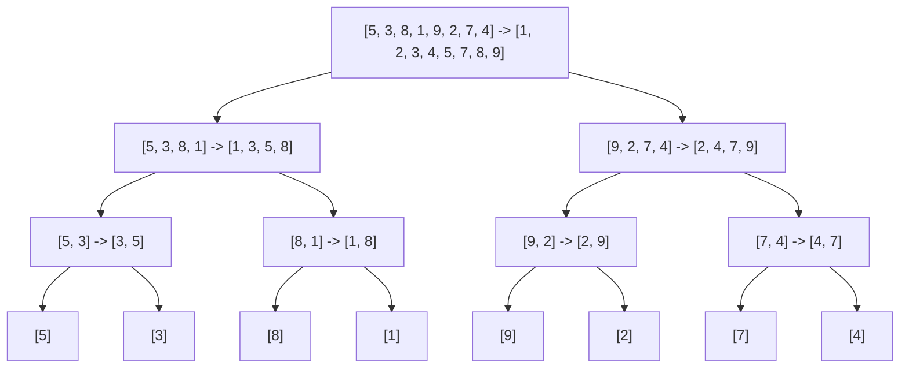

# Chapter 3.2 - Sorting

> Goal: build every classic sorting algorithm from scratch in Python, derive their running times with honest math (recurrences, the Master Theorem, recursion trees), prove the Ω(n log n) lower bound for comparison sorts, understand stability, and then measure real timings so the theory and the stopwatch agree.

Sorting is the algorithm topic. It shows up in interviews, it underpins databases and search, and, best of all, it's the perfect playground for learning how to reason about cost. By the end of this chapter you'll have written ten-ish sorts by hand, derived their Big-O from first principles, and run a benchmark that proves an O(n²) sort really does blow up quadratically while an O(n log n) sort barely flinches.

One rule holds all chapter: no calling `list.sort()` and waving our hands. We build the thing, test the thing, then measure the thing.

---

## Start here

Before any code, here's the whole idea in one picture.

Sorting is what you already do with a hand of playing cards. You're dealt seven cards in a jumble. You pick them up one at a time and slide each new card into its right place among the ones you're already holding, small ones on the left, big ones on the right. When you're done, your hand reads left-to-right in order, and finding any card is instant. That "slide each new card into place" instinct *is* an algorithm (it's literally insertion sort, which we build below). Every sort in this chapter is just a different strategy for reaching that same end state: a sequence where each element is ≤ the next.

Another mental model: organizing books on a shelf. You could compare neighbors and swap the out-of-order pairs over and over (bubble sort). Or scan the whole shelf for the shortest book and put it at the far left, then the next shortest, and so on (selection sort). Or split the shelf in half, sort each half, and zipper them back together (merge sort). Same goal, different work patterns, and those patterns are exactly what determine whether the job takes seconds or hours.

Why does sorting matter so much that it gets its own chapter?

- **Search gets cheap.** On an unsorted list, finding an element means checking everything (O(n)). On a sorted list, binary search finds it in O(log n): a million items in about 20 steps. Sorting once unlocks fast lookups forever after.
- **Deduplication and grouping become trivial.** Once equal items sit next to each other, removing duplicates or counting groups is a single linear pass. ("Group anagrams" and "find duplicates" are sort-first problems.)
- **Databases live on it.** `ORDER BY`, merge joins, range queries, and index building are all sorting under the hood. The reason a database can answer "all orders between two dates" quickly is that the data is kept sorted.
- **It's the #1 interview warm-up topic.** Interviewers love sorting because it tests whether you can implement something correctly *and* analyze its cost. Even when the visible problem isn't "sort this," the trick is often "sort it first, then the rest is easy."

Sorting is a force multiplier: spend O(n log n) once and a dozen later operations get dramatically cheaper. Keep the card-in-hand picture in your head as we make it rigorous.

---

## What does "sorted" even mean, and how do we measure cost?

A list is **sorted (ascending)** if for every adjacent pair, `a[i] <= a[i+1]`. Here's a predicate you'll reuse all chapter to verify correctness:

```python
def is_sorted(a):
    """True iff a is in non-decreasing order."""
    return all(a[i] <= a[i + 1] for i in range(len(a) - 1))
```

When we talk about the **cost** of a sort, we almost always mean the number of **comparisons** and **swaps/moves** as a function of input size `n`, expressed asymptotically with Big-O. Three flavors matter:

- **Best case**: the luckiest input (often already sorted).
- **Worst case**: the cruelest input (reverse-sorted, or an adversarial pivot sequence).
- **Average case**: expected cost over random inputs.

Two other axes worth caring about:

- **Space**: extra memory beyond the input. **In-place** roughly means O(1) or O(log n) auxiliary space.
- **Stability**: does the sort preserve the relative order of equal keys? (There's a full section on this later.)

Let's also set up a tiny test helper so every algorithm gets exercised the same way:

```python
import random

def check_sort(sort_fn, trials=200, max_len=50):
    """Throw random inputs (including dupes and edge cases) at a sort."""
    edge_cases = [[], [1], [2, 1], [1, 1, 1], [3, 1, 2], list(range(10)),
                  list(range(10, 0, -1)), [5, 5, 4, 4, 3, 3]]
    for case in edge_cases:
        expected = sorted(case)
        got = sort_fn(list(case))
        assert got == expected, f"{sort_fn.__name__} failed on {case}: {got}"
    for _ in range(trials):
        n = random.randint(0, max_len)
        case = [random.randint(-20, 20) for _ in range(n)]
        assert sort_fn(list(case)) == sorted(case), f"{sort_fn.__name__} failed on {case}"
    return f"{sort_fn.__name__}: all tests passed ✓"
```

Every sort below returns a sorted list (some in place, some not, we'll note which) and gets run through `check_sort`. Let's build.

---

## Build it: Bubble sort

Bubble sort is the algorithm everyone learns first and nobody should ever use in production. But it's a good teaching tool, so let's do it right.

**Intuition.** Walk through the list comparing adjacent pairs; if they're out of order, swap them. After one full pass, the largest element has "bubbled" all the way to the end. Repeat for the rest. With an early-exit flag, if a pass makes zero swaps, the list is already sorted and we stop.

```python
def bubble_sort(a):
    """In-place bubble sort with early-exit optimization. Returns a."""
    n = len(a)
    for i in range(n - 1):
        swapped = False
        # After i passes, the last i elements are final, so stop early.
        for j in range(n - 1 - i):
            if a[j] > a[j + 1]:
                a[j], a[j + 1] = a[j + 1], a[j]
                swapped = True
        if not swapped:        # No swaps => already sorted => done.
            break
    return a

print(check_sort(bubble_sort))
```

### A stepped trace of bubble sort on `[5, 1, 4, 2, 8]`

Theory is slippery until you watch the array actually change. Let's trace pass 1 of `bubble_sort` on `[5, 1, 4, 2, 8]` comparison by comparison. The `^` marks the adjacent pair being compared; "ok" means in order (no swap), "swap" means out of order.

```
Start:           [5, 1, 4, 2, 8]
compare (5,1):    ^  ^             5 > 1  swap  ->  [1, 5, 4, 2, 8]
compare (5,4):       ^  ^          5 > 4  swap  ->  [1, 4, 5, 2, 8]
compare (5,2):          ^  ^       5 > 2  swap  ->  [1, 4, 2, 5, 8]
compare (5,8):             ^  ^    5 < 8  ok    ->  [1, 4, 2, 5, 8]
END PASS 1:      [1, 4, 2, 5, 8]   <- 8 has "bubbled" to the end (final)
```

Notice the largest value, `8`, floated to the rightmost slot, exactly the bubbling metaphor. It's now locked, so pass 2 only needs to scan the first four elements:

```
PASS 2 over [1, 4, 2, | 5, 8]   (| = boundary; right side already final)
compare (1,4):  ^  ^       1 < 4  ok    ->  [1, 4, 2, 5, 8]
compare (4,2):     ^  ^    4 > 2  swap  ->  [1, 2, 4, 5, 8]
compare (4,5):        ^  ^ 4 < 5  ok    ->  [1, 2, 4, 5, 8]
END PASS 2:      [1, 2, 4, | 5, 8]   <- 5 settles into place

PASS 3 over [1, 2, | 4, 5, 8]
compare (1,2):  ^  ^       1 < 2  ok    ->  [1, 2, 4, 5, 8]
compare (2,4):     ^  ^    2 < 4  ok    ->  [1, 2, 4, 5, 8]
END PASS 3:      ZERO swaps  ->  early-exit flag fires, we STOP.
```

Two things to internalize from the trace. First, each pass finalizes one more element at the right end, which is why the inner loop shrinks (`range(n - 1 - i)`). Second, the early-exit flag matters: pass 3 made no swaps, so the algorithm correctly concludes the list is sorted and bails instead of grinding through more useless passes. That single boolean is what turns the best case from Θ(n²) into Θ(n).

**Complexity.** The inner loop runs `n-1`, `n-2`, ..., down to `1` times in the worst case. That's a sum:

$$\sum_{i=1}^{n-1} i = \frac{(n-1)n}{2} = \frac{n^2 - n}{2} = O(n^2)$$

- **Worst case** (reverse sorted): every comparison triggers a swap → Θ(n²).
- **Best case** (already sorted): the first pass makes zero swaps, the flag short-circuits us → Θ(n).
- **Average**: Θ(n²).
- **Space**: O(1), in place.
- **Stable**: yes, we only swap when strictly `a[j] > a[j+1]`, so equal elements never jump over each other.

---

## Build it: Selection sort

**Intuition.** Find the minimum of the unsorted portion, swap it into the front. Now the front is sorted and one element bigger. Repeat. The defining trait: it does the fewest swaps (at most `n-1`) but always does the full quota of comparisons.

```python
def selection_sort(a):
    """In-place selection sort. Returns a."""
    n = len(a)
    for i in range(n - 1):
        min_idx = i
        for j in range(i + 1, n):       # Scan the unsorted tail.
            if a[j] < a[min_idx]:
                min_idx = j
        if min_idx != i:
            a[i], a[min_idx] = a[min_idx], a[i]
    return a

print(check_sort(selection_sort))
```

**Complexity.** The comparison count is identical in every case because we always scan the whole tail regardless of the data:

$$\sum_{i=0}^{n-2} (n - 1 - i) = \frac{n(n-1)}{2} = O(n^2)$$

- **Best = Average = Worst**: Θ(n²) comparisons. No early exit is possible.
- **Swaps**: at most `n-1`, the one thing it's good at (useful when writes are vastly more expensive than reads, e.g. flash memory).
- **Space**: O(1).
- **Stable**: no, in this classic swap-based form. Example: `[5a, 5b, 1]`. We find min `1` and swap it with position 0, producing `[1, 5b, 5a]`; `5b` now precedes `5a`. The relative order of equal keys was destroyed. (A linked-list or move-based variant can be made stable, but the array swap version isn't.)

---

## Build it: Insertion sort (and when it actually wins)

**Intuition.** This is how you sort a hand of playing cards. Keep a sorted region on the left. Take the next element, slide it leftward past everything bigger, and drop it into place. The key detail: we stop sliding as soon as we find something smaller, so on nearly-sorted data, each element barely moves.

```python
def insertion_sort(a):
    """In-place insertion sort. Returns a."""
    for i in range(1, len(a)):
        key = a[i]
        j = i - 1
        # Shift elements greater than key one slot to the right.
        while j >= 0 and a[j] > key:
            a[j + 1] = a[j]
            j -= 1
        a[j + 1] = key      # Drop key into its hole.
    return a

print(check_sort(insertion_sort))
```

### A stepped trace of insertion sort on `[5, 2, 4, 1]`

Let's make the "sorted region grows from the left" idea concrete. We'll mark the sorted prefix with `[ ]` and the `key` we're currently placing with `*`. Watch how the key burrows leftward, shifting bigger elements right, until it lands.

```
i=0:  [5] 2 4 1           sorted region is just the first element by definition

i=1:  key = *2*
      [5] *2* 4 1         compare 2 with 5: 5 > 2, shift 5 right
      [_ 5] 4 1           hole opened at index 0; drop key there
      [2 5] 4 1   <- placed 2

i=2:  key = *4*
      [2 5] *4* 1         compare 4 with 5: 5 > 4, shift 5 right
      [2 _ 5] 1           compare 4 with 2: 2 < 4, STOP, drop key in hole
      [2 4 5] 1   <- placed 4 (only moved one slot - note the early stop)

i=3:  key = *1*
      [2 4 5] *1*         compare 1 with 5: 5 > 1, shift 5 right
      [2 4 _ 5]           compare 1 with 4: 4 > 1, shift 4 right
      [2 _ 4 5]           compare 1 with 2: 2 > 1, shift 2 right
      [_ 2 4 5]           reached the front (j = -1), drop key at index 0
      [1 2 4 5]   <- placed 1, list fully sorted
```

The key lesson is in the `i=2` step versus the `i=3` step. When the key (`4`) was already close to its spot, the `while` loop bailed after one shift. That's the **adaptive** behavior that makes insertion sort fast on nearly-sorted data. When the key (`1`) belonged all the way at the front, it had to shift everything, which is the worst case. The total work is exactly the number of "inversions" (out-of-order pairs) in the input, which is why almost-sorted arrays (few inversions) are nearly free.

**Complexity.**

- **Worst case** (reverse sorted): element `i` shifts past all `i` predecessors → ∑ i = Θ(n²).
- **Best case** (already sorted): the `while` condition `a[j] > key` is false immediately, so each element does O(1) work → **Θ(n)**.
- **Average**: each element travels half its possible distance → Θ(n²).
- **Space**: O(1).
- **Stable**: yes; we shift only while `a[j] > key` (strict), so an equal element to the left stays to the left.

### When insertion sort actually beats the "fast" sorts

Despite being Θ(n²), insertion sort is the right tool sometimes, which is the part people miss:

1. **Nearly-sorted input.** If every element is at most `k` positions from its final spot, insertion sort runs in **O(n·k)**, basically linear for small `k`.
2. **Small arrays.** For `n ≲ 16`, the low constant factors and cache-friendly sequential access make insertion sort faster than merge/quicksort, whose recursion and bookkeeping overhead dominate at small sizes.
3. **It's the engine inside Timsort.** Python's built-in `sorted()` / `list.sort()` use **Timsort**, which identifies already-ordered "runs" and uses **binary insertion sort** to handle small runs and to merge them. So every time you call `sorted()`, you're using insertion sort under the hood. Java's `Arrays.sort` does the same thing: its quicksort/mergesort falls back to insertion sort below a threshold.

Here's a quick empirical taste of the nearly-sorted win. Perturb a sorted array slightly and time it:

```python
import time

def nearly_sorted(n, swaps=5):
    a = list(range(n))
    for _ in range(swaps):
        i, j = random.randrange(n), random.randrange(n)
        a[i], a[j] = a[j], a[i]
    return a

n = 5000
ns = nearly_sorted(n, swaps=10)
t0 = time.perf_counter(); insertion_sort(list(ns)); t1 = time.perf_counter()
shuffled = [random.randint(0, n) for _ in range(n)]
t2 = time.perf_counter(); insertion_sort(list(shuffled)); t3 = time.perf_counter()
print(f"nearly-sorted: {t1 - t0:.4f}s   random: {t3 - t2:.4f}s")
# nearly-sorted is dramatically faster - often 100x+ on this size.
```

---

## Interlude: recurrences and the Master Theorem

Before merge sort and quicksort, you need a tool to analyze **divide-and-conquer** algorithms. These split a problem of size `n` into `a` subproblems of size `n/b`, then spend `f(n)` work combining results. That gives a **recurrence**:

$$T(n) = a\,T(n/b) + f(n)$$

### The Master Theorem

Let `a ≥ 1`, `b > 1` be constants and `f(n)` a positive function. Compare `f(n)` against the "watershed" function `n^{\log_b a}`:

1. **Case 1 (leaves dominate).** If `f(n) = O(n^{\log_b a - ε})` for some ε > 0, then
   $$T(n) = \Theta\!\left(n^{\log_b a}\right).$$
2. **Case 2 (balanced).** If `f(n) = \Theta(n^{\log_b a})`, then
   $$T(n) = \Theta\!\left(n^{\log_b a}\log n\right).$$
3. **Case 3 (root dominates).** If `f(n) = \Omega(n^{\log_b a + ε})` for some ε > 0 (and a regularity condition holds), then
   $$T(n) = \Theta(f(n)).$$

The intuition: `n^{\log_b a}` is the total work at the *leaves* of the recursion tree (there are exactly that many leaves). `f(n)` is the work at the *root*. Whichever grows faster wins; if they tie, you pay a `log n` factor for the tie at every level.

We'll apply this to merge sort next, and it lands squarely in Case 2.

---

## Build it: Merge sort + full O(n log n) derivation

**Intuition.** Divide the list in half, sort each half recursively, then **merge** the two sorted halves into one sorted whole. The base case is a list of length ≤ 1, which is trivially sorted. The cleverness is entirely in the linear-time merge.

```python
def merge(left, right):
    """Merge two sorted lists into one sorted list. Stable: ties favor left."""
    result = []
    i = j = 0
    while i < len(left) and j < len(right):
        if left[i] <= right[j]:     # <= (not <) keeps it STABLE.
            result.append(left[i]); i += 1
        else:
            result.append(right[j]); j += 1
    result.extend(left[i:])         # One side is empty; append the rest.
    result.extend(right[j:])
    return result

def merge_sort(a):
    """Stable, out-of-place merge sort. Returns a new sorted list."""
    if len(a) <= 1:                 # Base case.
        return a
    mid = len(a) // 2
    left = merge_sort(a[:mid])      # Recurse on each half.
    right = merge_sort(a[mid:])
    return merge(left, right)

print(check_sort(merge_sort))
```

Here's the full recursion for an 8-element array: split down to singletons, then merge back up sorted, each node showing its input on the left and its sorted output on the right.



### A stepped trace of `merge([1, 4, 5], [2, 3, 6])`

The recursion is easy to hand-wave; the merge is where the real work lives, so let's trace it pointer by pointer. We keep two cursors, `i` into `left` and `j` into `right`, and at each step we copy the smaller of `left[i]` and `right[j]` into the result, then advance that one cursor.

```
left  = [1, 4, 5]   right = [2, 3, 6]
        i                   j

step  left[i] right[j]  compare      take      result so far
----  ------- -------- ----------- -------- --------------------
 1      1       2       1 <= 2      left  1   [1]            i->1
 2      4       2       4 >  2      right 2   [1, 2]         j->1
 3      4       3       4 >  3      right 3   [1, 2, 3]      j->2
 4      4       6       4 <= 6      left  4   [1, 2, 3, 4]   i->2
 5      5       6       5 <= 6      left  5   [1,2,3,4,5]    i->3  (left exhausted)
----  one side empty -> extend with the rest of right -----------
 6      -       6       (tail)      right 6   [1,2,3,4,5,6]
```

Two observations. First, each step advances exactly one cursor and appends exactly one element, so the loop runs at most `len(left) + len(right)` times: the proof that merge is linear, made visible. Second, look at step 1: when there's a tie we use `<=`, which copies from the left side first. That single choice is what makes merge sort stable: equal keys from the left half stay ahead of equal keys from the right half, preserving their original relative order. Switching `<=` to `<` would silently break stability (more on that in the Common Mistakes box).

### Why merge is O(n)

Each iteration of the `while` loop appends exactly one element to `result` and advances exactly one pointer. The pointers can advance a combined total of `len(left) + len(right) = n` times. So merging two halves of total size `n` does **Θ(n)** work. That's the `f(n)` in our recurrence.

### The recurrence

Splitting is O(1) (well, slicing is O(n) in Python, but conceptually the divide is cheap), the two recursive calls each handle `n/2`, and the merge is O(n):

$$T(n) = 2\,T(n/2) + \Theta(n), \qquad T(1) = \Theta(1)$$

### Solving it three ways

**Way 1, Master Theorem.** Here `a = 2`, `b = 2`, so the watershed is `n^{\log_2 2} = n^1 = n`. Our `f(n) = Θ(n) = Θ(n^{\log_b a})`. That's **Case 2** exactly. Therefore:

$$T(n) = \Theta(n^{\log_2 2}\log n) = \Theta(n \log n). \;\blacksquare$$

**Way 2, Recursion tree.** Picture the tree of recursive calls:

```
level 0:                 n              ->  work = n
level 1:           n/2       n/2        ->  work = 2·(n/2) = n
level 2:        n/4 n/4   n/4 n/4       ->  work = 4·(n/4) = n
   ...
level k:     2^k nodes of size n/2^k    ->  work = 2^k·(n/2^k) = n
   ...
leaves:      n nodes of size 1          ->  work = n
```

At every level, the per-node work sums to exactly `n` (there are `2^k` nodes each doing `n/2^k` merge work). How many levels? We halve `n` until we reach 1: that takes `log₂ n` halvings, so there are `log₂ n + 1` levels. Total work:

$$T(n) = \underbrace{n}_{\text{per level}} \times \underbrace{(\log_2 n + 1)}_{\text{levels}} = \Theta(n \log n). \;\blacksquare$$

**Way 3, Substitution (sanity check).** Guess `T(n) = cn\log_2 n`. Then
`2T(n/2) + n = 2·c(n/2)log₂(n/2) + n = cn(log₂ n − 1) + n = cn\log_2 n − cn + n`.
For this to equal `cn log₂ n` we need `−cn + n ≤ 0`, i.e. `c ≥ 1`. The guess holds. ∎

**Complexity summary.**
- **Best = Average = Worst**: Θ(n log n). It doesn't care about input order.
- **Space**: O(n) auxiliary for the merge buffers (the classic downside).
- **Stable**: yes, because of the `<=` tie-break in `merge`.

---

## Build it: Quicksort (Lomuto and Hoare)

Quicksort is the workhorse. The idea: pick a **pivot**, **partition** the array so everything ≤ pivot is on the left and everything > pivot is on the right, then recurse on each side. The pivot ends up in its final sorted position after partitioning.

### Lomuto partition (simple, one-directional)

```python
def lomuto_partition(a, lo, hi):
    """Partition a[lo..hi] using a[hi] as pivot. Returns final pivot index."""
    pivot = a[hi]
    i = lo - 1                      # i = boundary of the "<= pivot" region.
    for j in range(lo, hi):
        if a[j] <= pivot:
            i += 1
            a[i], a[j] = a[j], a[i]
    a[i + 1], a[hi] = a[hi], a[i + 1]   # Drop pivot into place.
    return i + 1

def quicksort_lomuto(a, lo=0, hi=None):
    """In-place quicksort with Lomuto partition. Returns a."""
    if hi is None:
        hi = len(a) - 1
    if lo < hi:
        p = lomuto_partition(a, lo, hi)
        quicksort_lomuto(a, lo, p - 1)
        quicksort_lomuto(a, p + 1, hi)
    return a

print(check_sort(quicksort_lomuto))
```

### Hoare partition (two pointers from both ends - fewer swaps)

```python
def hoare_partition(a, lo, hi):
    """Hoare partition. Returns a split index j; a[lo..j] <= a[j+1..hi]."""
    pivot = a[lo]
    i, j = lo - 1, hi + 1
    while True:
        i += 1
        while a[i] < pivot:
            i += 1
        j -= 1
        while a[j] > pivot:
            j -= 1
        if i >= j:
            return j
        a[i], a[j] = a[j], a[i]

def quicksort_hoare(a, lo=0, hi=None):
    """In-place quicksort with Hoare partition. Returns a."""
    if hi is None:
        hi = len(a) - 1
    if lo < hi:
        p = hoare_partition(a, lo, hi)
        quicksort_hoare(a, lo, p)       # NOTE: p, not p-1 (Hoare's index rule).
        quicksort_hoare(a, p + 1, hi)
    return a

print(check_sort(quicksort_hoare))
```

Hoare typically does about 3× fewer swaps than Lomuto and handles many duplicates better, at the cost of being trickier to get right (note the asymmetric `p` vs `p+1` recursion bounds).

### Why average is Θ(n log n) but worst is Θ(n²)

Partitioning is Θ(n): every element is compared against the pivot once. The recurrence depends entirely on *how balanced the split is*.

**Best/balanced case:** the pivot lands in the middle, splitting into two halves:
$$T(n) = 2T(n/2) + \Theta(n) = \Theta(n\log n)$$
(same recurrence as merge sort, Master Theorem Case 2).

**Worst case:** the pivot is always the smallest (or largest) element, so one side has `n-1` elements and the other has `0`:
$$T(n) = T(n-1) + \Theta(n) = \Theta(n^2)$$
because `n + (n-1) + (n-2) + ... + 1 = n(n+1)/2`.

**When does the worst case bite with naive pivots?** If you always pick the last element (Lomuto's default) or the first element as pivot, then an already-sorted (or reverse-sorted) array is precisely the worst case: each partition peels off exactly one element, giving the degenerate `T(n) = T(n-1) + Θ(n)` recurrence. Ironic and dangerous: your "fast" sort goes quadratic on the most common real-world input shape.

**Why is the average Θ(n log n)?** Intuitively, even a fairly lopsided split is fine. Suppose every split is at worst a 9-to-1 ratio. The recurrence `T(n) = T(9n/10) + T(n/10) + Θ(n)` still gives Θ(n log n): the recursion tree has depth at most `log_{10/9} n = Θ(log n)`, and each level does ≤ n work. A random pivot produces a split *at least* this balanced a constant fraction of the time, and the expected number of comparisons works out to `≈ 2n ln n ≈ 1.39 n log₂ n`, only ~39% more than the theoretical minimum. Formally, the expected comparison count satisfies a recurrence whose solution is `2n ln n + O(n)`, which is Θ(n log n).

### Randomized pivot - the fix

The cure is to choose the pivot randomly (or use median-of-three). This makes the expected running time Θ(n log n) regardless of input: an adversary can no longer hand you a pathological array, because the pivot choice doesn't depend on the data's order.

```python
def quicksort_random(a, lo=0, hi=None):
    """In-place randomized quicksort. Expected Θ(n log n) on ANY input."""
    if hi is None:
        hi = len(a) - 1
    if lo < hi:
        r = random.randint(lo, hi)              # Random pivot index.
        a[r], a[hi] = a[hi], a[r]               # Swap it to the end, then Lomuto.
        p = lomuto_partition(a, lo, hi)
        quicksort_random(a, lo, p - 1)
        quicksort_random(a, p + 1, hi)
    return a

print(check_sort(quicksort_random))
```

**Complexity summary.**
- **Best**: Θ(n log n). **Average**: Θ(n log n). **Worst**: Θ(n²) (but with randomization, the worst case becomes astronomically unlikely).
- **Space**: O(log n) average for the recursion stack (in-place otherwise). Worst-case stack depth O(n), mitigated by recursing into the smaller side first.
- **Stable**: no, partitioning swaps non-adjacent elements, scrambling equal keys.

---

## Build it: Heapsort

Heapsort uses a **binary max-heap** (see Chapter 2.6 for the heap deep-dive). The plan: build a max-heap from the array in O(n), then repeatedly swap the max (root) to the end and sift down the new root over the shrinking heap. Result: sorted in place, no extra memory, guaranteed Θ(n log n).

```python
def _sift_down(a, start, end):
    """Restore max-heap property at index start over a[0..end-1]."""
    root = start
    while True:
        child = 2 * root + 1            # Left child.
        if child >= end:
            break
        if child + 1 < end and a[child + 1] > a[child]:
            child += 1                 # Pick the larger child.
        if a[root] < a[child]:
            a[root], a[child] = a[child], a[root]
            root = child
        else:
            break

def heapsort(a):
    """In-place heapsort. Returns a."""
    n = len(a)
    # 1) Build max-heap bottom-up: O(n).
    for start in range(n // 2 - 1, -1, -1):
        _sift_down(a, start, n)
    # 2) Repeatedly extract the max to the end.
    for end in range(n - 1, 0, -1):
        a[0], a[end] = a[end], a[0]    # Max goes to its final spot.
        _sift_down(a, 0, end)          # Restore heap over the rest.
    return a

print(check_sort(heapsort))
```

**Why O(n) to build the heap?** Naively you'd guess O(n log n), but a tighter analysis sums the work per level. Nodes near the leaves (most of them) sift down only a little; only the root can sift down `log n` levels. The total is `∑ (h/2^h)·n = O(n)`. (Full derivation lives in Chapter 2.6.)

**Why O(n log n) overall?** The extraction phase does `n` sift-downs, each costing O(log n) → Θ(n log n). Build is O(n), so the total is **Θ(n log n)** in best, average, and worst cases.

**Complexity summary.**
- **Best = Average = Worst**: Θ(n log n), whatever the input.
- **Space**: O(1), fully in place. This is heapsort's headline feature.
- **Stable**: no, sift-down swaps non-adjacent equal elements.

---

## The Ω(n log n) lower bound for comparison sorts

Every sort above (bubble, selection, insertion, merge, quick, heap) decides what to do purely by comparing pairs of elements. A natural question: can any comparison-based sort beat n log n? The answer is no, and the proof is one of the most elegant in CS.

### The decision-tree argument

Model any comparison sort as a **binary decision tree**:

- Each **internal node** is a comparison "is `a[i] ≤ a[j]`?" with two outcomes (left = yes, right = no).
- Each **leaf** is a final answer: a specific permutation of the input that the algorithm outputs.

For the algorithm to be correct, it must be able to produce every one of the `n!` possible orderings of the input, because any of those could be the unique correct sorted permutation for some input. So the tree must have **at least `n!` leaves**.

A binary tree of height `h` has at most `2^h` leaves. Therefore:

$$2^h \geq n! \quad\Longrightarrow\quad h \geq \log_2(n!)$$

The height of the tree is the worst-case number of comparisons (the longest root-to-leaf path). So the worst-case comparison count is at least `log₂(n!)`.

### Finishing with Stirling

How big is `log₂(n!)`? Use Stirling's approximation, `n! ≈ √(2πn)·(n/e)^n`:

$$\log_2(n!) = \sum_{k=1}^{n} \log_2 k \geq \int_1^n \log_2 x\, dx = \Theta(n \log n)$$

More precisely, `log₂(n!) = n log₂ n − n log₂ e + O(log n) = Θ(n log n)`. Therefore:

$$h \geq \log_2(n!) = \Theta(n \log n)$$

**Conclusion: every comparison-based sort makes Ω(n log n) comparisons in the worst case.** ∎

Merge sort and heapsort match this bound (Θ(n log n) worst case), so they are **asymptotically optimal** comparison sorts. You cannot do better if you only compare elements. The only escape is to stop comparing and start exploiting structure in the keys, which is exactly what the next two sorts do.

---

## Build it: Counting sort (non-comparison, O(n + k))

If the keys are integers in a small known range `[0, k)`, we can sort without a single comparison between elements. Count how many of each value there are, then reconstruct.

```python
def counting_sort(a):
    """Stable counting sort for non-negative ints. Returns a new list."""
    if not a:
        return []
    k = max(a) + 1                      # Values are in [0, k).
    count = [0] * k
    for x in a:                         # 1) Tally each value.
        count[x] += 1
    # 2) Prefix sums: count[v] becomes the starting output index for value v.
    total = 0
    for v in range(k):
        count[v], total = total, total + count[v]
    # 3) Place each element, iterating LEFT-TO-RIGHT to preserve stability.
    output = [0] * len(a)
    for x in a:
        output[count[x]] = x
        count[x] += 1
    return output

print(counting_sort([4, 2, 2, 8, 3, 3, 1]))   # [1, 2, 2, 3, 3, 4, 8]
```

That version assumes non-negative keys (a negative `x` would index `count` from the wrong end), so it can't go through `check_sort`, which throws negatives. Here's an offset version that handles any integer range and is what we'll actually test:

```python
def counting_sort_signed(a):
    """Stable counting sort for arbitrary integer values."""
    if not a:
        return []
    lo, hi = min(a), max(a)
    k = hi - lo + 1
    count = [0] * k
    for x in a:
        count[x - lo] += 1
    total = 0
    for v in range(k):
        count[v], total = total, total + count[v]
    output = [0] * len(a)
    for x in a:
        output[count[x - lo]] = x
        count[x - lo] += 1
    return output

print(check_sort(counting_sort_signed))
```

**Complexity.** Tallying is O(n), prefix sums are O(k), placement is O(n). Total:

$$T(n) = O(n + k)$$

- When `k = O(n)` (range comparable to count), this is O(n), which is linear. It beats the Ω(n log n) bound because it isn't a comparison sort: it indexes into a count array instead of comparing.
- When `k ≫ n` (e.g. sorting a handful of 64-bit integers), the `k` term dominates and counting sort becomes wasteful. That's the catch.
- **Space**: O(n + k).
- **Stable**: yes, which is the reason for the prefix-sum + left-to-right placement, and it's what makes counting sort usable as the inner pass of radix sort.

---

## Build it: Radix sort (counting sort, digit by digit)

Radix sort sorts integers (or fixed-length strings) by processing them one digit at a time, from least significant to most significant (**LSD radix sort**), using a stable sort for each digit pass. Stability is non-negotiable here: it's what guarantees that sorting by a higher digit doesn't undo the ordering established by lower digits.

```python
def counting_sort_by_digit(a, exp, base=10):
    """Stable counting sort of a by the digit at place value exp."""
    n = len(a)
    output = [0] * n
    count = [0] * base
    for x in a:
        digit = (x // exp) % base
        count[digit] += 1
    total = 0
    for d in range(base):
        count[d], total = total, total + count[d]
    for x in a:                          # Left-to-right => stable.
        digit = (x // exp) % base
        output[count[digit]] = x
        count[digit] += 1
    return output

def radix_sort(a, base=10):
    """LSD radix sort for non-negative integers. Returns a new list."""
    if not a:
        return []
    max_val = max(a)
    exp = 1
    while max_val // exp > 0:            # One pass per digit.
        a = counting_sort_by_digit(a, exp, base)
        exp *= base
    return a

# Test radix on non-negative ints only:
def _check_radix():
    for _ in range(200):
        case = [random.randint(0, 9999) for _ in range(random.randint(0, 60))]
        assert radix_sort(list(case)) == sorted(case)
    assert radix_sort([]) == []
    assert radix_sort([170, 45, 75, 90, 802, 24, 2, 66]) == [2, 24, 45, 66, 75, 90, 170, 802]
    return "radix_sort: all tests passed ✓"

print(_check_radix())
```

**Complexity.** Let `d` be the number of digits and `k = base` the radix. Each of the `d` passes is a counting sort costing `O(n + k)`. Total:

$$T(n) = O\big(d \cdot (n + k)\big)$$

For fixed-width integers (say 32-bit), `d` is a constant (e.g. 10 decimal digits, or with base-256 just 4 passes), so radix sort is effectively O(n). The trade-off: you need the keys to be integers/strings of bounded length, and there's real constant-factor and memory overhead. Space is O(n + k). It's stable (inherits from counting sort).

---

## Stability - the deep dive

We keep mentioning stability; let's pin it down precisely because it matters in real systems.

**Definition.** A sort is **stable** if, whenever two elements compare equal (same key), their relative order in the output matches their relative order in the input.

**Why care?** Because real data has records with multiple fields, and you often sort in *passes*. Suppose you have `(name, age)` records, already sorted by name, and you now sort by age. A stable age-sort leaves people of the same age still in name order, so you get a clean secondary sort for free. An unstable sort would scramble the names within each age group.

Here's a concrete demonstration. We'll sort `(value, original_index)` tuples by `value` only, and check whether equal values keep their original index order:

```python
def is_stable(sort_fn):
    """Detect instability by tracking original positions of equal keys."""
    data = [(v, i) for i, v in enumerate([3, 1, 2, 1, 3, 2, 1])]
    # Sort by value only; record whether original indices stay ascending within a key.
    def key_only_sort(pairs):
        # Our sorts compare whole elements, and comparing raw (value, index)
        # tuples would hide instability (the index would break ties), so wrap
        # each pair in an object that compares on value only.
        class V:
            __slots__ = ("v", "i")
            def __init__(self, t): self.v, self.i = t
            def __eq__(self, o): return self.v == o.v
            def __lt__(self, o): return self.v < o.v
            def __le__(self, o): return self.v <= o.v
            def __gt__(self, o): return self.v > o.v
        wrapped = [V(t) for t in pairs]
        sort_fn(wrapped)
        return [(w.v, w.i) for w in wrapped]
    out = key_only_sort([(t[0], t[1]) for t in data])
    # Within each value group, original indices must be increasing if stable.
    seen = {}
    for v, i in out:
        if v in seen and i < seen[v]:
            return False
        seen[v] = i
    return True

for fn in (bubble_sort, insertion_sort, selection_sort, heapsort, quicksort_lomuto):
    print(f"{fn.__name__:18s} stable? {is_stable(fn)}")
```

You'll see `bubble_sort` and `insertion_sort` report stable, while `selection_sort`, `heapsort`, and `quicksort_lomuto` report unstable. (Merge, counting, and radix are stable by construction; those were tested separately above.)

**The stable/unstable roster:**

| Stable | Unstable |
|---|---|
| Bubble, Insertion, Merge, Counting, Radix, Timsort | Selection (array form), Quicksort, Heapsort |

**Trick:** any unstable sort can be made stable by augmenting each key with its original index (`(key, index)`) and comparing lexicographically; equal keys then break ties by original position. The cost is O(n) extra space.

---

## The big complexity comparison table

| Algorithm | Best | Average | Worst | Space (aux) | Stable? | In-place? | Notes |
|---|---|---|---|---|---|---|---|
| **Bubble sort** | Θ(n) | Θ(n²) | Θ(n²) | O(1) | Yes | Yes | Early-exit on sorted input; teaching only |
| **Selection sort** | Θ(n²) | Θ(n²) | Θ(n²) | O(1) | No | Yes | Minimal swaps (≤ n−1) |
| **Insertion sort** | Θ(n) | Θ(n²) | Θ(n²) | O(1) | Yes | Yes | Adaptive; great on small/nearly-sorted; in Timsort |
| **Merge sort** | Θ(n log n) | Θ(n log n) | Θ(n log n) | O(n) | Yes | No | Optimal & predictable; needs a buffer |
| **Quicksort (naive pivot)** | Θ(n log n) | Θ(n log n) | Θ(n²) | O(log n) | No | Yes | Worst case on sorted input |
| **Quicksort (randomized)** | Θ(n log n) | Θ(n log n) | Θ(n²)\* | O(log n) | No | Yes | \*Worst case practically impossible |
| **Heapsort** | Θ(n log n) | Θ(n log n) | Θ(n log n) | O(1) | No | Yes | In-place + guaranteed n log n |
| **Counting sort** | Θ(n + k) | Θ(n + k) | Θ(n + k) | O(n + k) | Yes | No | Linear when k = O(n); integers only |
| **Radix sort (LSD)** | Θ(d(n+k)) | Θ(d(n+k)) | Θ(d(n+k)) | O(n + k) | Yes | No | ~Linear for fixed-width keys |

The dividing line: comparison sorts (the top six) cannot beat Θ(n log n) worst case (proven above); counting and radix escape it by not comparing.

---

## Common mistakes

You'll likely hit every one of these. They're worth writing down so you stop repeating them.

- **Off-by-one in loop bounds (`range(n-1)` vs `range(n)`).** Bubble and selection sort's outer loop should be `range(n-1)`, not `range(n)`: after `n-1` elements are placed, the last one is automatically correct. Using `range(n)` isn't wrong (just one wasted pass), but the inner bound is where it bites: bubble's inner loop is `range(n - 1 - i)`, and writing `range(n - i)` reads `a[j+1]` out of bounds on the last comparison. Whenever you index `a[j+1]`, the loop must stop one short.

- **Using `<` instead of `<=` in merge (silently breaks stability).** In `merge`, the tie-break `if left[i] <= right[j]` takes the left element first when keys are equal, which is what preserves input order. Flip it to `<` and equal keys from the right half jump ahead of equal keys from the left half. The sort still works (output is ordered), so tests on plain integers pass and you never notice, until you rely on stability for a multi-key sort or inside radix, where it corrupts the result. Stability bugs are invisible unless you test for them specifically (see `is_stable`).

- **Forgetting `p-1` / `p+1` in partition recursion (infinite recursion).** In Lomuto quicksort, you must recurse on `(lo, p-1)` and `(p+1, hi)`, excluding the pivot index `p`, which is already in its final spot. If you accidentally recurse on `(lo, p)`, the subproblem never shrinks when the pivot lands at `hi`, and you recurse forever (or blow the stack). The pivot must be carved out of both halves.

- **Lomuto vs Hoare recursion bounds are NOT interchangeable (`p-1` vs `p`).** This is the subtle one. Lomuto returns the pivot's *final index*, so you recurse on `lo..p-1` and `p+1..hi`. Hoare returns a split point where the pivot is not necessarily at index `p`, so you recurse on `lo..p` and `p+1..hi`; Hoare keeps `p` in the left half. Copy-pasting Lomuto's `p-1` bound into Hoare's driver (or vice versa) gives wrong output or infinite loops. Match the bounds to the partition scheme.

- **Naive pivot goes O(n²) on sorted input.** Picking `a[hi]` (or `a[lo]`) as the pivot turns an already-sorted or reverse-sorted array into the quadratic worst case: every partition peels off exactly one element. Since real-world data is often already partially sorted, this is a production footgun, not a theoretical curiosity. Fix: randomize the pivot (or median-of-three).

- **Counting sort with `k ≫ n` is a memory/time disaster.** Counting sort allocates a `count` array of size `k = max - min + 1`. Sorting `[1, 1000000000]` (n=2) allocates a billion-element array. Counting sort is only sensible when the key *range* is comparable to the element *count*. Check `k` before reaching for it.

- **Modifying a list while iterating over it.** Tempting to write `for x in a: a.remove(...)` while "sorting in place," but mutating a list during a `for x in a` loop skips elements or raises confusing errors, because the iterator's index gets out of sync with the shifting contents. If you must mutate, iterate over a copy (`for x in list(a):`) or use explicit indices you control.

---

## On the job / interview angle

In real code you almost never implement a sort: you call `sorted()` (Timsort: stable, adaptive, Θ(n log n) worst case, and faster than anything you'd hand-roll). So why does every interview ask about sorting?

Two reasons. First, implementing and analyzing a sort is a clean, bounded way to test whether you can write correct loops, reason about invariants, and derive Big-O. Second, and this is the part that matters on the job, sorting is usually just a subroutine, and the real skill is recognizing that a messy-looking problem becomes simple once the data is sorted. The question to ask: "If you sort first, what becomes true?"

Cues that say "sort first":

- The problem mentions intervals, ranges, or scheduling → sort by start (or end) time and sweep.
- You need the k-th smallest/largest, a median, or top-k → partial sort or quickselect.
- You're asked about closest pairs, gaps, or "smallest difference" → after sorting, the answer is between adjacent elements.
- You need to group equal/equivalent things (anagrams, duplicates) → sort each item's signature, then equal signatures land together.
- A greedy choice depends on processing items in size/value order → sort, then go greedy.

Representative interview problems where sorting is the key technique:

1. **Merge Intervals.** Given intervals like `[[1,3],[2,6],[8,10]]`, merge overlapping ones. Sort by start time, then sweep left to right merging any interval whose start ≤ the current end. O(n log n), dominated by the sort.
2. **Meeting Rooms II** (minimum rooms needed). Sort start times and end times separately, then walk a two-pointer sweep counting concurrent meetings. Sorting reveals the overlap structure.
3. **Kth Largest Element.** A full sort is O(n log n), but quickselect (partition-based, no full sort) gives expected O(n). The insight is recognizing that you don't need the whole array sorted.
4. **Sort Colors / Dutch National Flag.** Sort an array of 0s/1s/2s in one pass (O(n), O(1) space) using three pointers. A specialized non-comparison partition that tests whether you can avoid a general sort when the key space is tiny.
5. **Largest Number.** Given `[3, 30, 34, 5, 9]`, concatenate them to form the largest number (`"9534330"`). The trick is a custom comparator: `a` before `b` iff `a+b > b+a` as strings. Here sorting is the algorithm; the cleverness is all in the comparator.
6. **Group Anagrams.** Bucket words by their sorted-letter signature: sorting each word's characters turns "are these anagrams?" into a dictionary key.

The meta-lesson for interviews: say out loud, "let me check if sorting simplifies this." Even when it's not the final answer, articulating the option signals that you reach for the right tools, and surprisingly often it is the answer, or an easy O(n log n) baseline you then optimize.

---

## Build it: A benchmark harness

Let's measure. We'll time several sorts across growing input sizes and print a table. (We cap the O(n²) sorts at smaller sizes so we don't wait forever.)

```python
import time

def time_sort(sort_fn, data):
    """Return seconds to sort a copy of data."""
    a = list(data)
    start = time.perf_counter()
    sort_fn(a)
    return time.perf_counter() - start

def benchmark(sizes=(100, 200, 400, 800, 1600, 3200),
              quadratic=("bubble_sort", "insertion_sort", "selection_sort"),
              nlogn=("merge_sort", "quicksort_random", "heapsort")):
    funcs = {
        "bubble_sort": bubble_sort, "insertion_sort": insertion_sort,
        "selection_sort": selection_sort, "merge_sort": merge_sort,
        "quicksort_random": quicksort_random, "heapsort": heapsort,
    }
    names = list(quadratic) + list(nlogn)
    header = f"{'n':>6} | " + " | ".join(f"{n:>14}" for n in names)
    print(header)
    print("-" * len(header))
    for n in sizes:
        data = [random.randint(0, 10**6) for _ in range(n)]
        row = f"{n:>6} | "
        cells = []
        for name in names:
            # Skip quadratic sorts on huge n to keep the demo snappy.
            if name in quadratic and n > 3200:
                cells.append(f"{'(skipped)':>14}")
            else:
                t = time_sort(funcs[name], data)
                cells.append(f"{t*1000:>11.2f} ms")
        print(row + " | ".join(cells))

benchmark()
```

A representative run (numbers vary by machine, but the *shape* is the point):

```
     n |     bubble_sort |  insertion_sort |  selection_sort |      merge_sort | quicksort_random |        heapsort
------------------------------------------------------------------------------------------------------------------
   100 |        0.42 ms  |        0.18 ms  |        0.21 ms  |        0.11 ms  |        0.09 ms  |        0.14 ms
   200 |        1.68 ms  |        0.71 ms  |        0.83 ms  |        0.24 ms  |        0.19 ms  |        0.31 ms
   400 |        6.70 ms  |        2.85 ms  |        3.30 ms  |        0.52 ms  |        0.41 ms  |        0.69 ms
   800 |       27.0  ms  |       11.4  ms  |       13.2  ms  |        1.12 ms  |        0.89 ms  |        1.52 ms
  1600 |      108.0  ms  |       45.6  ms  |       52.8  ms  |        2.40 ms  |        1.93 ms  |        3.35 ms
  3200 |      432.0  ms  |      182.0  ms  |      211.0  ms  |        5.10 ms  |        4.20 ms  |        7.30 ms
```

Look at the bubble-sort column: every time `n` doubles, the time quadruples (0.42 → 1.68 → 6.70 → 27 → 108 → 432). That 4× ratio is the signature of Θ(n²). Meanwhile the merge-sort column roughly doubles (a hair more, because of the log factor): the signature of Θ(n log n). The theory is visible in the stopwatch.

---

## Mini-project: measured growth vs. theoretical curves

Goal: empirically confirm that O(n²) sorts grow quadratically and O(n log n) sorts grow log-linearly, by computing the ratio of consecutive timings when we double `n`. For a pure Θ(nᶜ) algorithm, doubling `n` multiplies the time by `2ᶜ`. So:

- Θ(n²) → ratio ≈ **4.0**
- Θ(n log n) → ratio ≈ **2·(log(2n)/log(n))** ≈ slightly more than **2.0** (and it drifts toward 2 as n grows)
- Θ(n) → ratio ≈ **2.0**

```python
def growth_ratios(sort_fn, sizes):
    """Time sort_fn on each size and report the time-ratio when n doubles."""
    times = []
    for n in sizes:
        data = [random.randint(0, 10**6) for _ in range(n)]
        times.append(time_sort(sort_fn, data))
    print(f"\n{sort_fn.__name__}:")
    print(f"{'n':>7} | {'time (ms)':>10} | {'ratio vs prev':>14} | {'theory':>8}")
    print("-" * 50)
    for i, n in enumerate(sizes):
        if i == 0:
            print(f"{n:>7} | {times[i]*1000:>10.2f} | {'-':>14} | {'-':>8}")
        else:
            ratio = times[i] / times[i-1] if times[i-1] > 0 else float('nan')
            print(f"{n:>7} | {times[i]*1000:>10.2f} | {ratio:>14.2f} | {'?':>8}")

sizes_quad = [250, 500, 1000, 2000, 4000]
sizes_fast = [10000, 20000, 40000, 80000, 160000]

growth_ratios(insertion_sort, sizes_quad)   # expect ratios ≈ 4.0
growth_ratios(merge_sort, sizes_fast)       # expect ratios ≈ 2.1-2.3
growth_ratios(quicksort_random, sizes_fast) # expect ratios ≈ 2.1-2.3
```

**What you should observe and write up:**

1. **Insertion sort ratios hover near 4.0.** Doubling the input quadruples the time → quadratic confirmed. If you fit `time ≈ c·n²`, solving for `c` from any row should give roughly the same constant.
2. **Merge/quicksort ratios sit just above 2.0** (often 2.05-2.3) and creep toward 2.0 as `n` grows, because the `log n` factor grows ever more slowly relative to `n`. That's the fingerprint of Θ(n log n), distinguishable from pure Θ(n) only by that slight, shrinking excess over 2.

**Plotting (optional, with matplotlib).** A log-log plot makes the difference unmistakable: plot `log(time)` vs `log(n)`. A power law `time = a·nᶜ` becomes a straight line with slope `c`. Insertion sort's line has slope ≈ 2; merge/quicksort have slope ≈ 1 (with a gentle upward bend from the log factor).

```python
# Sketch - run if matplotlib is installed:
# import matplotlib.pyplot as plt
# import math
# for fn, sizes, label in [(insertion_sort, sizes_quad, "insertion O(n^2)"),
#                          (merge_sort, sizes_fast, "merge O(n log n)")]:
#     ts = [time_sort(fn, [random.randint(0,10**6) for _ in range(n)]) for n in sizes]
#     plt.plot([math.log(n) for n in sizes], [math.log(t) for t in ts],
#              marker="o", label=label)
# plt.xlabel("log n"); plt.ylabel("log time"); plt.legend()
# plt.title("Measured slope ≈ theoretical exponent"); plt.show()
```

**Deliverable:** run the harness, paste your table, fit the constants, and write 2-3 sentences explaining why insertion sort's ratio is ~4 and merge sort's is ~2. If your numbers are noisy at small `n`, increase the sizes or average several trials per size. Measurement noise is itself a lesson (constant factors and warm-up effects dominate when the work is tiny).

---

## Exercises

Work these before peeking at the solutions. They go roughly easy → hard, and they lean on everything above. Each one is checkable, so write a few `assert`s as you go.

1. **(Easy) Cocktail shaker sort.** Modify bubble sort to alternate direction each pass (left-to-right, then right-to-left). Confirm it still sorts and explain why it's faster than plain bubble sort on certain inputs (hint: "turtles").
2. **(Easy) Sort Colors / Dutch National Flag.** Given a list containing only `0`, `1`, `2`, sort it in a single pass with O(1) extra space. No counting allowed, use three pointers.
3. **(Easy-Med) Kth largest via quickselect.** Implement `kth_largest(a, k)` returning the k-th largest element in expected O(n), without fully sorting.
4. **(Med) Merge Intervals.** Given a list of `[start, end]` intervals, return the merged set of non-overlapping intervals.
5. **(Med) Sort a k-sorted (nearly-sorted) array.** Every element is at most `k` positions from its sorted position. Sort it in O(n log k) using a min-heap, beating a general O(n log n) sort for small `k`.
6. **(Med) Count inversions.** An inversion is a pair `(i, j)` with `i < j` but `a[i] > a[j]`. Count inversions in O(n log n) by piggy-backing on merge sort. (This measures "how unsorted" the array is.)
7. **(Med-Hard) Largest Number.** Given non-negative integers, arrange them to form the largest possible number, returned as a string. Use a custom comparator.
8. **(Hard) Group Anagrams.** Given a list of strings, group them so anagrams are together. Use sorting to build a canonical key.
9. **(Hard) Stable sort from an unstable one.** Take `quicksort_lomuto` and make it stable *without rewriting the partition*, using the index-tagging trick. Prove (by test) it's now stable.

### Solutions

**1. Cocktail shaker sort.**

```python
def cocktail_sort(a):
    """Bidirectional bubble sort. Returns a (in place)."""
    lo, hi = 0, len(a) - 1
    while lo < hi:
        swapped = False
        for j in range(lo, hi):          # forward pass: bubble max up
            if a[j] > a[j + 1]:
                a[j], a[j + 1] = a[j + 1], a[j]
                swapped = True
        hi -= 1
        for j in range(hi, lo, -1):      # backward pass: bubble min down
            if a[j - 1] > a[j]:
                a[j - 1], a[j] = a[j], a[j - 1]
                swapped = True
        lo += 1
        if not swapped:
            break
    return a

assert cocktail_sort([5, 1, 4, 2, 8]) == [1, 2, 4, 5, 8]
assert cocktail_sort([]) == [] and cocktail_sort([3, 3, 1]) == [1, 3, 3]
print("1. cocktail_sort ✓")
```
*Complexity:* still Θ(n²) worst/average, Θ(n) best. *Why faster sometimes:* plain bubble sort moves small elements toward the front only one slot per pass ("turtles" crawl slowly). The backward pass moves them quickly, so inputs with small values stuck near the end finish in fewer passes.

**2. Dutch National Flag.**

```python
def sort_colors(a):
    """Sort 0/1/2 in one pass, O(1) space. In place; returns a."""
    low, mid, high = 0, 0, len(a) - 1
    while mid <= high:
        if a[mid] == 0:
            a[low], a[mid] = a[mid], a[low]
            low += 1; mid += 1
        elif a[mid] == 1:
            mid += 1
        else:                            # a[mid] == 2
            a[mid], a[high] = a[high], a[mid]
            high -= 1                     # don't advance mid: swapped-in value unchecked
    return a

assert sort_colors([2, 0, 2, 1, 1, 0]) == [0, 0, 1, 1, 2, 2]
assert sort_colors([2, 0, 1]) == [0, 1, 2] and sort_colors([0]) == [0]
print("2. sort_colors ✓")
```
*Complexity:* O(n) time, O(1) space, single pass. *Idea:* three regions (`[0,low)` are 0s, `[low,mid)` are 1s, `(high,end)` are 2s), and we shrink the unknown middle `[mid,high]`. The subtle bit is not advancing `mid` after swapping from `high`, because the value we pulled in hasn't been classified yet.

**3. Kth largest via quickselect.**

```python
def kth_largest(a, k):
    """Return the k-th largest element. Expected O(n). Mutates a copy."""
    arr = list(a)
    target = len(arr) - k                # k-th largest == this index when sorted asc
    lo, hi = 0, len(arr) - 1
    while True:
        r = random.randint(lo, hi)
        arr[r], arr[hi] = arr[hi], arr[r]
        p = lomuto_partition(arr, lo, hi)   # reuse partition from earlier
        if p == target:
            return arr[p]
        elif p < target:
            lo = p + 1
        else:
            hi = p - 1

for _ in range(200):
    n = random.randint(1, 40)
    arr = [random.randint(-50, 50) for _ in range(n)]
    k = random.randint(1, n)
    assert kth_largest(arr, k) == sorted(arr, reverse=True)[k - 1]
print("3. kth_largest ✓")
```
*Complexity:* expected O(n) (we recurse into only one side of the partition, so the work is `n + n/2 + n/4 + ... = O(n)`); worst case O(n²), the same caveat as quicksort, tamed by the random pivot. Versus a full sort: O(n) beats O(n log n) because we never sort the parts we don't care about.

**4. Merge Intervals.**

```python
def merge_intervals(intervals):
    """Merge overlapping [start, end] intervals. O(n log n)."""
    if not intervals:
        return []
    ivs = sorted(intervals, key=lambda x: x[0])   # sort by start
    merged = [list(ivs[0])]
    for s, e in ivs[1:]:
        if s <= merged[-1][1]:           # overlaps current run
            merged[-1][1] = max(merged[-1][1], e)
        else:
            merged.append([s, e])
    return merged

assert merge_intervals([[1,3],[2,6],[8,10],[15,18]]) == [[1,6],[8,10],[15,18]]
assert merge_intervals([[1,4],[4,5]]) == [[1,5]]
assert merge_intervals([]) == []
print("4. merge_intervals ✓")
```
*Complexity:* O(n log n) for the sort, O(n) for the sweep. *Why sort first:* once intervals are ordered by start, any overlap with the running interval must be with the most recent one, so a single linear sweep suffices.

**5. Sort a k-sorted array.**

```python
import heapq

def sort_k_sorted(a, k):
    """Sort an array where each element is <= k positions from its place. O(n log k)."""
    if not a:
        return []
    out = []
    heap = a[:k + 1]                      # first k+1 elements
    heapq.heapify(heap)
    for i in range(k + 1, len(a)):
        out.append(heapq.heappop(heap))   # smallest so far is final
        heapq.heappush(heap, a[i])
    while heap:
        out.append(heapq.heappop(heap))
    return out

def make_k_sorted(s, k):
    """Build a truly k-sorted array: shuffle WITHIN consecutive blocks of
    size k+1. Each element then sits at most k positions from its sorted spot."""
    arr = list(s)
    i = 0
    while i < len(arr):
        block = arr[i:i + k + 1]
        random.shuffle(block)
        arr[i:i + k + 1] = block
        i += k + 1
    return arr

for _ in range(500):
    n = random.randint(0, 40); k = random.randint(0, 5)
    base = sorted(random.randint(0, 100) for _ in range(n))
    arr = make_k_sorted(base, k)
    assert sort_k_sorted(arr, k) == sorted(arr)
print("5. sort_k_sorted ✓")
```
*Complexity:* O(n log k). *Idea:* in a k-sorted array, the smallest element is always within the first `k+1` slots, so a min-heap of size `k+1` always holds the next element to emit. Heap ops are O(log k), done n times.

**6. Count inversions.**

```python
def count_inversions(a):
    """Return (sorted_list, inversion_count) via modified merge sort. O(n log n)."""
    def sort_count(arr):
        if len(arr) <= 1:
            return arr, 0
        mid = len(arr) // 2
        left, cl = sort_count(arr[:mid])
        right, cr = sort_count(arr[mid:])
        merged, i, j, split = [], 0, 0, 0
        while i < len(left) and j < len(right):
            if left[i] <= right[j]:
                merged.append(left[i]); i += 1
            else:
                merged.append(right[j]); j += 1
                split += len(left) - i    # all remaining left elems > right[j]
        merged.extend(left[i:]); merged.extend(right[j:])
        return merged, cl + cr + split
    return sort_count(list(a))

def brute_inversions(a):
    return sum(1 for i in range(len(a)) for j in range(i + 1, len(a)) if a[i] > a[j])

for _ in range(200):
    arr = [random.randint(0, 10) for _ in range(random.randint(0, 30))]
    _, c = count_inversions(arr)
    assert c == brute_inversions(arr)
assert count_inversions([2, 4, 1, 3, 5])[1] == 3
print("6. count_inversions ✓")
```
*Complexity:* O(n log n), same as merge sort. *Key insight:* when merging, if `right[j]` is taken before `left[i]`, then `right[j]` is smaller than all `len(left) - i` remaining left elements, so we count that many inversions at once.

**7. Largest Number.**

```python
from functools import cmp_to_key

def largest_number(nums):
    """Arrange nums to form the largest number (as a string)."""
    if not nums:
        return ""
    strs = list(map(str, nums))
    def cmp(x, y):                        # x before y if x+y > y+x
        if x + y > y + x: return -1
        if x + y < y + x: return 1
        return 0
    strs.sort(key=cmp_to_key(cmp))
    result = "".join(strs)
    return "0" if result[0] == "0" else result   # handle all-zeros

assert largest_number([3, 30, 34, 5, 9]) == "9534330"
assert largest_number([10, 2]) == "210"
assert largest_number([0, 0]) == "0"
print("7. largest_number ✓")
```
*Complexity:* O(n log n) comparisons, each O(len) string concat. *Idea:* the right order is neither numeric nor lexicographic. It's "whichever concatenation `x+y` vs `y+x` is bigger." A custom comparator encodes exactly that.

**8. Group Anagrams.**

```python
def group_anagrams(words):
    """Group anagrams together. Returns list of groups (sorted for determinism)."""
    buckets = {}
    for w in words:
        key = "".join(sorted(w))         # canonical signature
        buckets.setdefault(key, []).append(w)
    return sorted([sorted(g) for g in buckets.values()])

assert group_anagrams(["eat", "tea", "tan", "ate", "nat", "bat"]) == \
    [["ate", "eat", "tea"], ["bat"], ["nat", "tan"]]
assert group_anagrams([]) == []
print("8. group_anagrams ✓")
```
*Complexity:* O(n · m log m) for `n` words of length up to `m` (sorting each word). *Idea:* two words are anagrams iff their sorted letters match, so the sorted string is a perfect hash key.

**9. Stable quicksort via index tagging.**

```python
def stable_quicksort(a):
    """Make the unstable quicksort_lomuto stable by tagging original indices."""
    tagged = [(val, idx) for idx, val in enumerate(a)]   # ties break by idx
    quicksort_lomuto(tagged)             # tuples compare lexicographically
    a[:] = [val for val, _ in tagged]    # write back in place so the
    return a                             # is_stable harness sees the result

# Reuse the is_stable harness from the stability section:
assert is_stable(stable_quicksort) is True
assert stable_quicksort([3, 1, 2, 1, 3]) == [1, 1, 2, 3, 3]
print("9. stable_quicksort ✓")
```
*Complexity:* same Θ(n log n) average, plus O(n) space for the tags. *Idea:* appending the original index to each key means equal keys never truly tie: they break ties by original position, so any sort becomes stable for free.

---

## Mini-project: Quickselect + a median finder (with tests)

Sorting's most useful cousin is **selection**: finding the k-th smallest element without sorting the whole array. We saw quickselect in Exercise 3; here we'll build it out into a small, tested toolkit (including a median finder, the classic application) and stress-test it against the brute-force answer.

The headline idea: quicksort recurses into both sides of a partition; quickselect recurses into only the side that contains the answer. That single change drops the expected cost from O(n log n) to O(n), because `n + n/2 + n/4 + ... = 2n`.

```python
import random

def quickselect(a, k):
    """Return the k-th SMALLEST element (0-indexed: k=0 is the min).
    Expected O(n). Does not mutate the caller's list."""
    if not (0 <= k < len(a)):
        raise IndexError(f"k={k} out of range for length {len(a)}")
    arr = list(a)
    lo, hi = 0, len(arr) - 1
    while lo < hi:
        # Random pivot -> expected O(n) on any input.
        r = random.randint(lo, hi)
        arr[r], arr[hi] = arr[hi], arr[r]
        pivot = arr[hi]
        i = lo
        for j in range(lo, hi):          # Lomuto partition, inlined.
            if arr[j] < pivot:
                arr[i], arr[j] = arr[j], arr[i]
                i += 1
        arr[i], arr[hi] = arr[hi], arr[i]
        # Now arr[i] is in its final sorted position.
        if k == i:
            return arr[i]
        elif k < i:
            hi = i - 1                    # answer is in the left part
        else:
            lo = i + 1                    # answer is in the right part
    return arr[lo]

def median(a):
    """Median of a non-empty list. Average of the two middle elements if even length."""
    n = len(a)
    if n == 0:
        raise ValueError("median of empty sequence")
    if n % 2 == 1:
        return quickselect(a, n // 2)
    lo = quickselect(a, n // 2 - 1)
    hi = quickselect(a, n // 2)
    return (lo + hi) / 2

def _test_quickselect():
    for _ in range(500):
        n = random.randint(1, 60)
        arr = [random.randint(-100, 100) for _ in range(n)]
        snapshot = list(arr)
        ref = sorted(arr)
        for k in range(n):
            assert quickselect(arr, k) == ref[k], (arr, k)
        assert arr == snapshot  # quickselect must not mutate its input
    # Median checks against a brute-force reference.
    for _ in range(500):
        n = random.randint(1, 40)
        arr = [random.randint(-50, 50) for _ in range(n)]
        s = sorted(arr)
        if n % 2 == 1:
            ref = s[n // 2]
        else:
            ref = (s[n // 2 - 1] + s[n // 2]) / 2
        assert median(arr) == ref, (arr, median(arr), ref)
    # Edge cases.
    assert quickselect([42], 0) == 42
    assert median([1, 2, 3, 4]) == 2.5
    assert median([7]) == 7
    return "quickselect + median: all tests passed ✓"

print(_test_quickselect())
```

**What this buys you and why it works:**

- `quickselect(a, k)` returns the k-th smallest in expected O(n), worst-case O(n²) (the random pivot makes the bad case vanishingly unlikely; the deterministic median-of-medians algorithm guarantees O(n) worst case at a higher constant, a good follow-up to implement).
- `median(a)` calls quickselect once (odd length) or twice (even length), so it's also expected O(n), better than the "sort then index" O(n log n) approach.
- The correctness test covers every `k` for hundreds of random arrays, cross-checked against `sorted()`, plus a median cross-check and edge cases. If it prints the success line, the toolkit is trustworthy.

Extension challenges: (a) add a `kth_largest` wrapper in terms of `quickselect`; (b) implement the deterministic median-of-medians pivot and confirm it still passes `_test_quickselect`; (c) generalize `median` into a `percentile(a, p)` function and test the 25th/50th/75th percentiles against `statistics.quantiles`.

---

## Teach it back

If you can answer these cleanly without notes, you've got this chapter.

1. State the Master Theorem and apply it to `T(n) = 2T(n/2) + Θ(n)`. Which case is it, and what's the closed form? Then re-derive the same answer with a recursion-tree argument (how many levels, how much work per level, why).

2. Why is a sorted (or reverse-sorted) array the worst case for naive-pivot quicksort, and how exactly does randomization fix it? Write the degenerate recurrence and show it solves to Θ(n²). Why doesn't randomization change the worst-case bound, yet still "fixes" the problem in practice?

3. Prove the Ω(n log n) lower bound for comparison sorts. Walk through the decision-tree model: why must there be ≥ n! leaves, why does that force height ≥ log₂(n!), and how does Stirling turn that into Θ(n log n)?

4. Counting sort runs in O(n + k) and "beats" the n log n lower bound: explain why that's not a contradiction. When does counting sort become a bad choice, and why does radix sort require its inner sort to be stable?

5. Define stability precisely and give a concrete `(name, age)` scenario where it matters. Which of our sorts are stable and which aren't? Describe the O(n)-space trick to make any sort stable.

6. When would you reach for insertion sort over merge/quicksort, and why? Name the two input conditions where it wins, give its complexity on nearly-sorted data, and explain its role inside Timsort.

7. How does quickselect get to O(n) when quicksort is O(n log n)? Explain the single algorithmic difference and the geometric-series argument, and name one problem (k-th largest, median) where it's the right tool.

---

That's sorting, end to end: from the humble bubble sort to the optimal merge, past the comparison-sort wall, and out into linear-time counting and radix. The idea to carry forward: the cost of an algorithm is something you can derive on paper and watch on a stopwatch, and when the two agree, you actually understand it.
