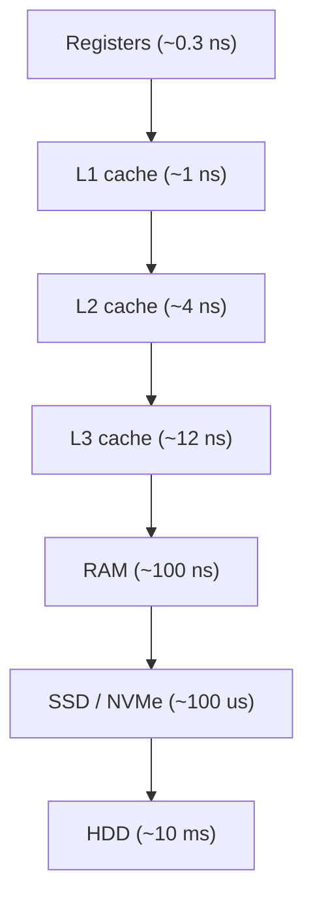

# Chapter 5.1 - Memory: the Stack, the Heap & Pointers

> Goal: stop treating memory as an infinite box. By the end you'll be able to draw a process's address space from memory, explain exactly what happens to the stack when a function is called, know what `malloc`/`free` really do, understand pointers in C well enough that Python's reference model stops being mysterious, and reason about why CPython needs both reference counting and a tracing GC. You'll also run a timing experiment that makes the memory hierarchy visible firsthand.

For most of a coding life, "memory" is a word you nod at: variables hold things, and the things stay put. That model works until a recursion blows the stack, or a "fast" loop runs 10x slower than its twin for no obvious reason, or you leak memory in a garbage-collected language and wonder how that's even possible. This chapter builds the real model, from the silicon up.

---

## Start here: the kitchen analogy

Before any of the technical stuff, here's a picture worth keeping in your head: a kitchen.

Imagine you're cooking. Your countertop is small, but everything on it is within arm's reach: that's the CPU's registers and L1 cache. Your pantry across the room holds far more, but you have to walk to it: that's RAM. The grocery store down the road holds essentially unlimited food, but a trip takes forever: that's the disk. Cooking fast and writing fast programs come down to the same rule: keep what you're using close, and don't make pointless trips to the store.

Now, two more kitchen ideas that map perfectly onto how a *program* uses memory:

- The **stack** is like a stack of plates by the sink. When a recipe calls a sub-recipe ("make the sauce"), you put a fresh plate on top with that sub-recipe's ingredients. When the sub-recipe finishes, you take its plate off and you're back to the recipe that called it. Plates go on and come off in strict last-on-first-off order, and the cleanup is automatic: finishing a sub-recipe clears its plate.
- The **heap** is like a big shared storage room where you can stash a pot of soup that needs to outlive the recipe that made it. You have to ask for shelf space ("give me room for a big pot"), and in a language like C you have to remember to clear that shelf later, or it stays occupied forever (a memory leak).

Why this matters: most confusing bugs and performance mysteries trace back to one of these three ideas: the hierarchy (why is this slow?), the stack (why did this recursion crash?), or the heap (why is memory growing forever?). Get the model right once and a whole class of future bugs becomes obvious. Everything below makes this kitchen picture precise.

---

## The memory hierarchy: why "memory" is a lie (it's a pyramid)

There isn't one memory. There's a hierarchy, built on a physics tradeoff: fast memory is small and expensive; big memory is slow and cheap. So computers stack layers, each one a cache for the slower layer below it.

Here are the rough latency numbers worth knowing. The absolute nanoseconds drift year to year, but the ratios are the point.

```text
            APPROX            "HUMAN SCALE"
LEVEL       LATENCY    SIZE   (if 1 cycle = 1 second)
──────────────────────────────────────────────────────────
Register    ~0.3 ns    ~KB    ~1 second        (instant)
L1 cache    ~1 ns      ~64KB  ~3 seconds
L2 cache    ~4 ns      ~512KB ~12 seconds
L3 cache    ~12 ns     ~32MB  ~40 seconds
RAM (DRAM)  ~100 ns    ~GBs   ~5 minutes
SSD (NVMe)  ~100 µs    ~TBs   ~4 days
HDD seek    ~10 ms     ~TBs   ~1 year
Network     ~1-100 ms  -      months to years
```

Here's the same pyramid as a flowchart, top (fastest/smallest) to bottom (slowest/biggest):



Look at the cliffs. RAM is ~100x slower than L1. The SSD is ~1000x slower than RAM. Disk is another ~100x past that. The CPU is so fast that, relative to it, reaching out to RAM is like getting up from your desk and walking to a different building to fetch one number.

This is why performance work is mostly about **locality**, not cleverness. Two kinds:

- **Temporal locality**: if you touch a byte, you'll probably touch it again soon. (Keep it in cache.)
- **Spatial locality**: if you touch a byte, you'll probably touch its neighbors soon. (Caches load whole **cache lines**, typically 64 bytes, not single bytes.)

When the CPU wants a byte, it doesn't fetch one byte. It fetches the entire 64-byte cache line that byte lives in. So if you march through an array element-by-element, after the first (slow) miss, the next ~15 ints are already sitting in L1, free. But if you jump randomly around memory, you pay a full cache miss almost every time. We'll measure exactly this at the end of the chapter.

---

## Cache lines, false sharing, and row- vs column-major (the locality deep dive)

The most useful unit in performance work is the cache line, usually 64 bytes. The CPU never reads or writes a single byte to RAM; it moves whole lines. Keep that in mind and a dozen mysteries dissolve.

```text
RAM, viewed as a grid of 64-byte cache lines:

 ┌──────── line 0 ────────┬──────── line 1 ────────┬──────── line 2 ────────┐
 │ b0 b1 b2 ... b62 b63   │ b64 ... b127           │ b128 ... b191          │
 └────────────────────────┴────────────────────────┴────────────────────────┘
   ↑ touch ANY byte in a line and the WHOLE 64-byte line is pulled into cache
```

A 64-byte line holds 16 `int32`s, or 8 `int64`/`double`s, or 8 pointers (on a 64-bit machine). So the first access to an array element is a slow miss that fetches the line; the next 15 ints (for `int32`) ride along for free. That's spatial locality made mechanical.

**Worked example, counting cache misses by hand.** Suppose you sum a contiguous array of one million `int32`s, line size 64 bytes:

```text
1,000,000 ints × 4 bytes = 4,000,000 bytes
4,000,000 bytes / 64 bytes per line = 62,500 lines

Sequential sum:  62,500 misses  (one per line; the other 15 ints per line are free)
Random   sum:    up to 1,000,000 misses  (worst case, a fresh line every access)

Ratio: ~16x more memory traffic for the random pattern - exactly the line size.
```

That factor of ~16 is not a coincidence; it's `line_size / element_size`. This is why "the same O(n) loop" can differ by an order of magnitude.

### False sharing: when two threads fight over one line

Here's a subtle one that bites real multithreaded code. Two threads each update *their own* counter, no shared variable, no race, no lock needed. Yet the program crawls, because the two counters happen to land in the same cache line.

```text
        cache line (64 bytes)
 ┌───────────────────────────────────────┐
 │ counterA (8B) │ counterB (8B) │ ...    │
 └───────────────────────────────────────┘
        ▲                ▲
     core 0           core 1
   writes A          writes B

Cache coherence protocol (MESI): when core 0 writes A, it must INVALIDATE
core 1's copy of the whole line. Core 1's next write to B then re-fetches
the line. They ping-pong the line back and forth - "false sharing."
Logically independent, physically contending.
```

The fix is **padding**: push each thread's data onto its own line (e.g., pad each counter struct to 64 bytes). In C you'd `_Alignas(64)`; in higher-level languages you space hot per-thread fields apart. The lesson generalizes: *independent data that's written by different cores should not share a cache line.*

### Row-major vs column-major: same work, different order, huge gap

A 2-D array is stored as one flat 1-D block. C, C++, NumPy (by default), and Python nested lists are **row-major**: an entire row sits contiguously, then the next row.

```text
matrix[2][4] stored row-major in memory:

 row 0          row 1
 ┌───────────┬───────────┐
 │ a b c d   │ e f g h   │   ← contiguous: a,b,c,d,e,f,g,h
 └───────────┴───────────┘

Traversing ROW-major order (i outer, j inner): a b c d e f g h
   → consecutive addresses → cache-line-friendly → fast

Traversing COLUMN-major order (j outer, i inner): a e b f c g d h
   → strides across rows → jumps row_length apart each step → cache-hostile → slow
```

For a big `N×N` matrix where one row no longer fits in cache, column-major traversal pays a near-miss on *every* element. We'll benchmark this directly below and you'll see 3-10x.

### Lab: feel cache lines and traversal order (run it)

```python
# cache_lab.py
import time

def bench(label, fn):
    t = time.perf_counter()
    out = fn()
    print(f"{label:<22} {time.perf_counter()-t:6.3f}s  (checksum {out})")

N = 2000                       # an N×N matrix of N*N ints
matrix = [[i + j for j in range(N)] for i in range(N)]

def row_major():               # i outer, j inner - walks each row left-to-right
    total = 0
    for i in range(N):
        row = matrix[i]
        for j in range(N):
            total += row[j]
    return total

def col_major():               # j outer, i inner - jumps between rows every step
    total = 0
    for j in range(N):
        for i in range(N):
            total += matrix[i][j]
    return total

print("=== ROW- vs COLUMN-MAJOR (same N*N adds, different order) ===")
bench("row-major (friendly)", row_major)
bench("col-major (hostile)",  col_major)
```

What you'll observe: identical arithmetic, but column-major runs noticeably slower because each `matrix[i][j]` with `i` changing fastest jumps a whole row's worth of memory per step. (Pure Python's interpreter overhead dampens it; the NumPy version below screams.)

```bash
# Run it and watch the gap:
python3 cache_lab.py

# Now the version where the effect is brutal - NumPy strips interpreter overhead:
python3 - <<'PY'
import numpy as np, time
N = 4000
A = np.ones((N, N), dtype=np.float64)        # row-major (C order) by default
def t(label, f):
    s = time.perf_counter(); f(); print(f"{label:<16}{time.perf_counter()-s:.3f}s")
t("row sums",  lambda: A.sum(axis=1))         # sum along rows  → contiguous → fast
t("col sums",  lambda: A.sum(axis=0))         # sum along cols  → strided   → slower
# Then transpose to Fortran order and watch the winner flip:
B = np.asfortranarray(A)
t("F row sums", lambda: B.sum(axis=1))
t("F col sums", lambda: B.sum(axis=0))
PY
```

The flip when you switch to Fortran (column-major) order settles it: fast isn't a property of "rows" or "columns," it's a property of walking memory in the order it's laid out.

On Linux you can count the cache misses directly with the `perf` tool:

```bash
# Compare cache-miss counts of two traversal orders (Linux; needs `perf`):
perf stat -e cache-misses,cache-references python3 cache_lab.py
# The column-major run reports dramatically more cache-misses than row-major.
```

---

## A process's address space: text, data, heap, stack

When the OS launches your program, it hands the process a **virtual address space**, its own private, illusory range of addresses from `0` up to some huge number (we'll see *how* this illusion works in the OS chapter; for now just accept that each process thinks it owns a clean linear range). That space is carved into regions:

```text
  HIGH addresses
  ┌───────────────────────────┐
  │  STACK                     │  ← grows DOWNWARD ↓
  │   - function call frames   │     (local vars, return addrs)
  │   - local variables        │
  ├───────────────────────────┤
  │             ↓              │
  │       (free space)         │  ← stack & heap grow toward each other
  │             ↑              │
  ├───────────────────────────┤
  │  HEAP                      │  ← grows UPWARD ↑
  │   - malloc'd memory        │     (dynamic allocation)
  ├───────────────────────────┤
  │  BSS                       │  uninitialized globals (zeroed)
  ├───────────────────────────┤
  │  DATA                      │  initialized globals/statics
  ├───────────────────────────┤
  │  TEXT (code)               │  the machine instructions (read-only)
  └───────────────────────────┘
  LOW addresses
```

- **Text**: the actual compiled instructions. Read-only and shareable (two copies of the same program can share one text segment in physical memory).
- **Data / BSS**: globals and statics. Data holds the ones with initial values; BSS holds the ones that start zeroed (it costs nothing in the file, the OS just zeroes a region at load time).
- **Heap**: the pool for *dynamic* allocation, things whose size or lifetime you don't know at compile time. Grows upward as you allocate.
- **Stack**: where function calls live. Grows downward. This is the star of the next section.

Notice that the stack and heap grow toward each other from opposite ends of the free space. In the bad old days, if they collided, you were in deep trouble. Today virtual memory and guard pages make the failure modes cleaner, but the mental image holds.

---

## The stack: stack frames and how calls push/pop

The **call stack** is a region of memory managed as a literal stack data structure (LIFO). Each function *call* gets a **stack frame** (a.k.a. *activation record*) pushed on top. A frame holds:

- the function's **local variables** and arguments,
- the **return address** (where to resume in the caller when this function finishes),
- saved registers and bookkeeping.

When the function returns, its frame is popped, reclaimed instantly by moving the stack pointer back up. That's why stack allocation is so fast: allocating a local variable is a single subtraction on the stack pointer. No searching, no bookkeeping, no fragmentation.

Let's trace it concretely. Say you have:

```python
def a():
    x = 1
    return b(x)      # a pauses here, waiting on b

def b(n):
    y = n + 1
    return c(y)      # b pauses here, waiting on c

def c(m):
    return m * 10    # base of the chain
```

When you call `a()`:

```text
Step 1: a() pushed          Step 2: b() pushed         Step 3: c() pushed
┌──────────────┐            ┌──────────────┐           ┌──────────────┐
│ a: x=1       │            │ b: n=1, y=2  │           │ c: m=2       │ ← running
│ return addr  │            ├──────────────┤           ├──────────────┤
└──────────────┘            │ a: x=1       │           │ b: n=1, y=2  │
                            │ return addr  │           ├──────────────┤
                            └──────────────┘           │ a: x=1       │
                                                       └──────────────┘
```

`c` computes `20`, returns; its frame pops; `b` wakes up, returns `20`; pops; `a` wakes up, returns `20`. The stack drains back to empty. The "return address" in each frame is the bookmark that makes "wake up and continue" possible.

So what is a stack overflow? The stack has a fixed maximum size (commonly ~1-8 MB per thread). Every call that hasn't returned yet keeps its frame on the stack. If you recurse too deep, or recurse with no base case, you keep pushing frames until you run past the end of the stack region into a **guard page**, and the OS kills you with a stack overflow / segfault. It's not that you "used too much memory" in general; it's that you used too much of one specific, small, fixed region. CPython adds its own software limit (`sys.getrecursionlimit()`, default ~1000) to turn that crash into a clean `RecursionError` before the real C stack blows.

```python
import sys
print(sys.getrecursionlimit())  # ~1000

def boom(n=0):
    return boom(n + 1)

try:
    boom()
except RecursionError as e:
    print("caught:", e)   # caught: maximum recursion depth exceeded
```

---

## The heap: dynamic allocation, malloc/free, fragmentation

The stack is great but rigid: a frame's memory dies when its function returns. What if you need memory that *outlives* the function that created it, or whose size you only learn at runtime? That's the **heap**.

On the heap, *you* (or your language's runtime) explicitly request a block of a given size, get back its address, and use it until you (or the GC) release it. In C this is `malloc` / `free`:

```c
int *arr = malloc(100 * sizeof(int));  // ask for room for 100 ints
// ... use arr[0..99] ...
free(arr);                              // give it back
```

Conceptually, the heap is managed by an **allocator**, a librarian sitting on a big region of memory, keeping a data structure of which chunks are free and which are in use (often free lists by size class). `malloc(n)` finds a free chunk ≥ n, marks it used, returns a pointer to it. `free(p)` marks that chunk free again and maybe merges it with adjacent free chunks (coalescing).

Because allocations and frees happen in *any* order (unlike the stack's strict LIFO), the heap suffers **fragmentation**:

- **External fragmentation**: free memory exists, but it's scattered in small non-contiguous gaps. You have 100 KB free total but can't satisfy a 50 KB request because no single gap is that big.
- **Internal fragmentation**: the allocator rounds your 33-byte request up to a 48-byte slot, wasting 15 bytes per allocation.

```text
After many malloc/free of mixed sizes:

[USED][free][USED][USED][free][free][USED][free]
       8KB              4KB  4KB        16KB
       └─ can't fit a 20KB request even though
          8+4+4+16 = 32KB is free, because the largest single chunk is only 16KB
```

The heap is flexible but costs you: allocation is slower than the stack (it has to *search*), and you pay for fragmentation and bookkeeping. A rule of thumb that serves well: prefer the stack; reach for the heap when you must (unknown size, or lifetime outliving the frame).

---

## Pointers in C, then mapped to Python's reference model

A **pointer** is a variable whose value is a memory address: that's the whole idea. If `x` lives at address `0x7ffe...10` and holds `42`, then a pointer `p` to `x` is a variable that *holds the number* `0x7ffe...10`.

```c
#include <stdio.h>
int main(void) {
    int x = 42;
    int *p = &x;     // & = "address of"  →  p now holds x's address
    printf("x      = %d\n", x);      // 42
    printf("&x     = %p\n", (void*)&x);  // some address
    printf("p      = %p\n", (void*)p);   // SAME address
    printf("*p     = %d\n", *p);     // 42   (* = "dereference": value AT that address)
    *p = 99;                         // write through the pointer
    printf("x      = %d\n", x);      // 99   ← we changed x without naming it!
    return 0;
}
```

Two operators do all the work:
- `&x`, "the address of x".
- `*p`, "the value at the address stored in p" (dereference).

That `*p = 99` changing `x` is the point of pointers: they let one piece of code modify memory that another piece of code owns.

Now Python. Python has no `&` or `*` and you never touch raw addresses, but the model underneath is the same idea wearing gloves. In Python, a variable is a name bound to an object, and the binding is effectively a pointer (a reference) to that object. Assignment doesn't copy the object; it copies the reference.


```python
a = [1, 2, 3]
b = a            # b doesn't copy the list - b points at the SAME list object
b.append(4)
print(a)         # [1, 2, 3, 4]   ← a sees it too; they're one object, two names

print(a is b)    # True   ← same object identity
print(id(a), id(b))  # identical ids (id() ≈ "the address")
```

`a is b` being `True`, and `id(a) == id(b)`, is Python admitting that `a` and `b` are two pointers to one object. **Aliasing**, two names for one mutable object, is exactly the C "modify through a pointer" behavior, just implicit.

The escape hatch is to *explicitly* copy:

```python
import copy
b = a.copy()              # shallow copy: new list, but SAME inner objects
b = copy.deepcopy(a)      # deep copy: recursively new objects all the way down
```

---

## Pass-by-value vs pass-by-reference vs Python's "pass by object reference"

This is where everyone gets confused at first, so let's be precise.

- **Pass-by-value** (C for scalars, by default): the function gets a *copy* of the argument. Mutating the parameter inside the function does not affect the caller's variable.

  ```c
  void f(int n) { n = 999; }   // changes the copy only
  int x = 5; f(x);             // x is still 5
  ```

- **Pass-by-reference** (C++ with `&`, or C by passing a pointer): the function gets access to the caller's actual variable and can change it.

  ```c
  void f(int *n) { *n = 999; } // writes through the pointer to the caller's int
  int x = 5; f(&x);            // x is now 999
  ```

- **Python: "pass by object reference"** (also called "call by sharing"). The function receives *a copy of the reference*, a new name bound to the *same object*. Consequences:
  - If you **mutate** the object (it's mutable, like a list/dict), the caller sees it, because both names point at the same object.
  - If you **rebind** the parameter name to a new object, the caller does *not* see it, you only changed the local name's binding, not the caller's.

  ```python
  def mutate(lst):
      lst.append(99)      # mutates the shared object → caller sees it

  def rebind(lst):
      lst = [0, 0, 0]     # rebinds local name → caller does NOT see it

  data = [1, 2, 3]
  mutate(data); print(data)   # [1, 2, 3, 99]
  rebind(data); print(data)   # [1, 2, 3, 99]  (unchanged by rebind)
  ```

The model that makes this click: Python always passes the reference by value. The reference (pointer) is copied; the object is not. Mutation reaches the shared object; reassignment just repoints your private copy of the arrow.

---

## Garbage collection: reference counting + tracing, and why CPython uses both

C makes you call `free` by hand. Forget, and you leak; free twice or free-then-use, and you corrupt memory (use-after-free, double-free, classic security bugs). Managed languages automate reclamation with a **garbage collector**.

**Strategy 1, Reference counting (CPython's primary mechanism).** Every object carries a counter of how many references point to it. Bindings adjust it: `+1` when a new reference is made, `−1` when one goes away. When the count hits 0, the object is unreachable and freed immediately.

```python
import sys
a = []
print(sys.getrefcount(a))   # e.g. 2 - note: getrefcount itself holds a temp ref, so it's always +1
b = a
print(sys.getrefcount(a))   # 3 (a, b, and the call's temp)
del b
print(sys.getrefcount(a))   # back to 2
```

Refcounting is wonderfully prompt (objects die the instant they're unreachable) and spreads its cost out. But it has a fatal blind spot: **reference cycles**.

```python
a = {}
b = {}
a['b'] = b      # a points to b
b['a'] = a      # b points to a  → a cycle
del a
del b           # the names are gone, but a and b still reference EACH OTHER
                # so neither refcount hits 0 → never freed by refcounting alone → LEAK
```

**Strategy 2, Tracing GC (CPython's cycle collector).** To plug that hole, CPython *also* runs a tracing garbage collector. Periodically it starts from known **roots** (globals, stack locals, etc.) and follows references to find everything *reachable*. Anything not reached, including those orphaned cycles, is garbage and gets collected. This is the `gc` module:

```python
import gc
gc.collect()          # force a cycle-collection pass; returns count of objects freed
print(gc.get_count()) # (gen0, gen1, gen2) allocation counters
```

CPython's tracing collector is **generational**: it groups objects into generations (0=young, 1, 2=old) on the *generational hypothesis*: most objects die young. So it scans gen 0 frequently and cheaply, promotes survivors to older generations, and scans old generations rarely. That keeps GC pauses small because most of the work is on the small, churny young set.

So the answer to "why both?": refcounting gives prompt, incremental cleanup for the common case (the vast majority of objects, which aren't in cycles), and the generational tracing GC exists to mop up the reference cycles that refcounting structurally cannot. They're complementary, not redundant.

**Memory leaks in GC'd languages.** A GC frees what's *unreachable*. It can't free what's still reachable but forgotten. So you still leak when you keep references alive by accident:
- A global cache/list/dict you keep appending to and never trimming.
- Registered callbacks/listeners you never unsubscribe.
- A closure that captures a big object and stays alive.
- Module-level state that accumulates forever.

GC kills *syntactic* leaks (forgot to free). It can't kill *logical* leaks (you're still holding on).

---

## GC deep dive: cycles, weakref, and the __slots__ memory win

The cycle problem deserves more than a one-liner, because it's where refcounting and tracing GC *split responsibilities*, and where the `weakref` module earns its keep.

### Anatomy of a cycle, drawn

```text
   Refcounting's view of  a ⇄ b  after `del a; del b`:

   ┌─────────┐  partner   ┌─────────┐
   │ Node A  │ ─────────► │ Node B  │
   │ refcnt 1│ ◄───────── │ refcnt 1│
   └─────────┘  partner   └─────────┘
        ▲                      ▲
        └── the names a,b are gone, but each object still holds ONE ref
            to the other → neither count reaches 0 → refcounting is stuck.

   The tracing collector's view:
        roots (globals, stack locals) ──X──►  (no path reaches A or B)
        → A and B are UNREACHABLE → garbage → collected.
```

So refcounting asks "does *anything* point at you?" (yes, your cycle partner does), while the tracing collector asks the better question "are you reachable from a **root**?" (no). That's why the cycle collector can free what refcounting cannot.

### weakref: a reference that doesn't keep the object alive

A **weak reference** points at an object *without* incrementing its refcount. The instant the last *strong* reference goes away, the object dies and the weakref goes "dead" (returns `None`). This is the standard tool for:

- Caches that mustn't prevent collection (`weakref.WeakValueDictionary`, entries vanish when the value is no longer used elsewhere).
- Back-pointers that would otherwise form cycles (child → parent, observer → subject): make the back-pointer weak so it can't keep the parent alive.

```python
import weakref

class Node:
    __slots__ = ("name", "_parent", "__weakref__")   # __weakref__ slot is required to allow weak refs (more on __slots__ next)
    def __init__(self, name): self.name = name; self._parent = None

parent = Node("root")
child  = Node("leaf")
child._parent = weakref.ref(parent)           # WEAK back-pointer (no cycle, no refcount bump)

print(child._parent())                          # <__main__.Node object at 0x...> - deref the weakref
del parent
print(child._parent())                          # None - parent was freed promptly; no cycle, no GC needed
```

Replacing strong back-pointers with weak ones means a *tree* of objects collapses the instant its root is dropped, no waiting for the cycle collector. That promptness matters in long-running services.


### `__slots__`: measure the memory savings

By default every Python instance carries a `__dict__`, a per-instance hash table mapping attribute names to values. Flexible, but heavy: a dict has real overhead, and you pay it *per object*. Declaring `__slots__` tells CPython "these are the only attributes," so it stores them in a compact fixed array instead of a dict, no per-instance `__dict__` at all.

```python
# slots_lab.py - measure the saving for real
import tracemalloc

class WithDict:                  # the default: each instance has a __dict__
    def __init__(self, x, y, z): self.x, self.y, self.z = x, y, z

class WithSlots:
    __slots__ = ("x", "y", "z")  # no __dict__; attributes live in a packed array
    def __init__(self, x, y, z): self.x, self.y, self.z = x, y, z

def make(cls, n):
    return [cls(i, i, i) for i in range(n)]

N = 1_000_000
for cls in (WithDict, WithSlots):
    tracemalloc.start()
    objs = make(cls, N)
    cur, peak = tracemalloc.get_traced_memory()
    tracemalloc.stop()
    print(f"{cls.__name__:<10} current={cur/1e6:7.1f} MB  for {N:,} objects "
          f"(~{cur/N:.0f} bytes each)")
    del objs
```

```bash
python3 slots_lab.py
# Typical result: WithSlots uses roughly HALF the memory of WithDict -
# often ~50-60 bytes/object vs ~150+ bytes/object. At a million objects
# that's tens of megabytes saved, for free, by one line.
```

The takeaway: `__slots__` is the cheapest big memory win in Python for code that creates *many* small, fixed-shape objects (graph nodes, records, points). Trade-offs: you lose dynamic attribute assignment and (naively) `__weakref__` support; add `"__weakref__"` to the slots tuple if you also need weak references to instances. The cycle-collector cost also drops, because slotted objects with no container attributes may not even need GC tracking.

---

## Lab: reading a memory profile (tracemalloc + memory_profiler)

Knowing the theory is half of it; the professional skill is *reading a profile* to find where memory actually goes. Two standard-library-friendly tools.

**`tracemalloc`, built in, snapshot-and-diff.** This is the one to reach for first because it ships with Python.

```python
# profile_lab.py
import tracemalloc

def build_records(n):
    # a deliberately wasteful representation: a list of dicts
    return [{"id": i, "name": f"user_{i}", "scores": [i] * 10} for i in range(n)]

tracemalloc.start(25)                      # keep up to 25 frames per traceback
snap_before = tracemalloc.take_snapshot()

data = build_records(200_000)              # do the work we want to measure

snap_after = tracemalloc.take_snapshot()
stats = snap_after.compare_to(snap_before, "lineno")   # what GREW between snapshots
print("=== TOP MEMORY GROWTH BY LINE ===")
for stat in stats[:5]:
    print(stat)                            # file:line  size diff  count diff

# Drill into the single biggest allocation site, with full traceback:
top = stats[0]
print("\n=== TRACEBACK OF THE BIGGEST GROWER ===")
for line in top.traceback.format():
    print(line)

cur, peak = tracemalloc.get_traced_memory()
print(f"\ncurrent={cur/1e6:.1f} MB  peak={peak/1e6:.1f} MB")
tracemalloc.stop()
```

```bash
python3 profile_lab.py
# Reading the output:
#  - The FIRST line of the "top growth" list is your hottest allocation site.
#  - "size diff" is how many bytes that line added between the two snapshots.
#  - "count diff" is how many new objects - a huge count of tiny objects often
#    means "use a more compact representation" (a class with __slots__, a tuple,
#    an array, or NumPy) instead of a dict per record.
```

**`memory_profiler`, line-by-line RSS, decorator-driven.** Great for "which line in this function grows resident memory?"

```bash
pip install memory_profiler
```

```python
# mp_lab.py  - run with:  python3 -m memory_profiler mp_lab.py
from memory_profiler import profile

@profile
def main():
    a = [0] * 1_000_000          # ~8 MB list of ints (small-int cache → shared int objects)
    b = [i for i in range(1_000_000)]   # distinct ints → bigger
    c = b * 3                    # triples it
    del b
    return len(a) + len(c)

if __name__ == "__main__":
    main()
```

```bash
python3 -m memory_profiler mp_lab.py
# Output is a per-line table:
#   Line #    Mem usage    Increment   Line Contents
#   The "Increment" column tells you exactly which line added the most memory.
# You'll SEE the `del b` line return memory, and the `c = b * 3` line spike it.
```

The workflow this trains (snapshot, do work, snapshot again, diff, read the top line, drill into the traceback) is exactly how you localize a leak or a memory hog in a real codebase. It's the same muscle as profiling CPU, just for bytes.

---

## Common mistakes

These are the memory traps that bite nearly everyone at some point. Reading them is cheaper than debugging them.

- **Confusing `is` with `==`.** `is` compares *identity* (same object in memory); `==` compares *value*. `a == b` can be `True` while `a is b` is `False`. The small-int cache (`-5..256`) makes `is` *accidentally* work for small numbers, then mysteriously break at 257. Rule: use `is` only for `None` (`x is None`) and other singletons; use `==` for everything else.
- **Mutable default arguments.** `def f(x, acc=[]):` creates the list *once*, at definition time, and reuses it across calls, so it accumulates garbage between calls. The fix is `def f(x, acc=None): acc = acc or []`. This is the #1 Python gotcha and it's pure aliasing.
- **Thinking assignment copies.** `b = a` for a list/dict does not copy; it makes a second name for the same object. Mutating through `b` shows up in `a`. Reach for `.copy()` (shallow) or `copy.deepcopy()` (deep) when you actually want a copy.
- **Trusting `sys.getsizeof` for containers.** It's *shallow*, it measures the container's own bookkeeping, not what it points at. A list of a million big strings reports about the same size as a list of a million tiny ints.
- **Assuming a GC'd language can't leak.** It can, any reachable-but-forgotten reference (a growing global cache, an un-removed listener) is a leak the GC will never touch.
- **In C: use-after-free, double-free, and forgetting `free`.** `free(p)` doesn't change `p`; it still holds the (now-dangling) address. Set `p = NULL` after freeing so a later mistaken dereference crashes loudly instead of silently corrupting memory.
- **Off-by-one on the heap.** `malloc(n * sizeof(int))` for `n` ints, not `malloc(n)`. Allocating `n` bytes when you need `n` ints is a classic buffer overflow.

---

## On the job / interview angle

Memory questions show up constantly, both in interviews and in real debugging.

- **"What's the difference between the stack and the heap?"** is a near-guaranteed interview question. The crisp answer: the stack is automatic, LIFO, fast (a pointer bump), per-thread and small, holds locals/call frames, and is reclaimed on return; the heap is manually/GC-managed, can be allocated/freed in any order, slower (the allocator has to search), large, and holds things that outlive their creating function. Mention fragmentation and stack-overflow-vs-out-of-memory and you've nailed it.
- **"Explain pass-by-value vs pass-by-reference in Python."** Interviewers love this because most candidates fumble it. The clean answer is "Python passes the reference *by value*" plus the mutate-vs-rebind distinction. If you can show the two-function example from memory, you're ahead of most.
- **"Why is iterating an array faster than a linked list even though both are O(n)?"** Cache locality. This is a favorite because it tests whether you understand that big-O hides constant factors that the memory hierarchy makes enormous.
- **On the job:** memory leaks in long-running services (web servers, daemons) are a real and recurring incident type. The skills here, spotting an unbounded cache, reading `getrefcount`/`gc` output, reasoning about what's still reachable, are exactly what you reach for when a service's memory creeps up over days. Tools like `tracemalloc` (Python) and `valgrind` (C) are the professional versions of the experiments below.

- **Performance reviews** of code ("why is this slow?") very often come down to allocation churn (too many short-lived heap objects) or poor locality. Being the person who can say "we're cache-thrashing here" is valuable.

**Real questions with model answers** (practice saying these out loud):

- **Q: "Walk me through what happens, memory-wise, when a Python function is called and returns."**
  *Model answer:* "A new stack frame is pushed for the call, that frame holds the local variables (which are references to objects on the heap), the arguments, and a return pointer back into the caller. The objects themselves live on the heap; the frame just holds references to them. When the function returns, the frame is popped instantly by moving the stack pointer, and each reference the frame held is dropped, decrementing those objects' refcounts. Any object whose count hits zero is freed immediately. So the *frame's* memory is reclaimed on the stack automatically and in LIFO order, while the *objects* are reclaimed on the heap by refcounting whenever their last reference disappears."

- **Q: "Why might a `list` of a million objects use far more memory than a NumPy array of a million numbers?"**
  *Model answer:* "A Python list stores a contiguous array of *pointers* (8 bytes each), and each pointer points at a separate boxed Python object, an `int` is ~28 bytes, with its own header and refcount. So a million ints is ~8 MB of pointers *plus* ~28 MB of objects (minus sharing of small ints). A NumPy `int64` array stores the raw 8-byte values back-to-back, ~8 MB total, no per-element object overhead, and it's contiguous so it's cache-friendly. The list pays object overhead and indirection; the array is just bytes."

- **Q: "A long-running service's memory grows ~50 MB/hour and never comes back down. How do you find the leak?"**
  *Model answer:* "First confirm it's a *logical* leak, not fragmentation, by checking it's monotonic. Then `tracemalloc.start()` early, take a snapshot, let it run under load, take another, and `compare_to` the first by line number; the top entries are the allocation sites that grew. I drill into the biggest one's traceback. The usual culprits are an unbounded cache/list, un-removed event listeners, or accumulating module-level state. The fix is bounding the cache (LRU) or removing the retained reference, and I verify by re-running the snapshot diff and watching the growth flatten."

- **Q: "When would you use `__slots__`?"**
  *Model answer:* "When I'm creating *many* instances of a small, fixed-shape class, graph nodes, geometry points, record objects. `__slots__` drops the per-instance `__dict__` and stores attributes in a packed array, roughly halving per-object memory and speeding attribute access. The cost is losing dynamic attributes and, by default, weakref support, which I add back by listing `__weakref__` in the slots if needed."

---

## Build it: pointer arithmetic in C, then Python `id()`/aliasing & `sys.getsizeof`

First, C pointer arithmetic, the thing that makes arrays and pointers feel like the same animal.

```c
// pointers.c  -  compile: gcc -o pointers pointers.c   run: ./pointers
#include <stdio.h>

int main(void) {
    int nums[5] = {10, 20, 30, 40, 50};
    int *p = nums;                 // array name decays to pointer to first element

    printf("p     -> %d (at %p)\n", *p,     (void*)p);       // 10
    printf("p+1   -> %d (at %p)\n", *(p+1), (void*)(p+1));   // 20
    printf("p+2   -> %d (at %p)\n", *(p+2), (void*)(p+2));   // 30

    // KEY INSIGHT: p+1 does NOT add 1 byte. It adds 1 *element* = sizeof(int) bytes.
    printf("address gap = %ld bytes (== sizeof(int) = %zu)\n",
           (char*)(p+1) - (char*)p, sizeof(int));

    // nums[i] is literally *(nums + i). These two lines are identical:
    printf("nums[3] = %d, *(nums+3) = %d\n", nums[3], *(nums + 3));
    return 0;
}
```

The key fact: `arr[i]` is *defined* as `*(arr + i)`. Indexing is pointer arithmetic with sugar. And `p + 1` advances by `sizeof(int)` bytes, not 1 byte: the compiler scales by the element size. This is why spatial locality in arrays is automatic: consecutive elements are at consecutive addresses.

Now Python's mirror world. No raw addresses, but `id()`, `is`, and `sys.getsizeof` let you peek at the object model.

```python
import sys

# --- Aliasing and identity ---
x = [1, 2, 3]
y = x
z = list(x)            # a real copy
print(x is y, x is z)  # True False   (y aliases x; z is a separate object)
print(id(x) == id(y))  # True

# --- The small-int / interning surprise ---
a = 256; b = 256
print(a is b)          # True  - CPython pre-caches small ints (-5..256)
a = 257; b = 257
print(a is b)          # often False - outside the cached range, separate objects
# (lesson: use == for value equality, is only for identity/None checks)

# --- Object sizes ---
print(sys.getsizeof(0))        # 24 bytes - a Python int is a fat object, not 4 bytes! (nonzero small ints report 28)
print(sys.getsizeof(1 << 100)) # bigger - Python ints are arbitrary precision
print(sys.getsizeof([]))       # ~56 - empty list overhead
print(sys.getsizeof([1,2,3]))  # bigger; but note getsizeof is SHALLOW...
```

**Important `getsizeof` gotcha:** it's *shallow*. `sys.getsizeof([a, b, c])` counts the list's own array of pointers, not the objects those pointers reference. A list of three huge strings reports nearly the same size as a list of three small ints, because it's measuring the container, not the contents. To get true deep size you have to recurse and de-duplicate by `id()`:

```python
def deep_size(obj, seen=None):
    seen = seen or set()
    if id(obj) in seen:        # avoid double-counting shared/cyclic refs
        return 0
    seen.add(id(obj))
    size = sys.getsizeof(obj)
    if isinstance(obj, dict):
        size += sum(deep_size(k, seen) + deep_size(v, seen) for k, v in obj.items())
    elif isinstance(obj, (list, tuple, set, frozenset)):
        size += sum(deep_size(i, seen) for i in obj)
    return size

print(deep_size([1, "hello", [2, 3], {"k": "v"}]))
```

---

## Mini-project: visualize a recursive call stack + measure cache-friendly vs cache-unfriendly traversal

Two experiments in one script. Part A makes the call stack *visible*. Part B makes the memory hierarchy *measurable*.

```python
# memory_lab.py
import sys, time, random

# ============================================================
# PART A - Visualize the call stack of a recursive function
# ============================================================
def visualize_factorial(n, depth=0):
    indent = "  " * depth
    print(f"{indent}→ call factorial({n})   [stack depth {depth}]")
    if n <= 1:
        print(f"{indent}  base case: return 1")
        return 1
    result = n * visualize_factorial(n - 1, depth + 1)
    print(f"{indent}← return {n} * factorial({n-1}) = {result}   [unwinding depth {depth}]")
    return result

print("=== CALL STACK TRACE: factorial(5) ===")
visualize_factorial(5)
print()

# Watch the live stack depth using sys._getframe (counts frames to the root)
def stack_depth():
    d, f = 0, sys._getframe()
    while f:
        d += 1; f = f.f_back
    return d

def countdown(n):
    if n == 0:
        print(f"   bottom reached at live stack depth = {stack_depth()}")
        return
    countdown(n - 1)

print("=== LIVE STACK DEPTH GROWS WITH RECURSION ===")
for n in (1, 5, 20):
    print(f"countdown({n}):", end=" ")
    countdown(n)
print()

# ============================================================
# PART B - Cache-friendly vs cache-unfriendly traversal
# ============================================================
# Same number of memory reads, same total data. Only the ACCESS PATTERN differs.
N = 4_000_000
data = list(range(N))

# Sequential: spatial locality - each cache line is fully used before moving on.
start = time.perf_counter()
total = 0
for i in range(N):
    total += data[i]
seq = time.perf_counter() - start

# Random: cache-hostile - every access likely a cache miss, jumping all over RAM.
indices = list(range(N))
random.shuffle(indices)
start = time.perf_counter()
total2 = 0
for i in indices:
    total2 += data[i]
rand = time.perf_counter() - start

print("=== CACHE LOCALITY TIMING ===")
print(f"sequential access: {seq:.3f}s")
print(f"random access:     {rand:.3f}s")
print(f"random is {rand/seq:.1f}x SLOWER - same data, just a worse access pattern")
```

What to expect: random access runs several times slower than sequential despite reading the exact same number of integers. (Python's interpreter overhead masks some of the effect; in C or NumPy the gap is more dramatic. To see it clearly, repeat Part B with a NumPy array and `arr[indices].sum()` vs `arr.sum()`.) The lesson is design-shaping: how you walk memory can matter more than how much work you do. This is why arrays beat linked lists in practice, why column-vs-row matrix traversal order changes timings, and why "big-O equal" algorithms can differ 10x in wall-clock.

---

## Mini-project: a leak detector and a refcount/cycle observatory

This one makes garbage collection *visible*. We'll build a tiny harness that (a) deliberately leaks via a reference cycle and shows the cycle collector catching it, and (b) watches refcounts rise and fall in real time. It uses only the standard library (`gc`, `sys`, `tracemalloc`).

```python
# gc_observatory.py
import gc, sys, tracemalloc, weakref

# ============================================================
# PART A - A reference cycle that refcounting alone can't free
# ============================================================
class Node:
    def __init__(self, name):
        self.name = name
        self.partner = None
    def __repr__(self):
        return f"Node({self.name})"

def make_cycle():
    a, b = Node("A"), Node("B")
    a.partner = b
    b.partner = a            # a <-> b cycle
    # Track whether they ever get collected using a weakref (doesn't keep them alive).
    return weakref.ref(a), weakref.ref(b)

gc.disable()                 # turn OFF the cycle collector so we can see the leak
ref_a, ref_b = make_cycle()  # the strong names a, b go away when make_cycle returns
print("=== CYCLE, GC DISABLED ===")
print("alive after function returns?", ref_a() is not None, ref_b() is not None)
# True True - refcounting couldn't free them: they reference each other → LEAK

gc.enable()
freed = gc.collect()         # run the cycle collector by hand
print("objects freed by gc.collect():", freed)
print("alive now?", ref_a() is not None, ref_b() is not None)  # False False - collected!

# ============================================================
# PART B - Watch a refcount rise and fall
# ============================================================
print("\n=== REFCOUNT LIFECYCLE ===")
obj = ["payload"]
print("refs:", sys.getrefcount(obj) - 1)   # subtract 1 for getrefcount's own temp ref
alias = obj
print("after alias:", sys.getrefcount(obj) - 1)
container = [obj, obj]                       # two more references
print("after container holds it twice:", sys.getrefcount(obj) - 1)
del alias, container
print("after deleting them:", sys.getrefcount(obj) - 1)

# ============================================================
# PART C - Catch a real "logical leak" with tracemalloc
# ============================================================
print("\n=== TRACEMALLOC LEAK HUNT ===")
CACHE = []                                   # an unbounded global cache = classic leak
def leaky(n):
    CACHE.append("x" * n)                     # never trimmed → grows forever

tracemalloc.start()
snap1 = tracemalloc.take_snapshot()
for _ in range(1000):
    leaky(1000)
snap2 = tracemalloc.take_snapshot()
top = snap2.compare_to(snap1, "lineno")[0]   # biggest growth between snapshots
print("biggest allocation growth:", top)
tracemalloc.stop()
```

What you learn by running it: Part A demonstrates that refcounting can't break cycles and that the tracing collector exists for exactly that case. Part B lets you watch the counter the runtime maintains for every object. Part C is the professional move: `tracemalloc` snapshots are how you find a leak in a real codebase: take a snapshot, do work, take another, diff them, and look at what grew.

**Extension:** turn `CACHE` into a bounded LRU (`functools.lru_cache` or a `collections.OrderedDict` capped at N) and re-run Part C, the growth should flatten, proving the fix.

---

## Mini-project: a memory-aware data-structure showdown

This project makes the cost of *representation choice* concrete. The same 500,000 "points" stored five ways, and you measure each. This is the decision you make constantly in real code ("dict? class? slots? tuple? array?"), so let's see the numbers instead of guessing.

```python
# representation_showdown.py
import sys, tracemalloc, array

N = 500_000

class PointDict:                          # 1) a normal class (has __dict__)
    def __init__(self, x, y): self.x, self.y = x, y

class PointSlots:                         # 2) a slotted class (no __dict__)
    __slots__ = ("x", "y")
    def __init__(self, x, y): self.x, self.y = x, y

def measure(label, build):
    tracemalloc.start()
    data = build()
    cur, _ = tracemalloc.get_traced_memory()
    tracemalloc.stop()
    print(f"{label:<28} {cur/1e6:7.2f} MB   (~{cur/N:.0f} bytes/point)")
    del data

print(f"=== {N:,} points, five representations ===")
measure("list of dicts",        lambda: [{"x": i, "y": i} for i in range(N)])
measure("list of PointDict",    lambda: [PointDict(i, i) for i in range(N)])
measure("list of PointSlots",   lambda: [PointSlots(i, i) for i in range(N)])
measure("list of (x, y) tuples",lambda: [(i, i) for i in range(N)])
measure("two array('i') columns",
        lambda: (array.array("i", range(N)), array.array("i", range(N))))
```

```bash
python3 representation_showdown.py
```

What the ranking teaches (typical order, smallest to largest): two `array` columns (raw ints, no per-element object) ≪ tuples ≈ slots ≪ PointDict ≪ list of dicts (a whole hash table per point). The gap between the dict-per-point and the columnar `array` is often 10x or more. This is the reasoning behind columnar databases, pandas/NumPy DataFrames, and "struct of arrays vs array of structs": grouping like fields into contiguous typed arrays slashes both memory and cache misses.

**Extension:** add a NumPy structured array (`np.zeros(N, dtype=[('x','i4'),('y','i4')])`) and a `__slots__ + __weakref__` variant; then time a full traversal of each and watch the columnar layouts win on *speed* too, for the cache-locality reasons from earlier in the chapter.

---

## Exercises

Work these in order; they climb from warm-up to quite tricky. Try each before peeking at the solutions.

1. **(Easy)** Without running it, predict the output, then verify:
   ```python
   a = [1, 2, 3]
   b = a
   b.append(4)
   print(a)
   ```
2. **(Easy)** Explain in one sentence why `sys.getsizeof([1,2,3])` and `sys.getsizeof(["a"*1000, "b"*1000, "c"*1000])` report nearly the same number.
3. **(Easy)** What does `p + 1` advance by in C if `p` is an `int*`? What if it's a `char*`? Why?
4. **(Medium)** Predict the output of this mutate-vs-rebind pair and explain each:
   ```python
   def f(x): x.append(99)
   def g(x): x = [0]
   d = [1]; f(d); g(d); print(d)
   ```
5. **(Medium)** Why does this recurse forever in C terms (what region fills up), and what's CPython's softer version of the failure?
   ```python
   def r(n): return r(n+1)
   ```
6. **(Medium)** Given `a = 256; b = 256` prints `a is b` → `True`, but `a = 257; b = 257` often prints `False`, explain the mechanism and why you should never rely on either.
7. **(Hard)** Create a reference cycle of three dicts (`x → y → z → x`), delete all the names, and write the code that proves (a) refcounting alone leaks them and (b) `gc.collect()` reclaims them.
8. **(Hard)** A coworker says "we use Python, so we can't have memory leaks." Give two concrete code patterns that leak in CPython despite the GC, and explain why the GC is *correct* not to free them.
9. **(Hard)** Write `deep_size(obj)` (you can reuse the chapter's) and use it to show that two lists with identical `sys.getsizeof` can have wildly different true sizes.
10. **(Hard)** Estimate, by hand, how many cache-line fetches it takes to sum a contiguous array of 8,000,000 `int32`s sequentially vs in fully random order. Assume a 64-byte line. Then say what factor separates them and why.
11. **(Hard)** Measure the memory difference between a `__slots__` class and a plain class for 1,000,000 instances, then explain *mechanically* where the saving comes from. What two capabilities do you give up?
12. **(Stretch)** Predict, then measure, the ratio between summing a 10-million-int list sequentially vs in shuffled order. Then redo it with a NumPy array and explain why the ratio changes. Bonus: use `tracemalloc` to confirm both lists occupy the same memory (the access *pattern*, not the size, drives the timing gap).

### Solutions

1. **`[1, 2, 3, 4]`.** `b = a` aliases; there's one list, two names. `b.append` mutates the shared object, so `a` sees it.

2. Because `getsizeof` is **shallow**: it counts the list object's internal array of three *pointers* (plus header), not the string objects those pointers reference. Both lists hold three pointers, so both report nearly the same size.

3. `int* + 1` advances by `sizeof(int)` (typically 4 bytes); `char* + 1` advances by 1 byte. Pointer arithmetic is scaled by the *element type's* size, `p + i` means "the i-th element," computed as `(char*)p + i*sizeof(*p)`. This is exactly why `arr[i]` ≡ `*(arr + i)` works.

4. **`[1, 99]`.** `f` *mutates* the shared list (caller sees the `99`). `g` *rebinds* its local parameter `x` to a brand-new `[0]`, which only changes `g`'s private name binding, the caller's list is untouched. Mutate reaches through the shared reference; rebind doesn't.

5. Each call pushes a stack frame that never returns (no base case), so frames pile up until the **call stack** region is exhausted, that's a stack overflow in C. CPython installs a software recursion limit (`sys.getrecursionlimit()`, ~1000) and raises `RecursionError` *before* the real C stack blows, turning a hard crash into a catchable exception.

6. CPython **pre-allocates and caches** the small integers `-5..256` as singletons, so any `256` literal reuses the one cached object → same identity → `is` is `True`. `257` is outside the cache, so each literal builds a separate object → different identity → `is` is often `False` (it can vary by how the code is compiled/peephole-optimized, which is precisely why it's unreliable). Always use `==` for value comparison.

7.
   ```python
   import gc, weakref
   def make():
       x, y, z = {}, {}, {}
       x['n'], y['n'], z['n'] = y, z, x      # x→y→z→x
       return weakref.ref(x), weakref.ref(y), weakref.ref(z)
   gc.disable()
   rx, ry, rz = make()
   print("leaked (alive)?", all(r() is not None for r in (rx, ry, rz)))  # True - refcount can't free the cycle
   gc.enable(); gc.collect()
   print("after gc.collect alive?", any(r() is not None for r in (rx, ry, rz)))  # False - reclaimed
   ```
   With weakrefs we observe liveness without keeping the objects alive. Disabled GC + a cycle = leak; enabling and collecting reclaims it.

8. Two patterns: **(a)** a module-level `CACHE = []` (or dict) you append to forever and never trim, every entry stays *reachable* from a global root. **(b)** registering callbacks/observers (`signal.connect(handler)`, event listeners) and never unregistering, the registry holds a live reference to each handler (and anything it closes over). The GC is *correct*: its only job is to free **unreachable** objects, and in both cases the objects are still reachable from a root, so freeing them would be a use-after-free. These are *logical* leaks (you're still holding on), not GC failures.

9.
   ```python
   import sys
   def deep_size(obj, seen=None):
       seen = seen or set()
       if id(obj) in seen: return 0
       seen.add(id(obj))
       s = sys.getsizeof(obj)
       if isinstance(obj, dict):
           s += sum(deep_size(k, seen)+deep_size(v, seen) for k,v in obj.items())
       elif isinstance(obj, (list, tuple, set, frozenset)):
           s += sum(deep_size(i, seen) for i in obj)
       return s
   small = [1, 2, 3]
   big   = ["x"*100000, "y"*100000, "z"*100000]
   print(sys.getsizeof(small), sys.getsizeof(big))   # nearly equal (shallow)
   print(deep_size(small), deep_size(big))            # wildly different (deep)
   ```
   The shallow sizes match (three pointers each); the deep sizes diverge because `deep_size` follows the pointers into the giant strings.

10. 8,000,000 ints × 4 bytes = 32,000,000 bytes. A 64-byte line holds 16 ints, so **sequential** sum fetches `32,000,000 / 64 = 500,000` lines, one miss per line, the other 15 ints free. **Random** order, in the worst case, touches a brand-new line on nearly every access, up to **8,000,000** fetches. The separating factor is `line_size / element_size = 64 / 4 = 16×` more memory traffic for the random pattern. That factor is exactly why "two O(n) loops" can differ by an order of magnitude: big-O counts operations, not cache-line fetches.

11. Run the chapter's `slots_lab.py`: the slotted class typically uses ~half the memory (often ~50-60 bytes/object vs ~150+). **Mechanically:** a normal instance carries a per-instance `__dict__`, a full hash table (with its own header, load-factor slack, and key/value entries), to hold attributes. `__slots__` replaces that with a fixed-size array of attribute *slots* laid out directly in the object, so there's no dict object, no hashing, and no slack. You give up **(a)** dynamic attribute assignment (you can only set the declared names) and **(b)** by default, weak-reference support and a `__dict__` (add `"__weakref__"` / `"__dict__"` to the slots tuple to restore either).

12. Prediction: shuffled is typically **2-5x slower** in pure Python (interpreter overhead dampens it). With NumPy (`arr.sum()` vs `arr[idx].sum()`) the gap usually *widens* because NumPy strips away the per-element interpreter overhead, so the cache-miss cost dominates the measurement instead of being hidden behind Python's own slowness. The `tracemalloc` bonus confirms both lists are byte-for-byte the same size (same objects, same pointers), only the *order you visit them in* differs, proving the timing gap is purely the memory hierarchy, not allocation. The lesson: the memory effect is always there; how visible it is depends on how much *other* overhead is masking it.

---

## Teach it back

1. **Why is a cache miss to RAM such a big deal, in CPU terms?** Because RAM is ~100x slower than L1 cache and the CPU stalls while waiting. On the "1 cycle = 1 second" scale, an L1 hit is ~3 seconds while a RAM fetch is ~5 minutes. So a code path full of cache misses spends most of its time *waiting*, not computing, which is why locality (spatial + temporal) often dominates raw operation count.

2. **Draw the four main regions of a process's address space and say what each holds.** From high to low: **stack** (call frames/locals, grows down) → free space → **heap** (dynamic allocation, grows up) → **BSS** (zeroed globals) → **data** (initialized globals) → **text** (read-only code). Stack and heap grow toward each other through the shared free region.

3. **What *is* a stack overflow, mechanically?** The stack is a small fixed-size region. Each un-returned call keeps a frame on it. Recursing too deep (or with no base case) pushes frames past the end of the region into a guard page, and the OS kills the process. CPython adds a software recursion limit (~1000) so you get a clean `RecursionError` first.

4. **Explain Python's "pass by object reference" using the mutate-vs-rebind distinction.** Python copies the *reference* (pointer), not the object. So **mutating** the passed object (`lst.append(...)`) reaches the shared object and the caller sees it; **rebinding** the parameter name (`lst = [...]`) only repoints the local copy of the arrow, so the caller doesn't see it. Slogan: *the reference is passed by value.*

5. **Why does CPython need both reference counting and a tracing GC?** Refcounting frees objects promptly when their count hits 0, which handles the common case cheaply and incrementally, but it *cannot* reclaim reference cycles (objects that point at each other keep each other's counts above 0). The generational tracing collector exists specifically to find and free those unreachable cycles, exploiting that most objects die young to keep pauses small.

6. **Can you leak memory in a garbage-collected language? Give an example.** Yes. The GC only frees what's *unreachable*; it can't free what you still (accidentally) hold a reference to. Classic leaks: an ever-growing global cache/list, never-unsubscribed event listeners, or a long-lived closure capturing a big object. These are *logical* leaks, the memory is still reachable, so the GC correctly leaves it alone.
