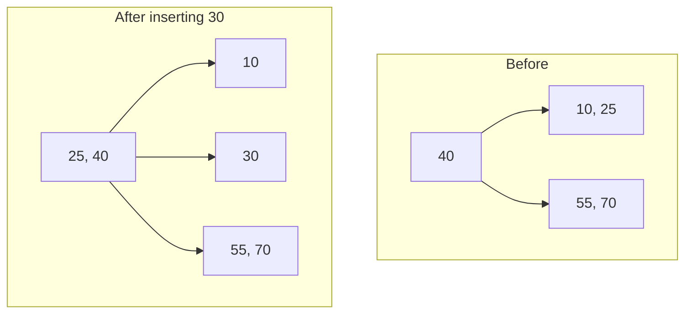

# Chapter 7.2 - Schema Design, Indexing & Transactions

> Goal: Learn to design schemas that don't rot (normalization), make them fast (indexes whose internals you actually understand), and keep them correct under concurrency (ACID, isolation levels, MVCC). By the end you should be able to take a slow query, read its `EXPLAIN`, and fix it on purpose, not by sprinkling indexes and praying.

Chapter 7.1 was about *expressing* what you want. This one is about the engineering: how to shape tables so updates don't create contradictions, how a B-tree turns a full table scan into a logarithmic hop, and what actually happens when two NYX users hit `UPDATE accounts` at the same instant. This is the chapter that separates "I can write SQL" from "I can run a database."

---

## Start here

Before we touch a single `CREATE INDEX`, let's get the two big ideas in plain language, because everything else is detail hanging off of these.

What is an index? Think of the back of a textbook. Imagine someone hands you a 900-page database textbook and asks, "find every page that mentions MVCC." You have two options. Option one: start at page 1 and read every single page, top to bottom, noting where MVCC shows up. That's a **sequential scan**: correct, but you read all 900 pages even if MVCC only appears twice. Option two: flip to the index at the back of the book, find "MVCC" (it's alphabetized, so you jump straight to the M section), and it tells you "pages 143, 712." You read two pages instead of 900.

A database index is literally that back-of-book index: a separate, pre-sorted structure that says "the value you're looking for lives over here," so the engine jumps straight there instead of reading every row. The book's index is sorted alphabetically; a Postgres B-tree index is sorted by the column's value. Same idea, same payoff.

And notice the catch that comes free with the analogy: the index costs something to maintain. Every time the author adds a new paragraph mentioning MVCC, they have to update the back-of-book index too. If they added a thousand new mentions, updating the index is real work. That's exactly why an index speeds up reads but slows down writes, a trade you'll see everywhere in this chapter.

Why does schema design matter? Think of a filing cabinet vs. a junk drawer. Schema design (normalization) is the question of where each fact lives. A junk drawer stores everything everywhere: your customer's email is scribbled on every receipt, so when the email changes you have to hunt down and fix every receipt, and you'll miss one. A well-designed filing cabinet stores each fact in exactly one labeled folder: the email lives in one customer record, and every receipt just points to it. Change it once, and every receipt is instantly correct. That "store each fact once" discipline is normalization, and it's the difference between a database that stays trustworthy for years and one that slowly fills with contradictions.

Why does this matter for a tech job? Almost every backend, full-stack, or data role will put a database behind your code, and the questions that separate a junior from a mid-level engineer are overwhelmingly the ones in this chapter:

- "This endpoint got slow as we added users. Why, and how do you fix it?" (Answer: read the `EXPLAIN`, find the missing index.)
- "Two requests hit the same row at once. How do you not corrupt the balance?" (Answer: transactions, isolation levels, locking.)
- "Design the tables for this feature." (Answer: normalization, keys, constraints.)

You can't bluff these in an interview, and you really can't bluff them at 2am when production is on fire. The good news: they're learnable, they're concrete, and by the end of this chapter you'll have actually run the slow-query-to-fast-query loop with real `EXPLAIN` output in front of you. That skill (take a slow query, read its plan, fix it on purpose) is one of the most valuable things you can carry into a job.

---

## Theory

### Normalization: designing away anomalies

Normalization is the process of structuring tables to eliminate **redundancy**, because redundancy breeds **update anomalies**. Consider a single denormalized table someone might design for orders:

| order_id | customer_name | customer_email | product | unit_price | qty |
|---|---|---|---|---|---|
| 1 | Ana Ramos | ana@acme.io | Pro Seat | 49.00 | 2 |
| 2 | Ana Ramos | ana@acme.io | Add-on | 9.00 | 1 |

Three kinds of trouble lurk here:

- **Update anomaly**: Ana changes her email. Now you must update *every* row she appears in. Miss one → the database contradicts itself.
- **Insertion anomaly**: you can't record a new product's price until someone orders it (no place to put it).
- **Deletion anomaly**: delete Ana's last order and you lose her email entirely.

Normalization fixes this by splitting data so each fact lives in exactly **one place**. The normal forms are a ladder; each rung removes a specific class of redundancy.

**1NF, First Normal Form.** Every cell holds a single atomic value; no repeating groups or arrays-in-a-column; each row is unique (has a key). A column `phone_numbers = '555-1, 555-2'` violates 1NF: split it into rows or a child table.

**2NF, Second Normal Form.** Be in 1NF *and* every non-key attribute depends on the whole primary key, not part of it. Only relevant when you have a **composite** key. Example: a table keyed on `(order_id, product_id)` storing `product_name`. But `product_name` depends only on `product_id` (half the key), a **partial dependency**. Move product attributes to a `products` table.

**3NF, Third Normal Form.** Be in 2NF *and* no non-key attribute depends on another non-key attribute (no **transitive dependency**). If a table has `zip → city → state`, then `state` depends on `city` which depends on `zip`, so `state` is transitively dependent on the key through `city`. Pull location data into its own table.

The mnemonic: *every non-key attribute must depend on **the key, the whole key, and nothing but the key**, so help me Codd.* (1NF = the key exists; 2NF = the whole key; 3NF = nothing but the key.)

**BCNF, Boyce-Codd Normal Form.** A slightly stronger 3NF: for *every* functional dependency `X → Y`, `X` must be a superkey. 3NF allows a rare exception where a non-key attribute determines part of a candidate key; BCNF forbids it. In practice, designing to 3NF gets you BCNF the vast majority of the time. The cases that differ involve overlapping candidate keys. They're worth knowing about, but rarely worth losing sleep over.

**Denormalization, and when to do it on purpose.** Normalization optimizes for write-correctness; it costs read-time JOINs. For a read-heavy analytics dashboard (hi, NYX), you'll sometimes *denormalize* deliberately: precompute a `daily_revenue` rollup table, or store `customer_name` redundantly on an immutable `orders` snapshot so a historical invoice never changes when the customer renames. The rule: normalize by default; denormalize as a measured optimization, and own the redundancy with triggers, materialized views, or a rebuild job that keeps copies in sync. Denormalizing without a sync strategy is just bugs waiting to happen.

### ER modeling

Before tables, model **entities** and **relationships**. Entities become tables; relationships become foreign keys or join tables.

- **One-to-many** (a user has many orders): foreign key on the "many" side (`orders.user_id`).
- **Many-to-many** (students ↔ courses): a **junction table** with two foreign keys (`enrollments(student_id, course_id)`), usually with the pair as a composite primary key.
- **One-to-one** (user ↔ profile): foreign key with a `UNIQUE` constraint, or share the primary key.

Cardinality and optionality (is the relationship mandatory? can the FK be NULL?) drive `NOT NULL` and constraint choices.

### Keys and constraints - make the DB enforce truth

```sql
CREATE TABLE order_items (
    order_id    BIGINT NOT NULL REFERENCES orders(id) ON DELETE CASCADE,
    product_id  BIGINT NOT NULL REFERENCES products(id),
    qty         INT    NOT NULL CHECK (qty > 0),
    unit_price  NUMERIC(10,2) NOT NULL CHECK (unit_price >= 0),
    PRIMARY KEY (order_id, product_id)      -- composite key
);
```

- `PRIMARY KEY` → unique + not null, the identity.
- `FOREIGN KEY` (`REFERENCES`) → referential integrity. `ON DELETE CASCADE` deletes children with the parent; `ON DELETE RESTRICT` blocks deleting a referenced parent.
- `UNIQUE` → no duplicate values (e.g. `email`).
- `CHECK` → arbitrary row-level predicate.
- `NOT NULL` → value required.

Every constraint you add is a class of bug the database makes impossible. Treat constraints as cheap, permanent unit tests that run on every write.

### Indexes: how a B-tree actually works

Without an index, finding `WHERE email = 'x'` requires a **sequential scan**: read every row, O(n). An index is a separate, sorted data structure that lets the engine find matching rows without scanning everything.

Postgres's default index is a **B-tree** (specifically a B+ tree). Here's the intuition:

A B-tree is a balanced, multi-way search tree. Each node holds many sorted keys (not just one like a binary tree) and pointers between them. Because each node has a high **fan-out** (often hundreds of keys, sized to a disk page ~8KB), the tree stays shallow. To find a key you start at the root, binary-search within the node to pick a child pointer, descend, repeat.

Why O(log n)? The number of levels is `log_b(n)` where `b` is the fan-out. With fan-out ~250 and a billion rows, that's `log_250(10^9) ≈ 4` levels. Four disk reads to find one row among a billion; a sequential scan would be a billion reads.

```
                 [ 40 | 80 ]                 ← root (1 page)
                /     |     \
        [10|25]   [55|70]   [90|99]          ← internal nodes
         / | \     / | \     / | \
      leaves: sorted keys → pointers to actual table rows (heap)
      leaves are linked → range scans walk sideways cheaply
```

The leaf level is a sorted linked list, which is why B-tree indexes are great for **range queries** (`BETWEEN`, `<`, `>`, `ORDER BY`) and not just equality: you find the start and walk.

**Why indexes speed reads but slow writes.** The index is a second sorted structure, so every `INSERT`/`UPDATE`/`DELETE` that touches an indexed column must also update it (re-balance, split nodes). Each index is a tax on writes and on storage. The trade is fundamental: indexes buy read speed with write speed and disk. On NYX's write-heavy event ingestion table you'd keep indexes lean; on the read-heavy reporting tables you'd add more.

Here's what a "split" actually looks like on the small tree from above (order 3, so each node holds at most 2 keys). Start with root `[40]` and its two leaf children `[10, 25]` and `[55, 70]`, then insert `30`: it belongs in the left leaf, which overflows to `[10, 25, 30]`, so the leaf splits in two and its median key (`25`) is pushed up into the root.



**Composite indexes** cover multiple columns in order: `CREATE INDEX ON orders (user_id, created_at)`. The **leftmost-prefix rule**: this index helps `WHERE user_id = ?`, and `WHERE user_id = ? AND created_at > ?`, but *not* `WHERE created_at > ?` alone, because the index is sorted by `user_id` first. Order columns by: equality filters first, then the range/sort column.

**Covering indexes**: if the index contains every column the query needs, Postgres answers from the index alone (an **index-only scan**), never touching the table heap. `CREATE INDEX ON orders (user_id) INCLUDE (amount_usd)` lets `SELECT amount_usd WHERE user_id=?` be index-only.

**When an index is NOT used** (and you wonder why it's still slow):
- The query returns most of the table: a seq scan is actually cheaper than thousands of random index lookups.
- You wrapped the column in a function: `WHERE lower(email) = 'x'` can't use an index on `email` (build a functional index `ON (lower(email))` or an expression index).
- Type mismatch / implicit cast on the indexed column.
- Leading wildcard `LIKE '%foo'` (B-trees index from the left).
- Stale statistics: run `ANALYZE` so the planner has accurate row estimates.

### Transactions & ACID

A **transaction** groups statements into an all-or-nothing unit. The classic example: transfer money, debit one account, credit another. If the credit fails, the debit must be undone, or money vanishes.

ACID is four guarantees:

- **Atomicity**: all statements commit together or none do. A failure mid-transaction `ROLLBACK`s everything. The transfer never leaves money half-moved.
- **Consistency**: the transaction moves the DB from one valid state to another; all constraints (FKs, CHECKs, triggers) hold at commit. The DB never persists a state that violates its own rules.
- **Isolation**: concurrent transactions don't step on each other; the result is as if they ran in some serial order (to a degree set by the isolation level, see below).
- **Durability**: once committed, it survives crashes. Postgres achieves this with the **WAL** (write-ahead log): changes are flushed to a sequential log on disk *before* being acknowledged, so a crash can replay the log.

```sql
BEGIN;
  UPDATE accounts SET balance = balance - 100 WHERE id = 1;
  UPDATE accounts SET balance = balance + 100 WHERE id = 2;
COMMIT;     -- or ROLLBACK to undo both
```

### Isolation levels and the anomalies they prevent

When transactions overlap, weird interleavings can produce anomalies. The SQL standard names them and defines levels that forbid more of them (at the cost of concurrency):

- **Dirty read**: T2 reads a row T1 modified but hasn't committed, then T1 rolls back, so T2 read data that never existed.
- **Non-repeatable read**: T1 reads a row, T2 updates and commits it, T1 reads again and gets a *different* value within the same transaction.
- **Phantom read**: T1 runs `SELECT ... WHERE x>5` twice; between them T2 inserts a new matching row, so T1's second read has an extra ("phantom") row.

| Isolation level | Dirty read | Non-repeatable | Phantom |
|---|---|---|---|
| Read Uncommitted | possible* | possible | possible |
| Read Committed | prevented | possible | possible |
| Repeatable Read | prevented | prevented | possible (prevented in PG) |
| Serializable | prevented | prevented | prevented |

\*Postgres never actually allows dirty reads; its "Read Uncommitted" behaves like Read Committed. Postgres's default is **Read Committed**. Its Repeatable Read also prevents phantoms (stronger than the standard requires) thanks to snapshot isolation, and Serializable adds **SSI** (Serializable Snapshot Isolation) to catch the remaining write-skew anomalies.

The trade: higher isolation = more correctness, less concurrency (more conflicts/retries). For financial logic in NYX you'd bump specific transactions to `SERIALIZABLE` and handle the occasional serialization-failure retry; for read dashboards, default Read Committed is fine.

### Locking & MVCC

Naively, isolation needs locks: T1 locks a row, T2 waits. But readers blocking writers (and vice versa) kills throughput. Postgres uses **MVCC, Multi-Version Concurrency Control**: instead of overwriting a row, an `UPDATE` writes a new version and marks the old one dead. Each transaction sees a **snapshot** consistent with its start. So readers never block writers, and writers never block readers. Two writers to the same row still conflict (one waits), but the read path stays lock-free. The cost is dead row versions ("bloat") that `VACUUM` reclaims.

### Deadlocks

A deadlock: T1 holds lock A, wants B; T2 holds B, wants A. Neither can proceed. Postgres detects the cycle and kills one transaction with a deadlock error. **Prevention**: always acquire locks in a consistent order (e.g. always update the lower account id first), and keep transactions short.

---

## Build it: slow → fast with an index, and a rollback

### A query going from slow to fast

Set up a table big enough that scans hurt:

```sql
CREATE TABLE events (
    id          BIGINT GENERATED ALWAYS AS IDENTITY PRIMARY KEY,
    user_id     BIGINT NOT NULL,
    event_type  TEXT NOT NULL,
    created_at  TIMESTAMPTZ NOT NULL DEFAULT now()
);

-- 2 million synthetic rows
INSERT INTO events (user_id, event_type, created_at)
SELECT (random()*100000)::bigint,
       (ARRAY['login','report_run','export'])[1 + (random()*2)::int],
       now() - (random()*365 || ' days')::interval
FROM generate_series(1, 2_000_000);

ANALYZE events;   -- refresh planner statistics
```

Now look at a lookup *before* indexing:

```sql
EXPLAIN ANALYZE
SELECT * FROM events WHERE user_id = 12345;
```

```
Seq Scan on events  (cost=0.00..38458.00 rows=20 width=...)
  Filter: (user_id = 12345)
  Rows Removed by Filter: 1999980
Planning Time: 0.1 ms
Execution Time: 142.7 ms        ← reads all 2M rows
```

`Seq Scan` + "Rows Removed by Filter: ~2M" = the smell of a missing index. Add one:

```sql
CREATE INDEX idx_events_user ON events (user_id);
ANALYZE events;

EXPLAIN ANALYZE
SELECT * FROM events WHERE user_id = 12345;
```

```
Index Scan using idx_events_user on events  (cost=0.43..8.40 rows=20 width=...)
  Index Cond: (user_id = 12345)
Planning Time: 0.2 ms
Execution Time: 0.08 ms          ← ~1800x faster
```

`Index Scan` with an `Index Cond` is what success looks like: the planner walks the B-tree (~4 hops) instead of reading 2M rows.

**Reading EXPLAIN:** `EXPLAIN` shows the planned cost estimate; `EXPLAIN ANALYZE` actually *runs* it and shows real time and row counts. Watch for: `Seq Scan` on a large table you filter heavily, big gaps between estimated `rows` and actual rows (stale stats), and expensive `Sort`/`Hash` nodes that an index could satisfy.

**Composite index for a real query.** "Recent report_runs for a user":

```sql
EXPLAIN ANALYZE
SELECT * FROM events
WHERE user_id = 12345 AND event_type = 'report_run'
ORDER BY created_at DESC LIMIT 20;

CREATE INDEX idx_events_user_type_time
  ON events (user_id, event_type, created_at DESC);
```

With this composite index the planner can satisfy the equality filters *and* the ordered limit straight from the index, no separate sort step.

### A transaction and a rollback

```sql
-- Setup
CREATE TABLE accounts (id INT PRIMARY KEY, balance NUMERIC NOT NULL CHECK (balance >= 0));
INSERT INTO accounts VALUES (1, 100), (2, 0);

-- A transfer that should succeed
BEGIN;
  UPDATE accounts SET balance = balance - 60 WHERE id = 1;  -- 100 → 40
  UPDATE accounts SET balance = balance + 60 WHERE id = 2;  -- 0 → 60
COMMIT;

-- A transfer that violates the CHECK and rolls back atomically
BEGIN;
  UPDATE accounts SET balance = balance - 999 WHERE id = 1;  -- would go negative
  -- ERROR: new row violates check constraint "accounts_balance_check"
ROLLBACK;     -- account 1 stays at 40; atomicity preserved
```

The `CHECK (balance >= 0)` enforces *consistency*; the `ROLLBACK` enforces *atomicity*. Together they make "overdraft" impossible at the data layer, not just in app code.

To watch isolation in action, open two `psql` sessions:

```sql
-- Session A
BEGIN;
UPDATE accounts SET balance = balance + 10 WHERE id = 1;
-- (do not commit yet)

-- Session B (concurrently)
SELECT balance FROM accounts WHERE id = 1;   -- sees the OLD value (MVCC snapshot), not blocked
UPDATE accounts SET balance = balance + 5 WHERE id = 1;  -- THIS blocks, waiting on A's row lock
```

Session B's *read* sails through (MVCC), but its *write* to the same row waits until A commits or rolls back. That's the lock model made concrete.

### Indexing a JOIN - EXPLAIN ANALYZE before and after

Single-table lookups are the easy case. The place indexes earn their keep in a real app is JOINs, because that's where a missing index makes the planner do a **nested loop** that re-scans the inner table once per outer row. Let's build a second table so we have something to join `events` against:

```sql
CREATE TABLE users (
    id          BIGINT GENERATED ALWAYS AS IDENTITY PRIMARY KEY,
    email       TEXT NOT NULL,
    plan        TEXT NOT NULL,        -- 'free' | 'pro' | 'enterprise'
    created_at  TIMESTAMPTZ NOT NULL DEFAULT now()
);

INSERT INTO users (email, plan)
SELECT 'user' || g || '@nyx.test',
       (ARRAY['free','pro','enterprise'])[1 + (g % 3)]
FROM generate_series(1, 100000) g;

ANALYZE users;
```

Now the realistic NYX question: "how many `report_run` events did enterprise users generate?" That joins `events` to `users` and filters on the user's plan. Run it *before* adding the join key index (recall `events.user_id` is indexed from earlier, but the join is on `users.id`, which is the primary key, so let's instead show the case the planner struggles with by joining on a non-indexed `events` column path). To make the lesson clean, we'll drop the earlier index temporarily:

```sql
DROP INDEX IF EXISTS idx_events_user;

EXPLAIN ANALYZE
SELECT count(*)
FROM events e
JOIN users u ON u.id = e.user_id
WHERE u.plan = 'enterprise' AND e.event_type = 'report_run';
```

```
Aggregate  (cost=70218.55..70218.56 rows=1 width=8) (actual time=512.3..512.3 rows=1 loops=1)
  ->  Hash Join  (cost=3084.00..69885.22 rows=133333 width=0) (actual time=41.2..498.7 ...)
        Hash Cond: (e.user_id = u.id)
        ->  Seq Scan on events e  (cost=0.00..58458.00 rows=666666 width=8)
              Filter: (event_type = 'report_run')
              Rows Removed by Filter: 1333334
        ->  Hash  (cost=2459.00..2459.00 rows=33333 width=8)
              ->  Seq Scan on users u  (...)
                    Filter: (plan = 'enterprise')
Planning Time: 0.4 ms
Execution Time: 513.1 ms          ← seq scan over all 2M events
```

The killer is `Seq Scan on events e` with "Rows Removed by Filter: 1333334": Postgres reads all 2M event rows to find the `report_run` ones. Give it an index that matches the filter, then rebuild the user index too:

```sql
CREATE INDEX idx_events_type_user ON events (event_type, user_id);
CREATE INDEX idx_events_user ON events (user_id);   -- restore for other queries
ANALYZE events;

EXPLAIN ANALYZE
SELECT count(*)
FROM events e
JOIN users u ON u.id = e.user_id
WHERE u.plan = 'enterprise' AND e.event_type = 'report_run';
```

```
Aggregate  (cost=18402.11..18402.12 rows=1 width=8) (actual time=88.4..88.4 rows=1 loops=1)
  ->  Hash Join  (cost=2542.10..18068.78 rows=133333 width=0) (actual time=12.1..81.0 ...)
        Hash Cond: (e.user_id = u.id)
        ->  Bitmap Heap Scan on events e  (cost=...)
              Recheck Cond: (event_type = 'report_run')
              ->  Bitmap Index Scan on idx_events_type_user
                    Index Cond: (event_type = 'report_run')
        ->  Hash  (...)
              ->  Seq Scan on users u  (Filter: plan = 'enterprise')
Planning Time: 0.5 ms
Execution Time: 89.0 ms           ← ~5.8x faster; events now read via index
```

The `Seq Scan on events` became a `Bitmap Index Scan` + `Bitmap Heap Scan`: Postgres used the index to find the matching event rows instead of reading the whole table. (A *bitmap* scan, rather than a plain index scan, is what Postgres picks when a query matches *many* rows: it builds a bitmap of matching heap pages first, then reads them in physical order, which beats random single-row lookups. Seeing it in a plan is normal and healthy.)

> **Reading lesson.** In a JOIN plan, read it inside-out: the indented children run first and feed their parent. Find the biggest `actual time` and the biggest "Rows Removed by Filter": that's where your index belongs.

### A partial index - index only the rows you query

NYX has an `events` table where 99% of rows are `login` noise and the queries you care about are about `export` events (the expensive, billable ones). A full index on `event_type` indexes all 2M rows including the millions of logins you never query. A **partial index** indexes only a subset defined by a `WHERE` clause, smaller, faster to maintain, and it still gets used when the query's predicate is implied by the index's:

```sql
CREATE INDEX idx_events_exports
  ON events (user_id, created_at)
  WHERE event_type = 'export';

EXPLAIN ANALYZE
SELECT * FROM events
WHERE event_type = 'export' AND user_id = 12345
ORDER BY created_at DESC;
```

```
Index Scan using idx_events_exports on events  (cost=0.42..8.10 rows=7 width=...)
  Index Cond: (user_id = 12345)
Planning Time: 0.2 ms
Execution Time: 0.06 ms
```

Notice there's no `Filter: (event_type = 'export')` line: the planner *knows* every row in this index is already an export, so it skips that check entirely. The index is a fraction of the size of a full one and adds far less write overhead, because inserts of `login`/`report_run` rows don't touch it at all. This is one of the best tools for HIPAA-aligned Anneava too: a partial index `WHERE deleted_at IS NULL` keeps "soft-deleted" rows out of the hot index entirely.

### An expression (functional) index - make `lower(email)` fast

Earlier in Theory we warned that wrapping a column in a function defeats its index. Here's the proof and the fix. Case-insensitive email login is the canonical example. With an ordinary index on `email`, this query can't use it:

```sql
CREATE INDEX idx_users_email ON users (email);

EXPLAIN ANALYZE
SELECT * FROM users WHERE lower(email) = 'user42@nyx.test';
```

```
Seq Scan on users  (cost=0.00..2334.00 rows=500 width=...)
  Filter: (lower(email) = 'user42@nyx.test'::text)
  Rows Removed by Filter: 99999
Execution Time: 28.4 ms          ← index on email is useless here
```

The plain index is sorted by the *raw* `email` value, but the query asks about `lower(email)`, a different value the index knows nothing about. Build an **expression index** on the exact expression the query uses:

```sql
CREATE INDEX idx_users_lower_email ON users (lower(email));
ANALYZE users;

EXPLAIN ANALYZE
SELECT * FROM users WHERE lower(email) = 'user42@nyx.test';
```

```
Index Scan using idx_users_lower_email on users  (cost=0.42..8.44 rows=1 width=...)
  Index Cond: (lower(email) = 'user42@nyx.test'::text)
Execution Time: 0.05 ms          ← ~560x faster
```

The rule, restated concretely: **the index expression must textually match the query's expression.** Index `lower(email)` and query `lower(email)`. If you index `email` and query `lower(email)`, no dice.

### A covering index - the index-only scan

The fastest read of all is one that never touches the table at all. If an index contains *every* column a query needs, both the columns it filters on and the columns it returns, Postgres can answer straight from the index in an **Index Only Scan**. Suppose NYX has a hot dashboard query: "for a user, list their event timestamps and types." Let's give it a covering index using `INCLUDE`:

```sql
CREATE INDEX idx_events_cover
  ON events (user_id) INCLUDE (created_at, event_type);
ANALYZE events;

EXPLAIN ANALYZE
SELECT created_at, event_type
FROM events
WHERE user_id = 12345;
```

```
Index Only Scan using idx_events_cover on events  (cost=0.43..6.10 rows=20 width=...)
  Index Cond: (user_id = 12345)
  Heap Fetches: 0
Planning Time: 0.2 ms
Execution Time: 0.03 ms
```

The two tells of success: the node is `Index Only Scan` (not plain `Index Scan`), and `Heap Fetches: 0`: Postgres never read the table heap at all; everything the query needed was in the index. (`Heap Fetches` above 0 means some rows weren't yet marked all-visible and Postgres *did* peek at the heap for them; a fresh `VACUUM` drives this toward 0.) The trade, as always: this index is wider (it carries three columns), so it costs more disk and more write maintenance. Use covering indexes for hot read paths, not everywhere.

> `INCLUDE` columns are stored only in the leaf level and aren't part of the sort key, so they can't be used for filtering or ordering, only for *returning*. If you also need to filter or sort on `created_at`, put it in the key: `(user_id, created_at) INCLUDE (event_type)`.

### A second normalization walkthrough - a messy time-tracking table

Let's normalize one more mess from scratch so the moves become reflex. Here's a table a contractor handed you for tracking billable hours:

```sql
CREATE TABLE timesheets_raw (
    entry_id      INT,
    employee_id   INT,
    employee_name TEXT,
    dept_id       INT,
    dept_name     TEXT,
    dept_manager  TEXT,
    project_codes TEXT,        -- e.g. 'NYX-1, NYX-2, ANV-7'
    work_date     DATE,
    hours         NUMERIC
);
```

Walk the ladder one rung at a time.

**1NF check.** Look at `project_codes`: a single cell holds `'NYX-1, NYX-2, ANV-7'`, a repeating group jammed into one column. That violates 1NF (cells must be atomic). The fix is to give each project its own row, which means an entry-to-project relationship. So we split one logical "entry" into the entry itself plus a child table for its projects.

**2NF check.** After 1NF, suppose the entry/project link is keyed on `(entry_id, project_code)`. Does `hours` depend on the *whole* key? No, `hours` is a property of the entry alone, not of which project it's tagged with. That's a **partial dependency** on part of the composite key. The fix: keep `hours` (and `work_date`, `employee_id`) on the `timesheet_entries` table keyed by `entry_id` only, and let the junction table hold just `(entry_id, project_code)`.

**3NF check.** Now look at the department columns: `dept_name` and `dept_manager` depend on `dept_id`, which is *not* the key of the entry: that's a **transitive dependency** (`entry_id → dept_id → dept_name`). Same story for `employee_name` depending on `employee_id`. The fix: pull departments and employees into their own tables.

Here's the resulting 3NF schema:

```sql
CREATE TABLE departments (
    id       BIGINT GENERATED ALWAYS AS IDENTITY PRIMARY KEY,
    name     TEXT NOT NULL,
    manager  TEXT NOT NULL
);

CREATE TABLE employees (
    id      BIGINT GENERATED ALWAYS AS IDENTITY PRIMARY KEY,
    name    TEXT NOT NULL,
    dept_id BIGINT NOT NULL REFERENCES departments(id)
);

CREATE TABLE projects (
    code TEXT PRIMARY KEY,          -- 'NYX-1', etc. (a natural key)
    name TEXT NOT NULL
);

CREATE TABLE timesheet_entries (
    id          BIGINT GENERATED ALWAYS AS IDENTITY PRIMARY KEY,
    employee_id BIGINT NOT NULL REFERENCES employees(id),
    work_date   DATE   NOT NULL,
    hours       NUMERIC(5,2) NOT NULL CHECK (hours > 0 AND hours <= 24)
);

-- many-to-many: one entry can touch many projects, one project many entries
CREATE TABLE entry_projects (
    entry_id     BIGINT NOT NULL REFERENCES timesheet_entries(id) ON DELETE CASCADE,
    project_code TEXT   NOT NULL REFERENCES projects(code),
    PRIMARY KEY (entry_id, project_code)
);
```

Count the wins versus the raw table: changing a department manager is now one row in `departments` instead of a hunt-and-replace across every timesheet; you can register a new project before anyone logs hours to it (no insertion anomaly); deleting an employee's last entry doesn't erase the fact that the employee exists; and `entry_projects` cleanly models the many-to-many that the comma-separated `project_codes` string was trying (and failing) to express. Notice `hours` even got a `CHECK`: nobody logs 25 hours in a day now.

---

## Common mistakes

These are the ones you'll see (and probably commit yourself at least once). Each is a wrong/right pair so the fix is unambiguous.

**1. Indexing a low-cardinality boolean/enum column.**
```sql
-- ✗ Wrong: an index on a column with 2 distinct values barely helps.
CREATE INDEX idx_users_is_active ON users (is_active);   -- ~50% match either way
```
A B-tree shines when a value selects a *small* fraction of rows. If `is_active = true` matches half the table, a seq scan is cheaper than millions of random index lookups, and the planner will ignore the index anyway. **Right:** index high-cardinality columns; for a rare-true flag, use a *partial* index that targets the rows you actually query: `CREATE INDEX ON users (id) WHERE is_active = false;`.

**2. Wrapping an indexed column in a function.**
```sql
-- ✗ Wrong: defeats the index on created_at
WHERE date_trunc('day', created_at) = '2026-06-26'
```
The index is sorted by raw `created_at`, not by the truncated value. **Right:** rewrite as a sargable range so the raw column is compared directly:
```sql
WHERE created_at >= '2026-06-26' AND created_at < '2026-06-27'
```
(or build an expression index on `date_trunc('day', created_at)` if you truly need that form).

**3. Over-indexing a write-heavy table.**
```sql
-- ✗ Wrong: eight indexes on a high-throughput ingestion table
CREATE INDEX ... ; -- × 8 on `events`
```
Every index is a write tax, each `INSERT` must update all of them. On NYX's event ingestion path, eight indexes can halve insert throughput. **Right:** keep the hot write table lean (index only the join/filter columns you actually query), and push heavy analytical indexes onto a read replica or a separate rollup table.

**4. Leading-wildcard `LIKE`.**
```sql
-- ✗ Wrong: B-tree can't use an index when the pattern starts with %
WHERE email LIKE '%@nyx.test'
```
A B-tree indexes from the left, so a leading `%` forces a scan. **Right:** if you need suffix/substring search, use a trigram index (`pg_trgm` + a GIN index) or restructure the data (e.g. store a reversed copy, or a separate `domain` column). `LIKE 'nyx%'` (trailing wildcard) *can* use a normal index.

**5. Forgetting `ANALYZE` after a bulk load.**
```sql
-- ✗ Wrong: load 2M rows, query immediately
COPY events FROM '...';   -- stats still think the table is empty
```
The planner makes decisions from statistics; stale stats produce terrible plans (it may seq-scan thinking the table is tiny, or ignore a perfect index). **Right:** run `ANALYZE events;` after any large data change. Autovacuum does this eventually, but don't gamble on timing right after a migration.

**6. Long-running transactions holding locks.**
```sql
-- ✗ Wrong: open a transaction, then go do slow work
BEGIN;
UPDATE accounts SET ... WHERE id = 1;
-- ... call an external payment API that takes 8 seconds ...
COMMIT;
```
That row (and any locks/old row versions) is held for the entire 8 seconds, blocking other writers and bloating the table. **Right:** do slow/external work *outside* the transaction; keep the transaction to the minimum set of DB statements, then commit fast.

**7. Not retrying serialization failures.**
```sql
-- ✗ Wrong: run a SERIALIZABLE transaction and assume it succeeds
BEGIN ISOLATION LEVEL SERIALIZABLE;
  ...
COMMIT;   -- can fail with "could not serialize access" (SQLSTATE 40001)
```
At `SERIALIZABLE` (and `REPEATABLE READ`), Postgres may abort a transaction that would break serializability. That's *expected*, not a bug. **Right:** wrap the transaction in a retry loop that re-runs on SQLSTATE `40001`:
```python
# Sketch: conn = your DB connection; SerializationFailure = your driver's
# serialization-failure exception (e.g. psycopg's errors.SerializationFailure).
for attempt in range(5):
    try:
        run_transfer(conn); break
    except SerializationFailure:
        if attempt == 4: raise
        sleep(backoff(attempt))
```

**8. `SELECT ... FOR UPDATE` in inconsistent order → deadlock.**
```sql
-- ✗ Wrong: transfer A locks id=1 then id=2; transfer B locks id=2 then id=1
-- Run concurrently → classic deadlock, Postgres kills one.
```
**Right:** always lock rows in a deterministic order (e.g. ascending id). For a transfer between accounts `a` and `b`, lock `least(a,b)` first, then `greatest(a,b)`. Consistent ordering makes the deadlock cycle impossible.

**9. N+1 queries from the application side.**
```python
# db = your DB/ORM connection object (illustrative sketch, not wired up here)
# ✗ Wrong: 1 query for orders, then 1 query per order for its customer
orders = db.query("SELECT * FROM orders LIMIT 100")
for o in orders:
    cust = db.query("SELECT * FROM customers WHERE id=%s", o.customer_id)  # 100 more!
```
That's 101 round trips. **Right:** fetch in one JOIN (`SELECT ... FROM orders o JOIN customers c ON c.id = o.customer_id`) or batch with `WHERE customer_id = ANY(...)`. ORMs hide this, watch your query log. This is the single most common real-world "slow page" cause you'll encounter in Next.js apps.

**10. Premature denormalization.**
```sql
-- ✗ Wrong: copy customer_name onto orders "for speed" before measuring
ALTER TABLE orders ADD COLUMN customer_name TEXT;  -- now it can drift
```
You just reintroduced an update anomaly to dodge a JOIN that an index would have made trivial. **Right:** normalize first, index the join key, measure. Denormalize only when an `EXPLAIN ANALYZE` proves the JOIN is the bottleneck *and* you have a sync strategy (trigger, materialized view, or rebuild job) to keep the copy honest.

---

## On the job / interview angle

These come up constantly in backend and full-stack interviews. Here are model answers in the voice you'd actually want to use, concrete, not hand-wavy.

**Q1. Explain the normal forms 1NF through 3NF.**
> 1NF: every column holds a single atomic value, no arrays or comma-lists in a cell, and each row is uniquely identifiable. 2NF: 1NF *plus* every non-key column depends on the *whole* primary key, not just part of it; this only bites when you have a composite key (no partial dependencies). 3NF: 2NF *plus* no non-key column depends on another non-key column, no transitive dependencies like `zip → city → state`. The one-liner I remember: every non-key attribute must depend on *the key, the whole key, and nothing but the key*.

**Q2. What is an index, and why is a B-tree lookup O(log n)?**
> An index is a separate sorted data structure that lets the engine find rows by value without scanning the whole table, like the index at the back of a book. Postgres's default is a B-tree, a balanced multi-way tree where each node holds many sorted keys sized to a disk page. Because each node has a high fan-out, say ~250, the tree's height is `log_250(n)`. For a billion rows that's about 4 levels, so a lookup is roughly 4 page reads instead of a billion-row scan. The height grows logarithmically with row count, which is the O(log n).

**Q3. Clustered vs. non-clustered index?**
> A clustered index *is* the table's physical row order: the leaf level holds the actual rows, so there's only one per table (SQL Server / MySQL InnoDB primary key work this way). A non-clustered (secondary) index is separate from the table and its leaves hold pointers back to the rows. Postgres is a bit different: all its indexes are technically "non-clustered"; the table heap is separate, and even the primary key is a regular B-tree pointing into the heap. You can physically reorder a Postgres table to match an index with the one-time `CLUSTER` command, but it isn't maintained automatically.

**Q4. What does the leftmost-prefix rule mean for a composite index?**
> A composite index on `(a, b, c)` is sorted by `a`, then `b` within equal `a`, then `c`. So it can serve queries that use a *left prefix* of those columns: `a`, or `a, b`, or `a, b, c`. It can't efficiently serve `b` alone or `c` alone, because the index isn't sorted by those first. Practical rule: put equality-filter columns first, then the one range/sort column last. So for `WHERE user_id = ? AND created_at > ?` you want `(user_id, created_at)`, not the reverse.

**Q5. Explain ACID.**
> Atomicity: a transaction's statements all commit or all roll back, no half-done state. Consistency: every committed transaction leaves the database satisfying all its constraints. Isolation: concurrent transactions don't corrupt each other; the result is as if they ran in some serial order, to the degree the isolation level promises. Durability: once committed, it survives a crash. Postgres guarantees this by writing changes to the write-ahead log on disk *before* acknowledging the commit, so a crash can replay the log.

**Q6. What are the isolation levels and which anomalies does each prevent?**
> From weakest to strongest: Read Uncommitted (allows dirty reads, though Postgres never actually does), Read Committed (no dirty reads, but non-repeatable and phantom reads possible; this is Postgres's default), Repeatable Read (no non-repeatable reads; Postgres's snapshot isolation also blocks phantoms here), and Serializable (no anomalies at all; Postgres uses Serializable Snapshot Isolation to also catch write skew). The trade is correctness vs. concurrency: higher levels mean more conflicts and retries.

**Q7. What is a deadlock and how do you prevent it?**
> A deadlock is a cycle of waits: transaction T1 holds lock A and wants B, while T2 holds B and wants A, neither can proceed. Postgres detects the cycle and aborts one transaction with a deadlock error. Prevention: acquire locks in a consistent global order (e.g. always lock the lower account id first), keep transactions short so locks are held briefly, and retry the aborted transaction.

**Q8. When would you denormalize?**
> When measurement, not a hunch, shows that the JOINs required by a normalized schema are a genuine bottleneck on a read-heavy path, and indexing hasn't closed the gap. Classic cases: a precomputed analytics rollup table or materialized view for a dashboard, or storing a snapshot value (like the customer's name on a historical invoice) so it intentionally *doesn't* change when the source changes. The cost is redundancy, so you only do it with a sync strategy, a trigger, a materialized view refresh, or a rebuild job, to keep the copies consistent.

---

## Mini-project: normalize a mess and prove the speedup

You're handed this denormalized monstrosity (a CSV someone loaded straight into a table):

```sql
CREATE TABLE sales_raw (
    sale_id     INT,
    cust_name   TEXT,
    cust_email  TEXT,
    cust_city   TEXT,
    cust_zip    TEXT,
    product     TEXT,
    category    TEXT,
    unit_price  NUMERIC,
    qty         INT,
    sold_at     DATE
);
```

It has all three anomalies: customer email repeated per sale, product price repeated, city derivable from zip.

**Step 1, design the 3NF schema.**

```sql
CREATE TABLE customers (
    id    BIGINT GENERATED ALWAYS AS IDENTITY PRIMARY KEY,
    name  TEXT NOT NULL,
    email TEXT NOT NULL UNIQUE,
    zip   TEXT NOT NULL
);
-- city/state belong to a location table (zip → city is a transitive dep)
CREATE TABLE zip_codes (
    zip   TEXT PRIMARY KEY,
    city  TEXT NOT NULL,
    state TEXT NOT NULL
);
CREATE TABLE products (
    id         BIGINT GENERATED ALWAYS AS IDENTITY PRIMARY KEY,
    name       TEXT NOT NULL UNIQUE,
    category   TEXT NOT NULL,
    unit_price NUMERIC(10,2) NOT NULL
);
CREATE TABLE sales (
    id          BIGINT GENERATED ALWAYS AS IDENTITY PRIMARY KEY,
    customer_id BIGINT NOT NULL REFERENCES customers(id),
    product_id  BIGINT NOT NULL REFERENCES products(id),
    qty         INT NOT NULL CHECK (qty > 0),
    sold_at     DATE NOT NULL
);
```

**Step 2, migrate the data** (dedupe via `DISTINCT`, then join keys back):

```sql
INSERT INTO customers (name, email, zip)
SELECT DISTINCT cust_name, cust_email, cust_zip FROM sales_raw;

INSERT INTO products (name, category, unit_price)
SELECT DISTINCT product, category, unit_price FROM sales_raw;

INSERT INTO sales (customer_id, product_id, qty, sold_at)
SELECT c.id, p.id, r.qty, r.sold_at
FROM sales_raw r
JOIN customers c ON c.email = r.cust_email
JOIN products  p ON p.name  = r.product;
```

Now changing a customer's email is **one** row. Anomalies: gone.

**Step 3, add the right indexes** for the access patterns ("sales by customer over a date range," "sales by category"):

```sql
CREATE INDEX idx_sales_customer_date ON sales (customer_id, sold_at);
CREATE INDEX idx_sales_product        ON sales (product_id);
```

**Step 4, prove the speedup.** Compare a per-customer date-range query against `sales_raw` (seq scan, filter on a string email) vs. the normalized `sales` (index scan on `(customer_id, sold_at)`):

```sql
EXPLAIN ANALYZE
SELECT * FROM sales_raw
WHERE cust_email = 'ana@acme.io' AND sold_at >= '2026-01-01';
-- expect: Seq Scan, full table read

EXPLAIN ANALYZE
SELECT s.* FROM sales s JOIN customers c ON c.id = s.customer_id
WHERE c.email = 'ana@acme.io' AND s.sold_at >= '2026-01-01';
-- expect: Index Scan on idx_sales_customer_date after an index lookup of the customer
```

Write up the before/after `Execution Time` and the plan node names. The deliverable is a short note: *what anomalies the normalization removed, which indexes you added and why, and the measured speedup.* That note is exactly the kind of thing you'd put in a NYX migration PR description.

---

## Mini-project 2: diagnose and fix three slow queries

This is the real job, distilled. Here's a schema and three queries that are deliberately slow. Your task for each: run `EXPLAIN ANALYZE`, name *why* it's slow from the plan, add the right index (or rewrite the query), and measure the win. No guessing, let the plan tell you.

### The schema

```sql
CREATE TABLE customers (
    id         BIGINT GENERATED ALWAYS AS IDENTITY PRIMARY KEY,
    email      TEXT NOT NULL,
    region     TEXT NOT NULL,            -- 'us' | 'eu' | 'apac'
    created_at TIMESTAMPTZ NOT NULL DEFAULT now()
);

CREATE TABLE orders (
    id          BIGINT GENERATED ALWAYS AS IDENTITY PRIMARY KEY,
    customer_id BIGINT NOT NULL REFERENCES customers(id),
    status      TEXT   NOT NULL,         -- 'pending' | 'paid' | 'refunded' | 'cancelled'
    amount_usd  NUMERIC(10,2) NOT NULL,
    placed_at   TIMESTAMPTZ NOT NULL
);

-- ~50k customers, ~3M orders
INSERT INTO customers (email, region)
SELECT 'c' || g || '@nyx.test', (ARRAY['us','eu','apac'])[1 + (g % 3)]
FROM generate_series(1, 50000) g;

INSERT INTO orders (customer_id, status, amount_usd, placed_at)
SELECT 1 + (random()*49999)::bigint,
       (ARRAY['pending','paid','refunded','cancelled'])[1 + (random()*3)::int],
       (random()*500)::numeric(10,2),
       now() - (random()*365 || ' days')::interval
FROM generate_series(1, 3_000_000);

ANALYZE customers;
ANALYZE orders;
```

No indexes yet beyond the primary keys. Let's go.

### Slow query 1 - a customer's recent orders

```sql
EXPLAIN ANALYZE
SELECT * FROM orders
WHERE customer_id = 4242
ORDER BY placed_at DESC
LIMIT 20;
```

```
Limit  (cost=72431.55..72431.60 rows=20 width=...) (actual time=448.2..448.2 rows=20 loops=1)
  ->  Sort  (cost=72431.55..72581.55 rows=60000 width=...)
        Sort Key: placed_at DESC
        ->  Seq Scan on orders  (cost=0.00..70831.00 rows=60 width=...)
              Filter: (customer_id = 4242)
              Rows Removed by Filter: 2999940
Planning Time: 0.3 ms
Execution Time: 449.1 ms
```

**Diagnosis:** `Seq Scan` reading all 3M rows to find one customer's 60 orders, *then* a `Sort` to order them. Two problems, one index fixes both, a composite on `(customer_id, placed_at DESC)` so the equality filter and the ordered limit both come from the index:

```sql
CREATE INDEX idx_orders_cust_placed ON orders (customer_id, placed_at DESC);
ANALYZE orders;
-- re-run the query
```

```
Limit  (cost=0.43..8.60 rows=20 width=...) (actual time=0.04..0.06 rows=20 loops=1)
  ->  Index Scan using idx_orders_cust_placed on orders  (cost=0.43..24.50 rows=60 ...)
        Index Cond: (customer_id = 4242)
Execution Time: 0.08 ms          ← ~5600x faster, and the Sort node is GONE
```

The disappearing `Sort` node is the headline: because the index is already sorted by `placed_at DESC` within each `customer_id`, the `LIMIT 20` just walks the first 20 index entries. Free ordering.

### Slow query 2 - pending orders in a region (a JOIN + filter)

```sql
EXPLAIN ANALYZE
SELECT o.id, o.amount_usd, c.email
FROM orders o
JOIN customers c ON c.id = o.customer_id
WHERE o.status = 'pending' AND c.region = 'eu';
```

```
Hash Join  (cost=2391.00..96544.00 rows=125000 width=...) (actual time=18.0..612.4 ...)
  Hash Cond: (o.customer_id = c.id)
  ->  Seq Scan on orders o  (cost=0.00..70831.00 rows=750000 width=...)
        Filter: (status = 'pending')
        Rows Removed by Filter: 2250000
  ->  Hash  (...)
        ->  Seq Scan on customers c  (Filter: region = 'eu')
Execution Time: 615.0 ms
```

**Diagnosis:** the `Seq Scan on orders` filtering `status = 'pending'` reads all 3M rows. `status` has only four values, so a plain index on it is low-cardinality, but `pending` is a meaningful, repeatedly queried subset, which is exactly the partial-index case. Index only the pending rows, and carry the join key:

```sql
CREATE INDEX idx_orders_pending ON orders (customer_id)
  WHERE status = 'pending';
ANALYZE orders;
-- re-run
```

```
Hash Join  (cost=... ) (actual time=8.1..120.4 rows≈125000 loops=1)
  Hash Cond: (o.customer_id = c.id)
  ->  Bitmap Heap Scan on orders o
        ->  Bitmap Index Scan on idx_orders_pending
  ->  Hash -> Seq Scan on customers c (Filter: region='eu')
Execution Time: 122.3 ms          ← ~5x faster
```

The orders scan is now driven by the partial index instead of reading all 3M rows. (If `region` filtering on `customers` were the dominant cost rather than the orders scan, you'd add an index on `customers(region)` too, but the plan said the orders seq scan was the expensive part, so that's where the index went. Always follow the plan, not your gut.)

### Slow query 3 - a query whose problem is the *query*, not a missing index

```sql
EXPLAIN ANALYZE
SELECT * FROM orders
WHERE date_trunc('day', placed_at) = DATE '2026-06-01';
```

```
Seq Scan on orders  (cost=0.00..78331.00 rows=15000 width=...) (actual time=0.3..690.5 ...)
  Filter: (date_trunc('day', placed_at) = '2026-06-01 00:00:00+00'::timestamptz)
  Rows Removed by Filter: 2991782
Execution Time: 691.8 ms
```

**Diagnosis:** even if you add an index on `placed_at`, this query *can't use it* because `placed_at` is wrapped in `date_trunc(...)`: the index is sorted by the raw timestamp, not the truncated one. The cheapest fix is to rewrite the predicate as a sargable range against the raw column, then a plain index works:

```sql
CREATE INDEX idx_orders_placed ON orders (placed_at);
ANALYZE orders;

EXPLAIN ANALYZE
SELECT * FROM orders
WHERE placed_at >= DATE '2026-06-01'
  AND placed_at <  DATE '2026-06-02';
```

```
Bitmap Heap Scan on orders  (cost=... rows=8200 width=...) (actual time=2.1..14.8 ...)
  Recheck Cond: (placed_at >= '2026-06-01' AND placed_at < '2026-06-02')
  ->  Bitmap Index Scan on idx_orders_placed
        Index Cond: (placed_at >= '2026-06-01' AND placed_at < '2026-06-02')
Execution Time: 16.0 ms          ← ~43x faster
```

Same result set, but now the raw column is compared directly so the B-tree's range capability kicks in. (If you actually needed the `date_trunc` form, say, grouping by day across many days, you'd instead build an expression index `ON (date_trunc('day', placed_at))`.)

### Deliverable

For each query, write one line: the plan node that was the bottleneck (e.g. "Seq Scan on orders, 3M rows removed by filter"), the fix you applied, and the before/after `Execution Time`. Then a closing paragraph: *which of the three was a missing-index problem and which was a query-shape problem*, because recognizing that difference is the actual skill. (Answers: #1 and #2 were missing-index; #3 was query shape, the index was useless until the predicate became sargable.)

---

## Exercises

Work these with a real Postgres if you can, `EXPLAIN ANALYZE` is more convincing than any prose. Solutions follow.
**E1 (easy).** This table is in 1NF but violates a higher form. Name the form it violates, the offending dependency, and the fix.
```
employees(emp_id PK, emp_name, dept_id, dept_name, dept_budget)
```

**E2 (easy).** Here's a composite-key table. Which normal form does it violate and why?
```
order_lines(order_id, product_id, qty, product_name, product_category)
PK = (order_id, product_id)
```

**E3 (easy).** Given `CREATE INDEX ON orders (customer_id, placed_at)`, predict whether each query can use the index for its filter, and explain:
(a) `WHERE customer_id = 7`
(b) `WHERE placed_at > '2026-01-01'`
(c) `WHERE customer_id = 7 AND placed_at > '2026-01-01'`
(d) `WHERE customer_id = 7 ORDER BY placed_at`

**E4 (medium).** A query `WHERE lower(email) = 'a@b.com'` is doing a seq scan despite an index `ON users (email)`. Why, and what's the fix?

**E5 (medium).** You have these two access patterns on `orders(id, customer_id, status, placed_at, amount_usd)`:
- "the 20 most recent orders for a customer"
- "the dashboard count of `pending` orders, which is ~2% of rows"
Design one index for each and justify the column order / partial clause.

**E6 (medium).** Two transactions run concurrently under **Read Committed**:
```
T1: BEGIN; UPDATE accounts SET balance = balance + 100 WHERE id = 1; (waits) COMMIT;
T2: BEGIN; SELECT balance FROM accounts WHERE id = 1;  -- (a)
    ... after T1 commits ...
    SELECT balance FROM accounts WHERE id = 1;          -- (b)
```
What anomaly can occur between reads (a) and (b)? Which isolation level would prevent it, and what does it cost?

**E7 (medium).** Write a safe money-transfer transaction that moves `$50` from account 1 to account 2, prevents overdraft, prevents lost updates under concurrency, and is deadlock-safe when many transfers run at once.

**E8 (hard).** Read this plan and explain what's wrong and how to fix it:
```
Sort  (actual time=905.0..980.2 rows=20 loops=1)
  Sort Key: placed_at DESC
  ->  Seq Scan on orders  (actual time=0.2..612.0 rows=58 loops=1)
        Filter: (customer_id = 88)
        Rows Removed by Filter: 2999942
```

**E9 (hard).** Under `SERIALIZABLE`, two concurrent transactions each read the *sum* of a table and then insert a row based on that sum (the classic write-skew setup). One commit fails with SQLSTATE `40001`. Is this a bug? What must the application do, and why does this not happen at Read Committed?

**E10 (hard).** A teammate proposes adding `customer_email` directly onto `orders` "to avoid the JOIN." The orders-by-customer page currently does a JOIN that `EXPLAIN` shows as an index scan taking 0.1 ms. Argue for or against the denormalization, and state the conditions under which you'd actually do it and how you'd keep it consistent.

### Solutions

**S1.** Violates **3NF** (it's in 2NF since the key is a single column, so no partial dependency is possible). The offending **transitive dependency** is `emp_id → dept_id → dept_name, dept_budget`: the department attributes depend on `dept_id`, a non-key column, not on `emp_id` directly. Fix: split into `employees(emp_id PK, emp_name, dept_id FK)` and `departments(dept_id PK, dept_name, dept_budget)`.

**S2.** Violates **2NF**. The key is composite `(order_id, product_id)`, but `product_name` and `product_category` depend only on `product_id`, half the key. That's a **partial dependency**. Fix: move product attributes to `products(product_id PK, product_name, product_category)`, leaving `order_lines(order_id, product_id, qty)`.

**S3.** The index is sorted by `customer_id` first, then `placed_at`.
(a) **Yes**, `customer_id` is the leftmost column; perfect equality match.
(b) **No**, `placed_at` is the second column; without constraining `customer_id` first, the index isn't sorted by `placed_at` globally, so the leftmost-prefix rule excludes it. (Postgres *might* do a full index scan if the index is cheaper to read than the heap, but it can't do an efficient `Index Cond` seek on `placed_at` alone.)
(c) **Yes**, equality on the leading column plus a range on the second is the ideal shape for `(customer_id, placed_at)`.
(d) **Yes**, equality on `customer_id` then *ordered* by `placed_at` means the index can return rows already sorted, so no separate `Sort` node. This is the leftmost-prefix rule plus the index's inherent ordering.

**S4.** The index is sorted by the **raw** `email` value, but the query filters on `lower(email)`, a different value the index doesn't contain. So Postgres can't seek into it and falls back to a seq scan, computing `lower()` on every row. Fix: build an **expression index** on the exact expression used: `CREATE INDEX ON users (lower(email));`. The index expression must textually match the query expression.

**S5.**
- Recent orders for a customer: `CREATE INDEX ON orders (customer_id, placed_at DESC);`, equality column (`customer_id`) first so we can seek to the customer, then `placed_at DESC` so the "20 most recent" come straight off the front of the index with no `Sort` and a cheap `LIMIT`.
- Dashboard count of pending: a **partial index**, `CREATE INDEX ON orders (id) WHERE status = 'pending';`. A plain index on `status` is low-cardinality (4 values) and bloated with rows you never query; the partial index contains *only* the ~2% pending rows, so it's tiny, cheap to maintain, and the planner uses it whenever the query says `WHERE status = 'pending'`.

**S6.** Between reads (a) and (b), T1 commits a change, so the same `SELECT` returns a different value within T2, a **non-repeatable read**. The lowest level that prevents it is **Repeatable Read**, which gives T2 a stable snapshot taken at its start, so both reads return the same value regardless of T1. Cost: T2 may now hit serialization conflicts on writes (and must be prepared to retry), and it works against an older snapshot, so it won't see committed changes from other transactions until it ends.

**S7.**
```sql
-- Deadlock-safe: lock rows in a deterministic order (ascending id) with FOR UPDATE.
BEGIN;
  -- Take row locks in id order so concurrent transfers can't form a cycle.
  SELECT 1 FROM accounts
   WHERE id IN (1, 2)
   ORDER BY id
   FOR UPDATE;

  -- Overdraft prevented by the CHECK (balance >= 0); if it fails, the whole txn rolls back.
  UPDATE accounts SET balance = balance - 50 WHERE id = 1;
  UPDATE accounts SET balance = balance + 50 WHERE id = 2;
COMMIT;
```
- *Overdraft:* the `CHECK (balance >= 0)` constraint (defined on the table) rejects a negative balance; the failed statement aborts and the transaction rolls back atomically.
- *Lost updates:* `FOR UPDATE` (or the row lock the `UPDATE` itself takes) serializes concurrent writers on the same row, so two transfers can't both read-then-overwrite the same starting balance.
- *Deadlock-safe:* locking `id IN (1,2) ORDER BY id` means every transfer acquires locks in the same global order, so no two transfers can hold-and-wait in a cycle. In application code you'd generalize to `least(a,b)` then `greatest(a,b)`, and wrap the whole thing in a retry loop for SQLSTATE `40001`/`40P01`.

**S8.** Two problems, both stemming from a missing index: the `Seq Scan on orders` reads all 3M rows (`Rows Removed by Filter: 2999942`) to find one customer's 58 orders, and then a `Sort` orders them by `placed_at DESC`. The fix is a single composite index `CREATE INDEX ON orders (customer_id, placed_at DESC);`. After it, the seq scan becomes an `Index Scan using ...` with `Index Cond: (customer_id = 88)`, and, because the index is already sorted by `placed_at DESC` within the customer, the `Sort` node disappears entirely, so a `LIMIT 20` just reads the first 20 index entries.

**S9.** Not a bug, it's `SERIALIZABLE` doing exactly its job. The two transactions, run truly serially, would have seen each other's inserts; running concurrently they each acted on a stale snapshot of the sum (**write skew**), so Postgres's Serializable Snapshot Isolation detected the conflict and aborted one with SQLSTATE `40001` to preserve the illusion of serial execution. The application **must retry** the aborted transaction (re-run it from `BEGIN`); on retry it sees the now-committed first transaction and behaves correctly. This doesn't arise at Read Committed because that level makes no serializability promise; it would simply let both commit, producing the anomalous result silently. So the trade is: `SERIALIZABLE` surfaces the conflict as a retryable error rather than letting it corrupt your data.

**S10.** **Argue against** (in this case): the JOIN is already an index scan taking 0.1 ms; it is not the bottleneck, so the denormalization buys essentially nothing while introducing an **update anomaly**: when a customer changes their email, every `orders` row must be updated, and any miss makes the database contradict itself. You'd be trading a real correctness risk for an imaginary performance gain: premature denormalization. **When you'd actually do it:** only if measurement showed the JOIN was actually hot and expensive (e.g. a high-fanout aggregation across millions of rows where the JOIN dominates the plan), *and* either (a) the value is meant to be an immutable historical snapshot (the email *at the time of the order*, which legitimately should not change), or (b) you add a sync mechanism, a trigger on `customers` to propagate email changes, or a materialized view refreshed on a schedule, so the copy can't silently drift. Normalize by default; denormalize as a measured, owned optimization.

---

## Teach it back

1. Give a concrete table that satisfies 2NF but violates 3NF, name the offending dependency, and show the fix.
2. Explain in your own words why a B-tree lookup is O(log n) and connect the *fan-out* of a node to the *number of disk reads* for a billion-row table.
3. You add an index and a `SELECT` gets faster but the table's bulk `INSERT` job gets slower. Why? What's the underlying trade?
4. You have `CREATE INDEX ON orders (user_id, created_at)`. Which of these queries can use it, and which can't: (a) `WHERE user_id=5`, (b) `WHERE created_at > '...'`, (c) `WHERE user_id=5 AND created_at > '...'`? State the rule.
5. Walk through the money-transfer example and say which ACID letter each part guarantees, including what role the WAL plays.
6. Describe a non-repeatable read with two concrete transactions, and name the lowest isolation level that prevents it. Then explain how MVCC lets a reader avoid blocking on a concurrent writer.
