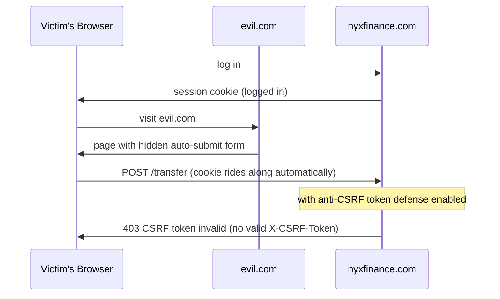

# Chapter 12.3 - Web Application Security & the OWASP Top 10

> Goal: Walk every item in the OWASP Top 10 with, for each: what it is, a concrete *vulnerable* code example, how the attack works conceptually, and the **defense in code**. Then do a real before/after security review of a deliberately-insecure FastAPI app. This is the playbook for hardening NYX Finance and the HIPAA-aligned Anneava.

Defensive framing: all vulnerable examples exist so you can recognize and *fix* them in your own code. Test only against apps you own or run locally.

---

## Start here - the absolute beginner on-ramp

Web app security sounds like memorizing a list of scary attack names. It's actually four ideas applied over and over. Once you internalize these, the OWASP Top 10 becomes "oh, that's just idea #1 again in a new spot."

**The four ideas (the entire chapter, compressed):**

1. **Never trust input.** Anything from the client, a form field, a URL parameter, a header, a cookie, a JSON body, even a hidden field, could be crafted by an attacker, *not* by your nice UI. So you validate it and you defend *where it gets used* (in SQL, in HTML, in a shell, in a URL fetch).
2. **Enforce authorization on every single request.** Just because a user is logged in doesn't mean they may touch *this* object. The server must check "are *you* allowed to do *this* to *that*?" every time, not rely on the UI hiding a button.
3. **Fail closed.** When something is ambiguous or breaks, deny rather than allow. A bug should lock the door, not open it.
4. **Layer defenses (defense in depth).** Validation *and* parameterized queries *and* least-privilege DB users *and* RLS. One control failing shouldn't be game over.

**The one analogy that unlocks injection (the most important class).** Imagine you're a restaurant kitchen and an order ticket says: *"1 burger, and also set the kitchen on fire."* If you blindly *do whatever the ticket says*, you've mixed **data** (the order) with **instructions** (set fire). Injection is exactly this: untrusted *data* gets interpreted as *code/commands*. The fix is to keep data and instructions in separate channels: that's what parameterized queries do for SQL, and output encoding does for HTML.

**Why this matters.** NYX Finance is literally a "transfer money" app and Anneava holds PHI: these are the highest-value targets there are. A single broken access-control check leaks balances; a single missed encoding turns a comment box into account takeover; a single plaintext password column turns a leak into a catastrophe. The good news is that the defenses are *small, mechanical, and repeatable*, once you see the pattern, fixing it is a one-liner at the point of use. This chapter's whole job is to make you *see the pattern automatically*.

If you remember one thing: **defend at the point of use, authorize every request, and assume every input is hostile.**

---

## Theory - the OWASP Top 10 (2021 categories)

The OWASP Top 10 is the industry-standard list of the most critical web app risks. We'll go in OWASP's order but the through-line is always the same: **never trust input, enforce authorization on every request, fail closed, and layer defenses.**

---

### A01 - Broken Access Control

**What it is:** the app doesn't properly enforce *what an authenticated user is allowed to do*. The #1 risk. Includes **IDOR** (Insecure Direct Object Reference): the user can access another user's object just by changing an ID.

**Vulnerable code:**

```python
@app.get("/accounts/{account_id}")
def get_account(account_id: int, user=Depends(current_user)):
    # BUG: fetches by id, never checks the account BELONGS to this user
    return db.query(Account).get(account_id)
# Attacker logged in as user 7 requests /accounts/8 -> reads someone else's account.
```

**How the attack works:** the attacker enumerates IDs (`/accounts/1`, `/accounts/2`, …). Since authorization is missing, every request succeeds. In a financial app this leaks balances; in Anneava it's a HIPAA breach.

**Defense:** enforce ownership on *every* access. Scope queries by the current user; never trust client-supplied IDs as authorization.

```python
@app.get("/accounts/{account_id}")
def get_account(account_id: int, user=Depends(current_user)):
    acct = (db.query(Account)
              .filter(Account.id == account_id, Account.owner_id == user.id)
              .first())
    if acct is None:
        raise HTTPException(404)   # 404 not 403: don't even confirm it exists
    return acct
```

**Multi-tenant / RLS tie-in:** for NYX/Anneava the strongest defense is **Row-Level Security (RLS)** in Postgres, the *database* enforces tenant isolation so a missing app-level check can't leak cross-tenant data:

```sql
ALTER TABLE accounts ENABLE ROW LEVEL SECURITY;
CREATE POLICY tenant_isolation ON accounts
  USING (tenant_id = current_setting('app.current_tenant')::uuid);
-- App sets:  SET app.current_tenant = '<tenant>';  per request/connection.
-- Now even a buggy query physically cannot return another tenant's rows.
```

Defense in depth: app-level check *and* DB-level RLS.

---

### A02 - Cryptographic Failures

**What it is:** sensitive data not protected by (correct) crypto, plaintext storage, weak algorithms, hardcoded keys, transmitting secrets over HTTP. (See 12.1 for the crypto itself.)

**Vulnerable code:**

```python
import hashlib
# BUG: fast unsalted hash for passwords -> trivially cracked from a DB leak
hashed = hashlib.md5(password.encode()).hexdigest()
db.save(User(password=hashed))
# Also: storing PAN/SSN in plaintext; serving login over http://
```

**How the attack works:** a DB leak + a GPU cracks unsalted MD5 hashes at billions/sec; rainbow tables reverse common passwords instantly. Plaintext PII is game over on any leak.

**Defense:** Argon2id/bcrypt for passwords (slow + salted), AES-GCM for data at rest, TLS 1.2+ in transit, keys in a secret manager, **classify data** and encrypt what's sensitive.

```python
from argon2 import PasswordHasher
ph = PasswordHasher()
hashed = ph.hash(password)          # salted, slow, self-describing params
# verify: ph.verify(hashed, attempt)  (raises on mismatch)
```

---

### A03 - Injection (SQLi, command, etc.)

**What it is:** untrusted input is interpreted as *code/commands* by an interpreter. SQL injection is the classic.

**Vulnerable code:**

```python
def login(username, password):
    # BUG: string-formatted SQL -> the input becomes part of the query
    q = f"SELECT * FROM users WHERE name = '{username}' AND pw = '{password}'"
    return db.execute(q).fetchone()
```

**How the attack works:** input `username = "admin' --"` makes the query `... WHERE name = 'admin' --' AND pw = ...`, the `--` comments out the password check, logging in as admin. Or `' OR '1'='1` returns all rows. The interpreter can't tell data from code because they were concatenated.

**Defense, parameterized queries (prepared statements).** The query structure is sent separately from the data; the driver never interprets data as SQL.

```python
# Parameterized - the gold standard. ? / %s are bound, never concatenated.
row = db.execute(
    "SELECT * FROM users WHERE name = %s AND pw = %s",
    (username, password_hash),
).fetchone()

# With an ORM (SQLAlchemy), parameterization is automatic:
user = db.query(User).filter(User.name == username).first()
```

**Command injection** is the same disease: never pass user input to a shell. Use `subprocess.run([...], shell=False)` with an argument list, never `os.system(f"...{user_input}")`.

---

### A04 - Insecure Design

**What it is:** the flaw is in the *design*, not a coding bug, missing threat modeling, a fundamentally insecure workflow (e.g., a password-reset that emails the password, a "transfer money" flow with no confirmation, no rate limit on a guessable code).

**Vulnerable design example:**

```python
@app.post("/reset")
def reset(email: str):
    code = random.randint(1000, 9999)   # 4-digit, predictable RNG, no rate limit
    send_email(email, code); store(email, code)
# Attacker brute-forces 10,000 codes in seconds -> takes over any account.
```

**Defense:** design securely from the start, threat model the feature (12.2), use unguessable tokens (`secrets.token_urlsafe(32)`), expire them, rate-limit attempts, require confirmation for sensitive actions, and add abuse limits. You can't patch a bad design with input validation; you redesign it.

---

### A05 - Security Misconfiguration

**What it is:** insecure defaults, debug mode on in prod, verbose error pages leaking stack traces, default credentials, unnecessary features/ports enabled, permissive cloud storage.

**Vulnerable config:**

```python
app = FastAPI(debug=True)           # BUG: stack traces leak internals to users
# + default admin/admin creds, an open S3 bucket, directory listing on, etc.
```

**How the attack works:** debug pages reveal file paths, library versions, even secrets in tracebacks; default creds let anyone in; verbose errors map the attack surface.

**Defense:** debug off in prod; generic error pages (log details server-side); remove defaults; harden per a baseline (12.2 checklist); least-functionality (disable what you don't use); scan config in CI.

```python
app = FastAPI(debug=False)
@app.exception_handler(Exception)
def handle(_, exc):
    logger.exception("unhandled")               # full detail to logs only
    return JSONResponse({"detail": "Internal error"}, status_code=500)  # generic to user
```

---

### A06 - Vulnerable & Outdated Components

**What it is:** using dependencies with known CVEs. Most apps are mostly third-party code; one vulnerable transitive dependency can sink you (Log4Shell, etc.).

**How the attack works:** attackers scan for apps running versions with public exploits and just run the exploit. No cleverness needed.

**Defense, tie to your CI dependency review / secret scanning:**

```yaml
# CI: fail the build on known-vulnerable deps and leaked secrets
- run: pip-audit                    # scans installed packages against CVE DBs
- run: gitleaks detect --no-banner  # secret scanning in the repo
# Also: Dependabot/Renovate PRs for updates; pin versions; lock files;
# review transitive deps; SBOM for the HIPAA audit trail.
```

Keep deps current, subscribe to advisories, and **review dependency-update PRs** rather than auto-merging blindly.

---

### A07 - Identification & Authentication Failures

**What it is:** weak auth, no rate limiting on login (credential stuffing), weak passwords allowed, broken session management, no MFA, predictable session IDs, sessions that don't expire.

**Vulnerable code:**

```python
@app.post("/login")
def login(u: str, p: str):
    user = get_user(u)
    if user and user.pw == sha256(p):   # no rate limit, fast hash, == compare
        return {"token": str(user.id)}  # BUG: guessable token = the user id!
```

**How the attack works:** unlimited attempts → credential stuffing with leaked password lists; a token that's just the user id → forge any session by changing a number.

**Defense:** rate-limit + lockout/backoff on login, Argon2/bcrypt verify, **random opaque session tokens** (or signed JWTs with short expiry), MFA for sensitive accounts, secure session cookies, server-side session invalidation on logout.

```python
@app.post("/login")
@limiter.limit("5/minute")                       # rate limit (09.4)
def login(u: str, p: str):
    user = get_user(u)
    if not user or not ph_verify(user.pw_hash, p):
        raise HTTPException(401, "Invalid credentials")   # generic, no user enumeration
    token = secrets.token_urlsafe(32)            # unguessable, opaque
    store_session(token, user.id, ttl=900)
    return {"token": token}
```

---

### A08 - Software & Data Integrity Failures

**What it is:** trusting code/data without verifying integrity, unsigned updates, untrusted CI/CD plugins, **insecure deserialization** of attacker-controlled data, pulling dependencies without integrity checks (supply-chain attacks).

**Vulnerable code:**

```python
import pickle
obj = pickle.loads(request.body)   # BUG: pickle executes arbitrary code on load!
```

**How the attack works:** a crafted pickle (or YAML `!!python/object`) runs attacker code during deserialization → remote code execution.

**Defense:** never deserialize untrusted data with `pickle`/unsafe `yaml.load`; use **JSON** (data-only) with a schema validator (Pydantic). Verify signatures on artifacts/updates; pin and hash dependencies; secure the CI/CD pipeline.

```python
from pydantic import BaseModel
class MyModel(BaseModel): ...   # your endpoint's expected shape

data = MyModel.model_validate_json(request.body)   # Pydantic: parse + validate, no code exec
```

---

### A09 - Security Logging & Monitoring Failures

**What it is:** not logging security-relevant events, or not alerting, so breaches go undetected for months. (Detection is the assumption prevention fails, ties to 12.2 IDS and 13.1.)

**Vulnerable state:** no audit log of logins/failures, sensitive actions, or access-control denials; or logging **secrets/PII in plaintext**.

**Defense:** structured audit logs for auth events, access-control failures, and sensitive actions (with correlation IDs, *without* passwords/tokens/PHI); ship to a central store (Elasticsearch/Splunk); alert on anomalies (login-failure spikes, repeated 403s). For Anneava (HIPAA), an audit trail of PHI access is a *requirement*, not a nicety.

```python
import logging
logger = logging.getLogger("security")

logger.info("access_denied", extra={
    "user_id": user.id, "resource": "account", "resource_id": account_id,
    "request_id": request_id, "ip": client_ip,   # NO secrets / NO PHI values
})
```

---

### A10 - Server-Side Request Forgery (SSRF)

**What it is:** the app fetches a URL the attacker controls, letting them make the *server* send requests to internal/unintended targets, e.g., the cloud metadata endpoint (`169.254.169.254`) to steal credentials, or internal services behind the firewall.

**Vulnerable code:**

```python
@app.get("/fetch")
def fetch(url: str):
    return requests.get(url).text   # BUG: server fetches ANY url the user supplies
# Attacker: /fetch?url=http://169.254.169.254/latest/meta-data/iam/... -> cloud creds
```

**How the attack works:** the server has network access the attacker doesn't (it's *inside* the perimeter). SSRF turns the server into a proxy to reach internal-only resources or cloud metadata.

**Defense:** allowlist permitted hosts/schemes, resolve+validate the IP and **reject private/link-local ranges**, disable redirects, and block the metadata IP at the network level (12.2 egress filtering); prefer not fetching user URLs at all.

```python
import ipaddress, socket
from urllib.parse import urlparse

ALLOWED_SCHEMES = {"https"}
def safe_fetch(url: str):
    p = urlparse(url)
    if p.scheme not in ALLOWED_SCHEMES:
        raise ValueError("scheme not allowed")
    ip = ipaddress.ip_address(socket.gethostbyname(p.hostname))
    if ip.is_private or ip.is_loopback or ip.is_link_local:   # blocks 169.254.x, 10.x, 127.x
        raise ValueError("internal address blocked")
    return requests.get(url, allow_redirects=False, timeout=5).text
```

---

### Cross-cutting: XSS, CSRF, validation, secrets, CORS

These aren't single 2021 categories but are essential web defenses.

#### Cross-Site Scripting (XSS)

**What it is:** attacker-controlled content is rendered as **executable script** in another user's browser. Three flavors:

- **Stored:** malicious script saved server-side (e.g., a comment) and served to every viewer.
- **Reflected:** script bounced off a parameter (`?q=<script>...`) in the response.
- **DOM-based:** client-side JS writes untrusted data into the DOM unsafely (`innerHTML = location.hash`).

**Vulnerable code:**

```python
@app.get("/search")
def search(query: str):
    # Server reflects raw input into HTML:
    return HTMLResponse(f"<p>Results for: {query}</p>")   # query="<script>steal()</script>"
```

**How the attack works:** the injected script runs with the victim's session → steal cookies/tokens, perform actions as them, keylog.

**Defense, output encoding + CSP + cookie flags:**

```python
import html

@app.get("/search")
def search(query: str):
    return HTMLResponse(f"<p>Results for: {html.escape(query)}</p>")   # context-aware encoding
# Templating engines (Jinja2) auto-escape by default - keep autoescape on.
```

Content-Security-Policy as a second layer (limits where scripts can load from, blocks inline script):

```python
from fastapi import Response
response = Response()   # stand-in for the `response: Response` param FastAPI injects

response.headers["Content-Security-Policy"] = "default-src 'self'; object-src 'none'"
```

And protect the session cookie so even successful XSS can't read it easily:

```python
from fastapi import Response
response = Response()             # stand-in for the `response: Response` param
token = "the-issued-session-token"  # the value you issue at login

response.set_cookie("session", token, httponly=True, secure=True, samesite="strict")
# httponly: JS can't read it; secure: HTTPS only; samesite: CSRF protection too.
```

#### Cross-Site Request Forgery (CSRF)

**What it is:** a malicious site causes the victim's browser to make an authenticated request to your app (cookies auto-attach), performing an action they didn't intend (e.g., transfer money).

**How the attack works:** victim is logged into NYX Finance; visits `evil.com` which auto-submits a form to `nyxfinance.com/transfer`. The browser includes the session cookie → the transfer goes through.

As a sequence diagram, with the anti-CSRF token check (below) as the final message pair that stops it:



**Defense, anti-CSRF tokens + SameSite cookies:**

```python
from fastapi import Response
response = Response()   # stand-in for the `response: Response` param

# 1. SameSite cookie blocks the cross-site cookie attach for the common case:
response.set_cookie("session", token, samesite="strict", secure=True, httponly=True)

# 2. Synchronizer token: server issues a per-session CSRF token, requires it
#    in a header/field on state-changing requests. evil.com can't read it
#    (same-origin policy), so it can't forge a valid request.
if request.headers.get("X-CSRF-Token") != session.csrf_token:
    raise HTTPException(403, "CSRF token invalid")
```

Note: token-auth APIs that use `Authorization: Bearer` headers (not cookies) are inherently CSRF-resistant because the browser won't auto-attach the header, but cookie-based sessions need explicit CSRF defense.

#### Input validation

Validate at the boundary: type, length, format, range, **allowlist** (what's permitted) over denylist (what's forbidden). Pydantic makes this declarative:

```python
from pydantic import BaseModel, EmailStr, conint, constr
class Transfer(BaseModel):
    to_account: constr(pattern=r"^\d{10}$")     # exactly 10 digits
    amount_cents: conint(gt=0, le=1_000_000_00)  # positive, capped
    memo: constr(max_length=140)
# Invalid input is rejected before it reaches business logic.
```

Validation is *defense in depth*, not a substitute for parameterized queries / output encoding, those defend at the point of use.

#### Secrets management

Never hardcode secrets or commit them. Use a secret manager (AWS Secrets Manager, Vault), inject at runtime, rotate regularly, and **secret-scan in CI** (gitleaks) to catch accidental commits. Different secrets per environment. (Ties to A02/A06.)

#### Same-Origin Policy & CORS done right

The **Same-Origin Policy** is the browser's core rule: a page can't read responses from a *different* origin (scheme+host+port). **CORS** is how a server *selectively relaxes* that for trusted origins.

```python
from fastapi.middleware.cors import CORSMiddleware
app.add_middleware(
    CORSMiddleware,
    allow_origins=["https://app.nyxfinance.com"],   # EXPLICIT allowlist
    allow_credentials=True,
    allow_methods=["GET", "POST"],
    allow_headers=["Authorization", "Content-Type"],
)
# WRONG: allow_origins=["*"] with allow_credentials=True - disallowed by spec and
# would expose authenticated responses to any site. Never reflect arbitrary Origin.
```

CORS done wrong (`*` + credentials, or reflecting the request's Origin) effectively disables the Same-Origin Policy's protection.

---

## Build it - recognize the pattern

For each Top 10 item the muscle memory is:

1. **Where does untrusted input enter, and where is it *used*?** (Query? HTML? Shell? URL fetch?)
2. **Defend at the point of use** (parameterize for SQL, encode for HTML, allowlist for URLs).
3. **Enforce authorization on every request** (ownership/tenant check + RLS).
4. **Fail closed, log the denial, alert on anomalies.**

---

## Mini-project - Before/After security review of an insecure FastAPI app

A deliberately-insecure app. Let's find each flaw and fix it.

### BEFORE (vulnerable)

```python
from fastapi import FastAPI, Request
import sqlite3, hashlib, pickle, requests

app = FastAPI(debug=True)                                   # A05
db = sqlite3.connect("app.db", check_same_thread=False)
API_KEY = "sk_live_hardcoded_secret_123"                    # A02/secrets

@app.post("/login")
def login(username: str, password: str):
    pw = hashlib.md5(password.encode()).hexdigest()         # A02 weak hash
    q = f"SELECT id FROM users WHERE name='{username}' AND pw='{pw}'"  # A03 SQLi
    row = db.execute(q).fetchone()
    return {"token": str(row[0])} if row else {"error": "no"}  # A07 guessable token

@app.get("/notes/{note_id}")
def get_note(note_id: int):                                 # A01 IDOR, no authz
    return db.execute(f"SELECT * FROM notes WHERE id={note_id}").fetchone()

@app.get("/search")
def search(q: str):
    return f"<h1>Results for {q}</h1>"                       # XSS reflected

@app.get("/fetch")
def fetch(url: str):
    return requests.get(url).text                            # A10 SSRF

@app.post("/import")
def import_data(request: Request):
    return pickle.loads(request._body)                       # A08 insecure deser
```

### Findings

| # | Endpoint | Flaw | OWASP |
|---|----------|------|-------|
| 1 | global | `debug=True`, hardcoded API key | A05, A02 |
| 2 | `/login` | MD5 password hash | A02 |
| 3 | `/login` | SQL injection via f-string | A03 |
| 4 | `/login` | token = user id (guessable), no rate limit | A07 |
| 5 | `/notes/{id}` | IDOR, no ownership check | A01 |
| 6 | `/search` | reflected XSS | XSS |
| 7 | `/fetch` | SSRF | A10 |
| 8 | `/import` | insecure deserialization | A08 |
| - | global | no security logging | A09 |

### AFTER (fixed)

```python
from fastapi import FastAPI, Request, HTTPException, Depends, Response
from fastapi.middleware.cors import CORSMiddleware
from pydantic import BaseModel, constr
from argon2 import PasswordHasher
import sqlite3, secrets, html, ipaddress, socket, logging, os, requests
from urllib.parse import urlparse

app = FastAPI(debug=False)                                  # FIX A05
app.add_middleware(CORSMiddleware, allow_origins=["https://app.nyxfinance.com"],
                   allow_credentials=True, allow_methods=["GET","POST"],
                   allow_headers=["Authorization","Content-Type"])
log = logging.getLogger("security")                         # FIX A09
ph = PasswordHasher()
db = sqlite3.connect("app.db", check_same_thread=False)
API_KEY = os.environ["API_KEY"]                             # FIX A02 (from env/secret mgr)
SESSIONS: dict[str, int] = {}

def current_user(request: Request) -> int:
    uid = SESSIONS.get(request.headers.get("Authorization", "").removeprefix("Bearer "))
    if uid is None:
        raise HTTPException(401, "Unauthorized")
    return uid

class Login(BaseModel):
    username: constr(max_length=64)
    password: constr(max_length=256)

@app.post("/login")                                         # add rate limit at edge/limiter
def login(body: Login):
    row = db.execute("SELECT id, pw_hash FROM users WHERE name = ?",
                     (body.username,)).fetchone()           # FIX A03 parameterized
    ok = False
    if row:
        try:
            ph.verify(row[1], body.password); ok = True     # FIX A02 argon2 verify
        except Exception:
            ok = False
    if not ok:
        log.info("login_failed", extra={"user": body.username})  # FIX A09
        raise HTTPException(401, "Invalid credentials")     # generic, no enumeration
    token = secrets.token_urlsafe(32)                       # FIX A07 opaque token
    SESSIONS[token] = row[0]
    return {"token": token}

@app.get("/notes/{note_id}")
def get_note(note_id: int, uid: int = Depends(current_user)):
    note = db.execute("SELECT * FROM notes WHERE id = ? AND owner_id = ?",
                       (note_id, uid)).fetchone()           # FIX A01 ownership scope
    if note is None:
        log.info("access_denied", extra={"user": uid, "note": note_id})
        raise HTTPException(404)
    return note

@app.get("/search")
def search(q: constr(max_length=100), response: Response):
    response.headers["Content-Security-Policy"] = "default-src 'self'"
    return Response(f"<h1>Results for {html.escape(q)}</h1>", media_type="text/html")  # FIX XSS

@app.get("/fetch")
def fetch(url: str, uid: int = Depends(current_user)):
    p = urlparse(url)
    if p.scheme != "https":
        raise HTTPException(400, "https only")
    ip = ipaddress.ip_address(socket.gethostbyname(p.hostname))
    if ip.is_private or ip.is_loopback or ip.is_link_local:  # FIX A10 block internal
        raise HTTPException(400, "internal address blocked")
    return requests.get(url, allow_redirects=False, timeout=5).text

@app.post("/import")
def import_data(body: dict):                                 # FIX A08: JSON only, no pickle
    # body is parsed JSON (data-only); validate with a Pydantic model in real code.
    return {"imported": len(body)}
```

The deliverable is this **before → findings table → after** review, with each fix mapped to its OWASP category and the *point-of-use* defense applied. This is the exact review you'd run on a NYX/Anneava service before shipping.

---

## Mini-project #2 - A reusable "secure-by-default" FastAPI starter + a test suite that proves it

The before/after review is reactive (find flaws, fix them). The senior move is *proactive*: bake the defenses into a starter so the secure thing is the *default*, then write **security regression tests** so a future you can't accidentally reintroduce a flaw. This is how you'd seed every new NYX/Anneava service.

```python
# secure_starter.py - defaults that make the insecure thing hard to do by accident
from fastapi import FastAPI, Request, HTTPException, Depends
from fastapi.responses import JSONResponse
from fastapi.middleware.cors import CORSMiddleware
from pydantic import BaseModel, constr, conint
from argon2 import PasswordHasher
import secrets, logging, os

log = logging.getLogger("security")
ph = PasswordHasher()
app = FastAPI(debug=False)                                  # never debug in prod (A05)

# Explicit CORS allowlist (never "*" + credentials) (CORS)
app.add_middleware(CORSMiddleware, allow_origins=["https://app.nyxfinance.com"],
                   allow_credentials=True, allow_methods=["GET", "POST"],
                   allow_headers=["Authorization", "Content-Type"])

# Security headers on EVERY response (A05 + XSS + clickjacking)
@app.middleware("http")
async def security_headers(request: Request, call_next):
    resp = await call_next(request)
    resp.headers["Content-Security-Policy"] = "default-src 'self'; object-src 'none'"
    resp.headers["X-Content-Type-Options"] = "nosniff"
    resp.headers["X-Frame-Options"] = "DENY"
    resp.headers["Strict-Transport-Security"] = "max-age=31536000; includeSubDomains"
    resp.headers["Referrer-Policy"] = "no-referrer"
    return resp

# Generic error handler - detail to logs, generic message to user (A05/A09)
@app.exception_handler(Exception)
async def handle(request: Request, exc: Exception):
    log.exception("unhandled", extra={"path": request.url.path})
    return JSONResponse({"detail": "Internal error"}, status_code=500)

# --- a tiny domain to test against ---
SESSIONS: dict[str, int] = {}
ACCOUNTS = {1: {"owner_id": 10, "balance": 5000}, 2: {"owner_id": 20, "balance": 9000}}

def current_user(request: Request) -> int:
    uid = SESSIONS.get(request.headers.get("Authorization", "").removeprefix("Bearer "))
    if uid is None:
        raise HTTPException(401, "Unauthorized")        # fail closed
    return uid

class Transfer(BaseModel):                              # allowlist validation at the boundary
    to_account: constr(pattern=r"^\d{1,4}$")
    amount_cents: conint(gt=0, le=1_000_000_00)

@app.get("/accounts/{account_id}")
def get_account(account_id: int, uid: int = Depends(current_user)):
    acct = ACCOUNTS.get(account_id)
    if acct is None or acct["owner_id"] != uid:        # ownership check (A01)
        log.info("access_denied", extra={"user": uid, "account": account_id})
        raise HTTPException(404)                        # 404, don't confirm existence
    return {"id": account_id, "balance": acct["balance"]}

def make_session(uid: int) -> str:                     # opaque token (A07)
    t = secrets.token_urlsafe(32); SESSIONS[t] = uid; return t
```

Now the part juniors skip and seniors insist on, **tests that fail if the security regresses:**

```python
# test_security.py - run with: pytest -q
from fastapi.testclient import TestClient
from secure_starter import app, make_session
client = TestClient(app)

def test_security_headers_present():
    r = client.get("/accounts/1", headers={"Authorization": "Bearer " + make_session(10)})
    for h in ("Content-Security-Policy", "X-Content-Type-Options",
              "X-Frame-Options", "Strict-Transport-Security"):
        assert h in r.headers, f"missing {h} (A05 regression)"

def test_requires_auth():
    assert client.get("/accounts/1").status_code == 401   # fail closed

def test_owner_can_read_own_account():
    tok = make_session(10)
    assert client.get("/accounts/1", headers={"Authorization": f"Bearer {tok}"}).status_code == 200

def test_idor_blocked():                                  # the key A01 regression test
    tok = make_session(10)                                # user 10 owns account 1, NOT account 2
    r = client.get("/accounts/2", headers={"Authorization": f"Bearer {tok}"})
    assert r.status_code == 404, "IDOR! a user read another user's account"

def test_invalid_transfer_rejected():
    # amount over the cap / wrong format must be rejected by validation before logic
    from secure_starter import Transfer
    import pytest
    with pytest.raises(Exception):
        Transfer(to_account="not-digits", amount_cents=-5)
```

**Why this is the deliverable that matters:** the `test_idor_blocked` test is a *living, executable* statement of "user 10 must never read account 2." If a future refactor drops the ownership check, the test goes red in CI and the build fails, security becomes a property the code *proves about itself*, not a thing you hope you remembered. Wire `pytest` + `pip-audit` + `gitleaks` into CI so every PR re-proves no-IDOR, no-known-CVE, no-leaked-secret.

**Extensions:** add a rate-limit test (hammer `/login` and assert it eventually 429s); add a CSP-bypass test (assert reflected `<script>` is escaped); add a test that `debug` is `False`; generate the OWASP mapping table automatically from test names.

---

## Common mistakes

- **Trusting client-side validation.** JS checks are UX, not security; a proxy bypasses them (12.4). Always re-validate and re-authorize server-side.
- **Authenticating but not authorizing.** "Logged in" ≠ "allowed to touch *this* object." Check ownership/tenant on every request (A01).
- **String-building SQL / shell commands.** f-strings into queries or `os.system` are injection (A03). Parameterize; use `subprocess.run([...], shell=False)`.
- **Fast/unsalted password hashes.** MD5/SHA for passwords is cracked instantly from a leak (A02). Argon2id/bcrypt.
- **Reflecting input into HTML without encoding** (XSS). Encode at output; keep template autoescape on; add CSP.
- **`allow_origins=["*"]` with `allow_credentials=True`**, disallowed and effectively disables the Same-Origin Policy. Use an explicit allowlist.
- **Verbose errors / debug mode in prod** (A05). Leaks stack traces, paths, versions. Generic errors to users, detail to logs.
- **`pickle.loads` / `yaml.load` on untrusted data**, remote code execution (A08). Use JSON + Pydantic.
- **Server fetches user-supplied URLs without validation** (SSRF, A10). Allowlist hosts/schemes; block private/link-local IPs; no redirects.
- **Logging secrets/PII/PHI.** Log identifiers and references, never the sensitive values (A09), for Anneava this is a HIPAA requirement.
- **Guessable session tokens / no rate limit on login** (A07). Opaque random tokens, short expiry, rate limit + lockout.
- **Auto-merging dependency updates blindly, or ignoring CVEs** (A06). Run `pip-audit`; review update PRs.
- **404 vs 403 leak.** Returning 403 confirms a resource exists; prefer 404 to avoid enumeration.

---

## On the job / interview angle

OWASP-Top-10 fluency is one of the most common security expectations for *any* web-dev role, junior included, not just security teams. Interviewers love injection, access control, and XSS because the answers reveal whether you understand the data-vs-code boundary.

**What teams expect a junior to do correctly:**

- Parameterized queries / ORM everywhere; never string-built SQL.
- Ownership/tenant checks on every authenticated endpoint.
- Argon2/bcrypt for passwords; secrets from a manager, not source.
- Output-encode in templates (autoescape on); set security headers and secure cookie flags.
- Validate input with Pydantic; fail closed; log security events without secrets.

**Representative interview questions (with crisp answers):**

1. *"How do you prevent SQL injection?"* → Parameterized queries / prepared statements (or an ORM): the query structure is sent separately from the data, so input is never interpreted as SQL. Validation is a bonus layer, not the fix.
2. *"What is IDOR and how do you stop it?"* → A user accesses another's object by changing an id; stop it by scoping every query to the authenticated user/tenant server-side, returning 404 if not owned, and adding DB-level RLS for defense in depth.
3. *"Explain the three XSS types and the primary defense."* → Stored/reflected/DOM; primary defense is context-aware **output encoding** at render; CSP and HttpOnly cookies are additional layers.
4. *"Why is a Bearer-token API more CSRF-resistant than cookie sessions?"* → Browsers don't auto-attach `Authorization` headers cross-site (they do auto-attach cookies); cookie sessions need SameSite + an anti-CSRF token.
5. *"What's SSRF and the classic target?"* → The server fetches an attacker-controlled URL, reaching internal resources it can but the attacker can't, classically the cloud metadata endpoint `169.254.169.254` to steal IAM credentials. Defend with host/scheme allowlists and blocking private ranges.
6. *"Walk me through the OWASP Top 10."* → Give one line each: A01 broken access control, A02 crypto failures, A03 injection, A04 insecure design, A05 misconfiguration, A06 vulnerable components, A07 auth failures, A08 integrity/deserialization, A09 logging/monitoring failures, A10 SSRF.
7. *(Observability angle)* *"How would you detect an attack in progress?"* → Structured audit logs of auth events and access-control denials shipped to Elasticsearch/Splunk, alerting on 403/401 spikes and login-failure bursts, detection assuming prevention fails (A09, cross-link 13.1).

---

## Exercises

Use a throwaway local app / SQLite for the hands-on ones. Easy → hard.

1. **(Spot the flaw)** Given `q = f"SELECT * FROM users WHERE name='{name}'"`, write the `name` value that logs in as `admin` without the password, and rewrite the query parameterized.
2. **(Encoding)** Given `return f"<p>{comment}</p>"`, supply a `comment` that pops an alert, then rewrite it safely with `html.escape`.
3. **(Access control)** Rewrite a `get_invoice(invoice_id, user)` endpoint that currently fetches by id alone so it enforces ownership and returns 404 when not owned.
4. **(Password storage)** Replace `sha256(password)` storage with Argon2, and write the verify path. Explain why the stored hash differs each time.
5. **(SSRF)** Write a `safe_fetch(url)` that allows only `https`, resolves the host, and rejects private/loopback/link-local IPs. Show the URL it must block on a cloud VM.
6. **(CORS)** Explain why `allow_origins=["*"]` + `allow_credentials=True` is dangerous, and write the corrected middleware for `https://app.nyxfinance.com`.
7. **(Deserialization)** Convert an endpoint doing `pickle.loads(body)` to safely parse JSON into a Pydantic model, and state the attack you just removed.
8. **(Logging)** Write an `access_denied` audit log line for a failed account access that is queryable in Elasticsearch and contains *no* secrets/PHI.
9. **(Test)** Write a pytest that fails if a user can read an account they don't own (the IDOR regression test).
10. **(Hard / synthesis)** Take the BEFORE app from the mini-project, and for *each* of its 8 flaws, write the one-line fix and the OWASP id, from memory.

### Solutions

1. `name = "admin' --"` makes `...WHERE name='admin' --'`, the `--` comments out the rest. Fixed: `db.execute("SELECT * FROM users WHERE name = ?", (name,))`.
2. `comment = "<script>alert(1)</script>"` executes. Fixed: `return f"<p>{html.escape(comment)}</p>"` (and keep template autoescape on; add CSP).
3. ```python
   @app.get("/invoices/{invoice_id}")
   def get_invoice(invoice_id: int, uid: int = Depends(current_user)):
       inv = db.execute("SELECT * FROM invoices WHERE id=? AND owner_id=?",
                        (invoice_id, uid)).fetchone()
       if inv is None: raise HTTPException(404)
       return inv
   ```
4. `from argon2 import PasswordHasher; ph=PasswordHasher(); stored=ph.hash(pw)`; verify with `ph.verify(stored, attempt)` (raises on mismatch). The hash differs each time because Argon2 embeds a fresh random salt - defeating rainbow tables.
5. See the `safe_fetch` in the A10 section. The URL it must block: `https://169.254.169.254/latest/meta-data/iam/security-credentials/` (cloud metadata → IAM creds). Private ranges like `10.x`, `127.x`, `169.254.x` are rejected after DNS resolution.
6. With `*` + credentials, any site could read authenticated responses, undoing the Same-Origin Policy (and the spec forbids the combo). Fixed: explicit `allow_origins=["https://app.nyxfinance.com"]` with the methods/headers you actually use.
7. `data = MyModel.model_validate_json(body)`. Removed: insecure deserialization (A08) - `pickle`/unsafe YAML execute arbitrary code on load; JSON is data-only and Pydantic validates the shape.
8. ```python
   log.info("access_denied", extra={"event":"access_denied","user_id":uid,
            "resource":"account","resource_id":account_id,"request_id":rid,"ip":ip})
   # NO password/token/PHI values - only identifiers and references.
   ```
9. See `test_idor_blocked` in mini-project #2: log in as a user who owns account 1, request account 2, assert `404`.
10. global `debug=True`→`debug=False` (A05) & hardcoded key→env/secret manager (A02); `/login` MD5→Argon2 (A02), f-string SQL→parameterized (A03), token=user-id→`secrets.token_urlsafe(32)` + add rate limit (A07); `/notes/{id}` add `AND owner_id=?` ownership (A01); `/search` `html.escape` + CSP (XSS); `/fetch` allowlist+block-private-IPs (A10); `/import` JSON+Pydantic not pickle (A08); plus add security logging (A09).

---

## Teach it back

1. **SQL injection: show the malicious `username` that bypasses a login built with an f-string query, and explain why parameterized queries defeat it (data vs code).**
2. **What's IDOR, and why is a database-level RLS policy a stronger defense than an app-level ownership check alone?**
3. **Compare stored, reflected, and DOM XSS. What's the *primary* defense (point-of-use), and what does CSP add on top?**
4. **Why is a token-auth API using `Authorization: Bearer` inherently more CSRF-resistant than cookie sessions, and what two defenses protect cookie sessions?**
5. **Explain SSRF: why can the server reach things the attacker can't, and what's the canonical high-value target on a cloud VM?**
6. **`allow_origins=["*"]` with `allow_credentials=True`, why is this dangerous, and what does it effectively undo?**
