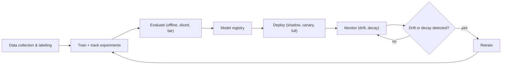

# Chapter 20.2 - Machine Learning Engineering & MLOps

> Goal: Close the gap between a model that works in your notebook and an ML *system* that works in production for years. This is the discipline that actually gets you hired as an **MLE** (machine-learning engineer), not a Kaggle competitor. By the end you'll understand the full ML lifecycle, the feature pipeline and leakage traps, experiment tracking, serving a model over an API with validation, deployment patterns (shadow/canary/A-B), monitoring for **drift** and **decay**, retraining and CI/CT, and reproducibility, and you'll have built a real FastAPI model service with a drift check and an experiment logger. You'll also go *deeper* than [14.1](../14-ML-DL/14.1-ml-foundations.md) on the classical-ML topics that round out the foundations: ensembles and gradient boosting, imbalanced data, hyperparameter tuning, and cross-validation pitfalls.

You already know how to *train* models (Chapter 14). The brutal truth of the job is that **training is maybe 10% of the work.** The other 90% (data plumbing, serving, monitoring, retraining, not silently breaking) is *engineering*, and it's where most ML projects die. This chapter is that 90%. We'll keep coming back to **NYX Finance** (real-time analytics + LLM summaries) because it's the perfect testbed: live data, latency budgets, and models that *will* go stale.

---

## Start here - the on-ramp

Here's the picture that reframes everything. A Kaggle notebook is a **photograph**: one fixed dataset, one model, one accuracy number, frozen in time. A production ML system is a **living organism**: data keeps flowing in, the world keeps changing underneath your model, users act on its predictions (which changes their behavior, which changes the data), and the whole thing has to keep working at 3 a.m. without you watching.

That difference is the entire field of **MLOps** (= DevOps for ML). The single most important sentence in this chapter:

> **A model's accuracy is a property of a moment, but a production model's job is to stay good as the world drifts away from the data it was trained on.**

Three things make ML systems harder to operate than ordinary software, and you should feel all three in your gut before any code:

1. **They fail *silently*.** A normal service that breaks throws a 500 and pages you. A model that's quietly become 15% less accurate because the world shifted throws *nothing*. It keeps returning confident, wrong answers. You only find out from a business metric tanking, unless you're **monitoring for it**.
2. **They depend on *data*, not just code.** Same code + different data = different model. So "reproducible" now means version-pinning *data*, not just `git`. A bug can live entirely in the data pipeline with the code untouched.
3. **They rot.** Even a perfect model decays as reality drifts (new fraud patterns, new user behavior, a pandemic). A model is not a deliverable you ship once; it's a service you **keep alive** with monitoring and **retraining**.

Internalize "models rot silently and depend on data," and every practice in this chapter (feature stores, drift detection, canary deploys, retraining pipelines, model cards) stops looking like ceremony and starts looking like *survival*.

---

## The ML lifecycle - the whole loop

MLOps organizes the work as a *loop*, not a line. You go around it forever.

```
   ┌──────────────► 1. Problem framing ◄──────────────────────┐
   │                       │                                  │
   │                       ▼                                  │
   │            2. Data collection & labeling                 │
   │                       │                                  │
   │                       ▼                                  │
   │              3. Feature pipeline ───┐                    │
   │                       │             │ (feature store)    │
   │                       ▼             ▼                    │
   │              4. Train + track experiments                │
   │                       │                                  │
   │                       ▼                                  │
   │           5. Evaluate (offline, sliced, fair)            │
   │                       │                                  │
   │                       ▼                                  │
   │           6. Package + serve (API / batch)               │
   │                       │                                  │
   │                       ▼                                  │
   │       7. Deploy (shadow → canary → full)                 │
   │                       │                                  │
   │                       ▼                                  │
   └─── 8. MONITOR (drift, decay, feedback) ──► retrain ──────┘
```

### 1. Problem framing

The most expensive mistakes happen here, before a single line of model code. Questions to answer *first*: Is ML even the right tool, or would a rule beat it (and be debuggable)? What's the **prediction target** and is it actually available at *training* time *and* serving time? Is it **classification, regression, ranking, or generation**? The question that matters most: **what business metric does this move, and what's the cost of a false positive vs. a false negative?** For NYX fraud-flagging, a missed fraud (false negative) costs real money; a false alarm (false positive) costs an analyst five minutes. That asymmetry should drive *everything* downstream: the threshold, the loss, the eval metric. Framing the problem as "maximize accuracy" when the classes are 99:1 is how you ship a useless model that's 99% accurate by predicting "never fraud."

### 2. Data collection & labeling

Models are mostly made of data. Where does it come from, how is it labeled, how good are the labels, and how much does labeling cost? **Label quality caps model quality**, noisy labels put a ceiling on accuracy no architecture can break through. Real concerns: inter-annotator agreement, label drift over time, class imbalance, and **the cost and latency of getting labels** (if labels arrive weeks late, your feedback loop and retraining cadence are bottlenecked by that, not by compute).

### 3. The feature pipeline - and the leakage trap

A **feature** is a model-ready signal derived from raw data. The feature pipeline transforms raw events → features, and it is where most production ML bugs live. Two issues dominate:

**Data leakage**, the silent killer. Leakage is when information that **wouldn't be available at prediction time** sneaks into training, giving you an inflated offline score that *collapses* in production. The classic forms:

- **Target leakage:** a feature that's a proxy for the label (e.g., "account_closed_date" when predicting churn, it's only set *after* churn). Your model "learns" to read the answer.
- **Train/test contamination:** fitting a scaler/imputer/encoder on the *full* dataset before the split, so test statistics leak into training. **Always `fit` preprocessing on train only**, then `transform` the test set. (This is exactly why scikit-learn `Pipeline` exists, it makes the fit-on-train discipline automatic across CV folds.)
- **Temporal leakage:** in time-series, using future information to predict the past. If you predict tomorrow's price using a feature computed with a window that peeks past `t`, your backtest is fiction. **For temporal data you must split by time, never randomly.** (You built the pandas/wrangling muscle for this in [16.2](../16-Data/16.2-data-wrangling-pandas-numpy.md).)

```python
# WRONG - scaler sees test data; test statistics leak into training.
X_scaled = StandardScaler().fit_transform(X)        # fit on EVERYTHING
X_train, X_test = train_test_split(X_scaled)

# RIGHT - pipeline fits preprocessing on train folds only, every time.
from sklearn.pipeline import Pipeline
from sklearn.preprocessing import StandardScaler
from sklearn.linear_model import LogisticRegression
from sklearn.model_selection import cross_val_score

pipe = Pipeline([("scale", StandardScaler()),
                 ("clf",   LogisticRegression(max_iter=1000))])
scores = cross_val_score(pipe, X, y, cv=5)   # scaler re-fit on each fold's TRAIN split
```

**Training/serving skew**, the *other* killer. The features computed at training time (often in batch, in pandas, over historical data) and the features computed at serving time (often in a real-time service, in different code) **drift apart**. A subtle difference, a default-fill value, a unit, a timezone, a rounding, silently poisons predictions. The industry's answer is the **feature store**: a system that computes a feature *once* and serves the **same logic and values** to both training (offline) and serving (online). It's the single biggest architectural idea in feature engineering at scale: *define the feature once, guarantee train == serve.*

### 4. Train + track experiments

In a notebook you run 50 experiments and remember none of them. In production you need to answer "which exact code + data + hyperparameters produced the model currently serving customers?" months later. **Experiment tracking** (MLflow, Weights & Biases) logs, for every run: parameters, metrics, the code version, the data version, and the resulting **model artifact**, so every model is fully reproducible and comparable. The mental model: *a model is the output of a function of (code, data, config); track all three inputs and the output, every run.* We'll build a tiny version of this below so it's not a black box.

**Training at scale** is its own topic (distributed data-parallel training, gradient accumulation, mixed precision, Chapter 14.2 touches the mechanics). The MLOps concern is *reproducible, observable* training: a job you can re-run and get the same result, with metrics streaming to a dashboard.

---

## Model evaluation beyond accuracy

This is where notebook-thinking is most dangerous. Accuracy is almost never the right number, and a single global metric hides the failures that get you fired.

### Pick the metric the problem actually cares about

For imbalanced classification (fraud, disease, churn), accuracy is a lie. Use:

- **Precision** = of the things you flagged, how many were right? (Cost of false *positives*.)
- **Recall** = of the things you should have flagged, how many did you catch? (Cost of false *negatives*.)
- **F1** = harmonic mean of the two, when you need balance.
- **ROC-AUC** vs. **PR-AUC**: ROC-AUC can look great on imbalanced data while the model is useless on the rare class; **PR-AUC (precision-recall) is the honest metric when positives are rare.** Reach for PR-AUC on NYX fraud.

The deeper point: **you choose an operating threshold based on the business cost asymmetry**, not the default 0.5. A precision/recall *curve* tells you the achievable tradeoffs; the business tells you which point to stand on.

### Slicing - the practice that catches the real failures

A model can be 95% accurate overall and **60% accurate on a subgroup that matters**, new users, a specific region, a device type, a demographic. Global metrics average that away. **Always evaluate on slices.** This is non-negotiable both for quality (you'll find the segment where the model is broken) and for **fairness** (you'll find the segment where it's discriminatory).

```python
import pandas as pd
from sklearn.metrics import f1_score, precision_score, recall_score

def sliced_report(df, y_true_col, y_pred_col, slice_col):
    """Per-slice precision/recall/F1 - the table that catches hidden failures."""
    rows = []
    for name, g in df.groupby(slice_col):
        yt, yp = g[y_true_col], g[y_pred_col]
        rows.append({
            "slice": name, "n": len(g),
            "precision": round(precision_score(yt, yp, zero_division=0), 3),
            "recall":    round(recall_score(yt, yp, zero_division=0), 3),
            "f1":        round(f1_score(yt, yp, zero_division=0), 3),
        })
    out = pd.DataFrame(rows).sort_values("f1")
    return out   # worst slices float to the top - look there first

# A model that's 0.95 overall but 0.55 on slice 'new_user' is a model you can't ship.
```

**Fairness metrics** make "is this model discriminatory?" concrete: *demographic parity* (equal positive rates across groups), *equalized odds* (equal TPR and FPR across groups), *calibration within groups*. You generally can't satisfy all of them simultaneously (there are formal impossibility results), so you choose which definition matches the harm you're preventing, a framing decision, not a metric you can blindly optimize. This is the engineering counterpart to the ethics discussion in [20.1](20.1-artificial-intelligence.md): bias is something you *measure on slices and mitigate*, not a footnote.

### Offline vs. online evaluation

- **Offline** = on held-out historical data, before deploy. Necessary, but it answers "would this have been good in the *past*?"
- **Online** = on live traffic, measuring the *business metric* you actually care about (conversions, fraud caught, latency, revenue). A model can win offline and lose online (the offline proxy metric didn't match the real objective; the data shifted; users react to predictions). **Online evaluation via A/B testing is the ground truth.** Offline metrics are a filter to decide *what's worth A/B-testing*, not the final word.

---

## Classical-ML foundations that round out the picture

Before serving, let's go deeper than [14.1](../14-ML-DL/14.1-ml-foundations.md) on four topics that come up constantly on the job and in interviews.

### Ensembles: bagging vs. boosting (the deep version)

A single model has a bias/variance tradeoff (derived in 14.1). **Ensembles** combine many models to beat any single one, and *how* they combine determines *what* they fix.

**Bagging (Bootstrap AGGregating)**: train many models *in parallel* on bootstrap resamples of the data, then average (regression) or vote (classification). Averaging independent models with the same bias keeps the bias but **slashes variance** (variance of an average of `k` roughly-independent estimators falls ~`1/k`). **Random Forests** = bagged decision trees + an extra trick (each split considers only a random subset of features) to *decorrelate* the trees, which makes the variance reduction bite harder. Bagging is your default when a single model overfits.

**Boosting**: train models *sequentially*, each one focused on the mistakes of the ensemble so far. This **reduces bias** (it builds a strong learner out of weak ones), and it's the engine behind the models that win most tabular-data competitions.

**Gradient boosting, the intuition done properly.** Here's the idea that makes it click. Boosting fits an additive model `F(x) = Σ γₘ hₘ(x)` stage by stage. At each stage, instead of re-fitting the labels, you **fit the new tree to the negative gradient of the loss with respect to the current predictions**, the *direction* that would most reduce the loss. For squared error, that negative gradient *is* the residual `y − F(x)`, so gradient boosting reduces to "each new tree predicts the current residuals," and adding it nudges predictions toward the truth. For other losses (log-loss, etc.) it's the same move with a different gradient. **It's literally gradient descent in function space:** each tree is one step downhill on the loss surface, the learning rate `γ` is the step size, and you take many small steps (shallow trees, low learning rate, many of them).

**XGBoost / LightGBM / CatBoost** are highly engineered gradient boosting:
- a **second-order** Taylor expansion of the loss (uses the Hessian, not just the gradient) for better steps,
- explicit **regularization** on tree complexity (penalize number of leaves and leaf weights), this is *why* XGBoost resists overfitting better than vanilla GBMs,
- clever **split-finding** (histogram binning, sparsity-aware handling of missing values) for speed,
- LightGBM's leaf-wise growth and GOSS sampling; CatBoost's native categorical handling and ordered boosting to fight target leakage.

**On the job:** for tabular data, a tuned gradient-boosting model is very often the strongest baseline, frequently beating deep nets, and it should be your first serious model on NYX's structured data, with deep learning reserved for the text/sequence parts.

### Imbalanced data

When positives are 1% (fraud, rare disease), naive training optimizes for the majority and ignores the rare class. Tactics, roughly in order of preference:

1. **Right metric + threshold** (PR-AUC, tune the decision threshold for the cost asymmetry). Often this alone is enough, and it's the cleanest fix.
2. **Class weights / cost-sensitive loss**: tell the model that a false negative costs `k×` a false positive (`class_weight="balanced"` or a custom loss). No data duplication, principled.
3. **Resampling**: oversample the minority (**SMOTE** synthesizes new minority points by interpolating between neighbors) or undersample the majority. **Only resample the *training* fold, never the validation/test set.** Resampling test data fabricates a rosy score that won't hold in production. Inside cross-validation, resampling must happen *inside* each fold.

### Hyperparameter tuning

- **Grid search**: exhaustively try every combination on a grid. Simple, but cost explodes combinatorially and it wastes effort on dimensions that don't matter.
- **Random search**: sample combinations at random. *Provably more efficient than grid* when only a few hyperparameters actually matter (you get more distinct values on the important axis for the same budget, Bergstra & Bengio's result). A great default.
- **Bayesian optimization** (Optuna, Hyperopt): build a probabilistic model of "config → score" and use it to choose the next config that best balances *exploring* the unknown and *exploiting* known-good regions. Far fewer evaluations to find good configs, this is *informed search* over the hyperparameter space (the same explore/exploit idea as [20.1](20.1-artificial-intelligence.md)'s search, applied to tuning).

> **The tuning leakage trap:** if you tune hyperparameters on your test set, the test score is optimistic: you've fit the model *and the tuning* to that data. Use a **three-way split** (train / validation / test) or **nested cross-validation**: inner loop tunes, outer loop gives an honest estimate. The test set is touched *once*, at the very end.

### Cross-validation pitfalls

CV gives a more robust performance estimate than a single split, but it has traps that silently inflate scores:

- **Preprocess inside the fold.** Fitting a scaler/encoder on all data before CV leaks (see above). Use a `Pipeline` so each fold re-fits on its own training portion.
- **Group leakage.** If multiple rows belong to the same entity (same user, same patient, same NYX account), random folds put correlated rows in both train and test → inflated score. Use **GroupKFold** so an entity is entirely in one fold.
- **Temporal data needs `TimeSeriesSplit`.** Random folds let the model train on the future to predict the past. Time-series CV always trains on past, validates on future, expanding the window forward.
- **Stratify for imbalance** (`StratifiedKFold`) so each fold has the same class ratio; otherwise a rare class can be absent from a fold entirely.

---

## Packaging & serving

A trained model is a file (`.pkl`, `.pt`, `.onnx`, a saved Booster). **Serving** is making it answer requests. Two modes:

- **Batch / offline inference**: score a big table on a schedule (nightly fraud-risk scores for all accounts), write results to a store, read them when needed. High throughput, latency-tolerant, cheap, simple. *Use it whenever predictions don't need to be fresh-to-the-second.*
- **Real-time / online inference**: a service answers per-request in milliseconds (score *this* transaction *now*). This is where latency/throughput engineering ([9.1](../09-System-Design/09.1-scalability-fundamentals.md)) bites: you have a **latency budget** (p99, not just average), and you trade off model size vs. speed.

A REST API over FastAPI ([8.2](../08-Web/08.2-backend-apis.md)) is the standard real-time interface; **gRPC** is preferred for internal, high-throughput, low-latency service-to-service calls (binary protobuf, multiplexed HTTP/2). For online inference, the workhorses are **batching requests** (group concurrent requests to amortize model overhead), **caching** identical inputs, and keeping the model warm in memory.

## Build it - wrap a model in a FastAPI service with validation

Let's make it concrete: train a small model, serialize it, and serve it with **input validation** (Pydantic), so the service rejects garbage instead of feeding it to the model and returning nonsense. (Input validation is a top source of production ML incidents, a feature arriving as a string, a null, or out of range.)

```python
# train.py - produce a model artifact
import joblib
from sklearn.datasets import load_breast_cancer
from sklearn.ensemble import GradientBoostingClassifier
from sklearn.model_selection import train_test_split

X, y = load_breast_cancer(return_X_y=True, as_frame=True)
Xtr, Xte, ytr, yte = train_test_split(X, y, test_size=0.2, stratify=y, random_state=42)
model = GradientBoostingClassifier(random_state=42).fit(Xtr, ytr)

# Bundle the model WITH its metadata: feature order, training stats for drift checks.
artifact = {
    "model": model,
    "features": list(X.columns),
    "train_means": Xtr.mean().to_dict(),
    "train_stds": Xtr.std().to_dict(),
    "version": "1.0.0",
}
joblib.dump(artifact, "model.joblib")
print("Saved model.joblib  |  test acc:", round(model.score(Xte, yte), 3))
```

```python
# serve.py - FastAPI service with validation, versioning, and timing
import time, joblib, numpy as np
from fastapi import FastAPI, HTTPException
from pydantic import BaseModel, Field

ART = joblib.load("model.joblib")
MODEL, FEATURES, VERSION = ART["model"], ART["features"], ART["version"]

app = FastAPI(title="NYX risk-scorer", version=VERSION)

class PredictRequest(BaseModel):
    # Validation: must be a dict of feature -> float. Pydantic rejects bad types up front.
    features: dict[str, float] = Field(..., description="feature_name -> value")

class PredictResponse(BaseModel):
    prediction: int
    probability: float
    model_version: str
    latency_ms: float

@app.get("/health")           # liveness/readiness probe (k8s, load balancers)
def health():
    return {"status": "ok", "model_version": VERSION}

@app.post("/predict", response_model=PredictResponse)
def predict(req: PredictRequest):
    t0 = time.perf_counter()
    missing = [f for f in FEATURES if f not in req.features]
    if missing:               # fail loud on schema mismatch, don't guess
        raise HTTPException(status_code=422, detail=f"missing features: {missing}")
    try:
        x = np.array([[req.features[f] for f in FEATURES]], dtype=float)
    except (TypeError, ValueError):
        raise HTTPException(status_code=422, detail="non-numeric feature value")
    proba = float(MODEL.predict_proba(x)[0, 1])
    pred = int(proba >= 0.5)
    return PredictResponse(
        prediction=pred, probability=round(proba, 4),
        model_version=VERSION,
        latency_ms=round((time.perf_counter() - t0) * 1000, 2),
    )
```

Run with `uvicorn serve:app`. Note the production manners baked in: a `/health` endpoint for orchestrators, **strict input validation that 422s on bad data instead of silently misbehaving**, the **model version in every response** (so you can attribute predictions to a model when debugging), and **latency in the payload** (cheap per-request observability, ties straight to [13.1](../13-Observability/13.1-observability.md)). This skeleton is 80% of a real model service.

---

## Deployment patterns

You never just swap `model_v1` for `model_v2` in production. ML models *especially* need careful rollout because they fail silently, a "better offline" model can be worse online in ways the offline metric never showed. The patterns (which mirror [10.3](../10-Cloud-DevOps/10.3-cicd-and-deployment.md)):

- **Shadow deployment.** Run the new model on *real* production traffic *in parallel* with the old one, but **don't act on its outputs**, just log them and compare. Zero user risk, real-world validation. The best first step for any new ML model: does it behave sanely on live data, and is its latency within budget?
- **Canary.** Route a small slice of traffic (1% → 5% → 25% → 100%) to the new model, watching metrics at each step, with **automatic rollback** if they degrade. Limits blast radius.
- **A/B test.** Deliberately split traffic between models to measure the **business metric** with statistical significance, this is your *online evaluation* and the real arbiter of "is the new model actually better?" (Pair with the stats from [16.1](../16-Data/16.1-statistics-and-probability.md): you need enough samples for a significant result, and you must guard against peeking.)
- **Blue-green.** Two full environments; flip all traffic at once with instant rollback. Less granular than canary; great when you need an atomic switch.

The thread through all four: **deploy in a way that lets you observe the new model on real traffic and undo the change fast.** That's the same risk posture as any deploy, with the extra ML twist that "is it working" requires *monitoring model quality*, not just HTTP 200s.

### The model registry - the gate between "trained" and "serving"

You don't deploy a `.joblib` file straight off a data scientist's laptop. Between *trained* and *serving* sits a **model registry**, a versioned store of model artifacts, each annotated with a **stage** (`None → Staging → Production → Archived`) and the metadata you need to trust it: training data hash, code SHA, eval metrics, and who approved the promotion. The registry is what turns "a pickle in someone's home directory" into "an auditable supply chain for models." A promotion from `Staging → Production` is a *gated decision* (did it pass the sliced eval? did the shadow run look sane?), and the registry records that decision so that, months later, you can answer "which artifact is live, who promoted it, and on what evidence."

Here's the idea distilled down: a tiny registry that makes the stage transitions and gates explicit (real teams use the MLflow Model Registry or an equivalent, but the mechanics are the same):

```python
import json, time, pathlib

class ModelRegistry:
    """A versioned model store with staged promotion gates."""
    STAGES = ("None", "Staging", "Production", "Archived")

    def __init__(self, path="registry.jsonl"):
        self.path = pathlib.Path(path)

    def _all(self):
        if not self.path.exists():
            return []
        return [json.loads(l) for l in self.path.read_text().splitlines()]

    def register(self, name, version, artifact_uri, metrics, data_hash, code_sha):
        rec = {"name": name, "version": version, "uri": artifact_uri,
               "stage": "None", "metrics": metrics, "data_hash": data_hash,
               "code_sha": code_sha, "ts": time.time()}
        with self.path.open("a") as f:
            f.write(json.dumps(rec) + "\n")
        return rec

    def promote(self, name, version, to_stage, gate):
        """Promote only if the gate (a predicate over metrics) passes."""
        assert to_stage in self.STAGES
        recs = self._all()
        target = next(r for r in recs if r["name"] == name and r["version"] == version)
        if not gate(target["metrics"]):
            raise ValueError(f"gate failed for {name} v{version}: {target['metrics']}")
        # demote whatever is currently in that stage (only one Production at a time)
        for r in recs:
            if r["name"] == name and r["stage"] == to_stage:
                r["stage"] = "Archived"
        target["stage"] = to_stage
        self.path.write_text("\n".join(json.dumps(r) for r in recs) + "\n")
        return target

    def production(self, name):
        return next((r for r in self._all()
                     if r["name"] == name and r["stage"] == "Production"), None)

reg = ModelRegistry()
reg.register("nyx_fraud", "2", "s3://models/nyx_fraud/2",
             {"pr_auc": 0.94, "worst_slice_recall": 0.82}, "d41d8c", "e4f5g6h")
# The gate encodes the promotion policy: good overall AND no broken slice.
reg.promote("nyx_fraud", "2", "Production",
            gate=lambda m: m["pr_auc"] >= 0.90 and m["worst_slice_recall"] >= 0.75)
print("serving:", reg.production("nyx_fraud")["version"])
```

The serving layer reads `registry.production("nyx_fraud")` to know which artifact to load, and **rollback is just promoting the previous version back to `Production`**, a one-call, auditable operation, which is exactly what you want at 3 a.m. This is the missing link between training and the FastAPI service: the service should fetch *from the registry*, not from a hardcoded path.

---

## Monitoring ML in production - the part everyone skips

This is the heart of MLOps and the thing that separates an MLE from a data scientist. A deployed model needs **two layers** of monitoring:

1. **Operational** (same as any service, [13.1](../13-Observability/13.1-observability.md)): latency p50/p95/p99, throughput/QPS, error rate, saturation. If the service is down or slow, nothing else matters.
2. **Model-quality** (the ML-specific layer): is the model still *making good predictions*? This is where it gets subtle, because **you usually don't have ground-truth labels in real time** (you find out if a loan defaulted *months* later). So you monitor *proxies* for quality.

### Drift - the core concept

- **Data drift (covariate shift):** the distribution of the *inputs* `P(X)` changes. Your users got younger, a sensor recalibrated, a new product launched. The model was trained on a world that no longer exists. You *can* detect this in real time without labels, just compare incoming feature distributions to the training distribution.
- **Concept drift:** the *relationship* `P(Y|X)` changes, the same inputs now mean a different outcome. Fraud tactics evolve; "normal" spending shifted during a pandemic. This is more dangerous and usually needs *labels* (eventually) to detect, because the inputs can look unchanged while the right answer has moved.
- **Model decay:** the consequence, accuracy silently erodes over time as the world drifts away from the training data. Monitoring exists to *catch decay before the business does.*

**Feedback loops** deserve a callout: when a model's predictions *change* the data it's later trained on, you get a self-reinforcing loop. A fraud model that blocks transactions never sees whether they'd have been fraud, so its future training data is censored; a recommender that only shows popular items makes them more popular and starves the long tail. These loops can quietly poison a model over months: *you have to design data collection to escape them* (e.g., hold out a small randomized control slice).

### Detecting data drift without labels

The practical move: compare the live feature distribution to the training distribution, per feature, and alert when they diverge. Statistical tools: **Population Stability Index (PSI)**, **KL divergence**, or a **two-sample test** (Kolmogorov-Smirnov for continuous features, chi-square for categorical). Let's build a real, simple one.

## Build it - a drift check + an experiment logger

```python
import numpy as np

def population_stability_index(expected, actual, bins=10):
    """
    PSI between a reference (training) sample and a live sample for ONE feature.
    Rule of thumb:  <0.1 stable,  0.1-0.25 moderate shift,  >0.25 significant drift.
    """
    # bin edges from the reference distribution
    edges = np.quantile(expected, np.linspace(0, 1, bins + 1))
    edges[0], edges[-1] = -np.inf, np.inf            # catch out-of-range live values
    e_counts, _ = np.histogram(expected, bins=edges)
    a_counts, _ = np.histogram(actual,   bins=edges)
    e_pct = np.clip(e_counts / e_counts.sum(), 1e-6, None)   # avoid log(0)
    a_pct = np.clip(a_counts / a_counts.sum(), 1e-6, None)
    return float(np.sum((a_pct - e_pct) * np.log(a_pct / e_pct)))

# Example: did feature 'amount' drift?
rng = np.random.default_rng(0)
train_amount = rng.normal(100, 15, 10_000)            # training distribution
live_stable  = rng.normal(100, 15, 2_000)             # same world
live_drifted = rng.normal(130, 25, 2_000)             # shifted + wider

print("PSI (stable): ", round(population_stability_index(train_amount, live_stable), 3))
print("PSI (drifted):", round(population_stability_index(train_amount, live_drifted), 3))
# stable ~0.0 ; drifted >0.25  -> alert: investigate / consider retraining
```

```python
import json, time, hashlib, pathlib

class ExperimentLogger:
    """
    A tiny MLflow-in-spirit: log params, metrics, and a data hash per run so every
    model is reproducible and comparable. Real teams use MLflow/W&B; this shows
    the underlying mechanism - structured, queryable records of (code, data, config) -> result.
    """
    def __init__(self, path="experiments.jsonl"):
        self.path = pathlib.Path(path)

    @staticmethod
    def _data_hash(X):
        return hashlib.sha256(np.ascontiguousarray(X).tobytes()).hexdigest()[:12]

    def log_run(self, name, params, metrics, X_train, code_version="dev"):
        record = {
            "run": name,
            "ts": time.time(),
            "code_version": code_version,          # e.g. git SHA -> reproducibility
            "data_hash": self._data_hash(X_train), # pins the exact data used
            "params": params,
            "metrics": metrics,
        }
        with self.path.open("a") as f:
            f.write(json.dumps(record) + "\n")
        return record

    def best(self, metric, maximize=True):
        runs = [json.loads(l) for l in self.path.read_text().splitlines()]
        return (max if maximize else min)(runs, key=lambda r: r["metrics"][metric])

# usage
log = ExperimentLogger()
log.log_run("gb_v1", {"lr": 0.1, "n_estimators": 100},
            {"pr_auc": 0.92, "recall": 0.81}, train_amount.reshape(-1, 1), code_version="a1b2c3d")
log.log_run("gb_v2", {"lr": 0.05, "n_estimators": 300},
            {"pr_auc": 0.94, "recall": 0.85}, train_amount.reshape(-1, 1), code_version="e4f5g6h")
print("best by pr_auc:", log.best("pr_auc")["run"])   # gb_v2
```

The drift check plugs into the monitoring pipeline (run it on a sliding window of live features, emit PSI as a metric to Grafana, alert past a threshold, a direct extension of your [13.1](../13-Observability/13.1-observability.md) SLO work). The experiment logger captures the reproducibility triple, **code version + data hash + config → metrics**, so six months from now you can answer "what made the model serving customers."

---

## Retraining, CI/CD/CT, and reproducibility

### Retraining - and when to do it

Drift detection answers *when* to retrain. Strategies: **scheduled** (nightly/weekly, simple, predictable), **triggered** (retrain when drift or a quality metric crosses a threshold, efficient, reactive), or **continual/online** (update incrementally as data streams, powerful but easy to destabilize). The MLOps goal is to make retraining a **boring, automated, monitored pipeline**, not a heroic manual notebook run, because a retrain you do by hand at 2 a.m. is a retrain that introduces bugs.

### CI/CD/CT for ML

Standard CI/CD ([10.3](../10-Cloud-DevOps/10.3-cicd-and-deployment.md)) tests and ships *code*. ML adds **CT, Continuous Training**, and the test suite grows:

- **CI for ML** also validates *data* (schema checks, distribution checks, no nulls where there shouldn't be) and runs **model tests**: does the new model beat a baseline on a frozen eval set? Does it pass *behavioral* tests (known invariances, e.g., a fraud score shouldn't drop when the amount goes up, all else equal)? Does it hold up on every *slice*? A model that improves overall but tanks a protected slice should **fail the pipeline**.
- **CD for ML** ships the model artifact through shadow → canary with automatic rollback gates.
- **CT** is the automated loop that retrains, re-evaluates, and re-deploys on a trigger, *the full lifecycle as a pipeline.* This is the thing that makes an ML system self-sustaining instead of slowly rotting.

Here's that closed loop, from data to a deployed model that watches itself and retrains when it drifts:



### Reproducibility - version *everything*

"Works on my machine" is fatal in ML because the model depends on data you can't see in `git`. Reproducibility requires pinning **four** things: **code** (git SHA), **data** (a version/hash; this is what **DVC** does: git-for-data, storing pointers to immutable dataset versions in your repo), **environment** (pinned dependencies, a Docker image, [10.1](../10-Cloud-DevOps/10.1-docker.md)), and **config/hyperparameters** (tracked per run). Pin all four and any model is rebuildable byte-for-byte. Miss one, usually data, and you have a model nobody can reproduce or debug.

### The modern stack & cost (a sober map)

You do *not* need all of this, but you should recognize the layers: **data/feature** (a warehouse + dbt, a feature store like Feast); **experiment tracking** (MLflow, W&B); **orchestration** (Airflow, Prefect, Kubeflow, Dagster, schedule the pipeline DAGs); **serving** (FastAPI/BentoML/Triton/KServe, on Kubernetes, [10.2](../10-Cloud-DevOps/10.2-kubernetes.md)); **monitoring** (Evidently, Prometheus/Grafana, WhyLabs); **registry** (versioned model store with stage gates). The trap is *cargo-culting the whole stack* for a problem a cron job and a pickle would solve.

**Cost is a first-class engineering concern.** GPUs are expensive; inference at scale dwarfs training cost over a model's life; a real-time service that could've been batch is money lit on fire. Levers: batch when you can, right-size the model (a distilled or boosted model often matches a giant one at a fraction of the cost), cache, autoscale to traffic, and *measure cost per prediction* like you measure latency. "It's accurate" is not a deploy decision; "it's accurate *and the unit economics work*" is.

---

## Putting it together - one honest training-to-eval pipeline

Let's stitch the *correct* practices into one script so the leakage-free, properly-evaluated pattern is in muscle memory. This is the shape of a real `train.py` for NYX's fraud scorer: nested-CV tuning, no leakage, imbalance handled, sliced + threshold-aware evaluation, and the run logged + registered. Read it as the antidote to the notebook.

```python
import numpy as np, pandas as pd
from sklearn.model_selection import StratifiedKFold, RandomizedSearchCV
from sklearn.pipeline import Pipeline
from sklearn.preprocessing import StandardScaler
from sklearn.ensemble import HistGradientBoostingClassifier
from sklearn.metrics import average_precision_score, precision_recall_curve

def threshold_for_precision(y_true, scores, target_precision=0.90):
    """Pick the operating threshold that meets a business precision floor."""
    prec, rec, thr = precision_recall_curve(y_true, scores)
    # prec/rec have one more element than thr; align and find feasible points
    ok = np.where(prec[:-1] >= target_precision)[0]
    if len(ok) == 0:
        return 1.0, 0.0                       # cannot meet target at any threshold
    i = ok[np.argmax(rec[:-1][ok])]           # among feasible, maximize recall
    return float(thr[i]), float(rec[:-1][i])

def train_and_eval(X, y, groups_slice):
    # ---- outer split: held-out TEST touched exactly once, at the end ----
    outer = StratifiedKFold(n_splits=5, shuffle=True, random_state=42)
    tr_idx, te_idx = next(outer.split(X, y))
    X_tr, X_te = X.iloc[tr_idx], X.iloc[te_idx]
    y_tr, y_te = y.iloc[tr_idx], y.iloc[te_idx]

    # ---- pipeline = preprocessing + model, so CV re-fits scaling per fold (no leakage)
    pipe = Pipeline([
        ("scale", StandardScaler()),
        ("clf", HistGradientBoostingClassifier(
            random_state=42, class_weight="balanced")),  # imbalance handled in the loss
    ])
    # ---- inner CV: tune on TRAIN only, score by PR-AUC (honest for rare positives) ----
    search = RandomizedSearchCV(
        pipe,
        {"clf__learning_rate": [0.03, 0.1, 0.3],
         "clf__max_depth": [None, 4, 8],
         "clf__max_iter": [200, 400]},
        n_iter=8, scoring="average_precision",
        cv=StratifiedKFold(3, shuffle=True, random_state=1), random_state=1,
    ).fit(X_tr, y_tr)
    best = search.best_estimator_

    # ---- evaluate ONCE on the untouched test set ----
    scores = best.predict_proba(X_te)[:, 1]
    pr_auc = average_precision_score(y_te, scores)
    thr, rec_at_thr = threshold_for_precision(y_te, scores, target_precision=0.90)
    preds = (scores >= thr).astype(int)

    # ---- sliced eval: the table that catches hidden failures ----
    df = X_te.copy(); df["y"], df["pred"], df["slice"] = y_te.values, preds, groups_slice.iloc[te_idx].values
    sliced = sliced_report(df, "y", "pred", "slice")   # reuse the earlier helper

    return {"pr_auc": round(pr_auc, 3), "threshold": round(thr, 3),
            "recall_at_p90": round(rec_at_thr, 3), "worst_slice_recall": float(sliced["recall"].min())}, best, sliced
```

Everything dangerous from the chapter is defused in one place: **`Pipeline`** keeps scaling inside each fold (no contamination), **`class_weight="balanced"`** handles imbalance without touching the test set, the **inner/outer split** keeps tuning off the test data, **`average_precision` (PR-AUC)** is the imbalance-honest score, the **threshold is chosen from a business precision floor** rather than 0.5, and the result carries a **worst-slice** number that a promotion gate can veto on. Hand a recruiter *this* script and they know you've operated ML, not just trained it. The output dict drops straight into the `ExperimentLogger` and the `ModelRegistry.promote` gate above, that's the lifecycle closing on itself.

> **Common mistakes this script exists to prevent:** scaling before the split (leakage), tuning on the test set (optimistic scores), reporting accuracy on imbalanced data (meaningless), defaulting the threshold to 0.5 (ignores the cost asymmetry), and reporting only a global metric (hides the broken slice). If you internalize one code block from this chapter, make it this one.

---

## Mini-project - a model, end to end

Take one model all the way around the lifecycle loop and produce the two artifacts that prove you're an engineer, not just a modeler: a **model card** and a **runbook**.

**Build:**
1. **Train + evaluate properly.** Pick an imbalanced dataset (fraud-style). Use a `Pipeline` (no leakage), `StratifiedKFold` or `TimeSeriesSplit` as appropriate, tune with random or Bayesian search on a validation set, report **PR-AUC + precision/recall at a business-justified threshold**, and produce a **sliced report** showing performance across at least two meaningful segments.
2. **Serve it** via the FastAPI skeleton above, with input validation, `/health`, versioning, and per-request latency.
3. **Monitor it.** Wire in the PSI drift check on a sliding window of live (or replayed) features; emit PSI and request latency as metrics; define one **alert** ("PSI > 0.25 on `amount` for 1h" or "p99 latency > budget").
4. **Log experiments** with the logger so every model run is reproducible (code SHA + data hash + config → metrics).

**Write the model card** (the artifact teams and regulators ask for): intended use and out-of-scope uses; training data and its known limitations/biases; evaluation metrics **including the sliced breakdown**; the chosen threshold and *why* (the cost asymmetry); known failure modes; and the retraining cadence.

**Write the runbook** (the artifact the on-call engineer needs at 3 a.m.): how to tell if the model is healthy (which dashboards/alerts), what each alert means and the first three things to check, **how to roll back to the previous model version** (this is the most important section), how to trigger a retrain, and who owns it. A model without a runbook isn't production-ready: it's a liability with a confidence score.

---

## Teach it back

1. **Why is a production ML system fundamentally harder to operate than ordinary software?** (Silent failure, data dependence, decay.)
2. **What is data leakage?** Name three forms and the discipline that prevents each.
3. **Why is accuracy usually the wrong metric**, and what do you use instead for imbalanced problems? Why PR-AUC over ROC-AUC?
4. **What is slicing and why is it non-negotiable** for both quality and fairness?
5. **Explain gradient boosting as "gradient descent in function space."** What does each tree fit, and what does XGBoost add?
6. **Data drift vs. concept drift**, which can you detect *without* labels, and how (PSI)?
7. **Walk shadow → canary → A/B.** What does each one buy you, and why do ML models especially need careful rollout?
8. **What is CT (continuous training)**, and what *extra* things does an ML CI pipeline test beyond code?
9. **What four things must you version** to make a model reproducible, and why is data the one people miss?
10. **What goes in a model card vs. a runbook**, and why is "how to roll back" the most important runbook section?

---

## Exercises

**1. (Leakage hunt.)** You're predicting 30-day customer churn and your offline ROC-AUC is 0.99, suspiciously high. Name three specific features that would cause this and how you'd confirm leakage.

<details><summary>Solution</summary>

Suspects: (a) `days_since_last_login` computed *as of today* rather than as of the prediction cutoff, it implicitly encodes that they already churned; (b) `account_status` or `cancellation_date`, set only *after* churn (target leakage, a near-perfect proxy for the label); (c) `support_tickets_last_30d` if the window overlaps the *outcome* period rather than ending at the prediction time (temporal leakage). Confirm by: checking feature-importance for one dominant feature, auditing each top feature's "is this knowable at prediction time?", and re-running with a strict **time-based split** where every feature is computed only from data before the cutoff, the unrealistic AUC should collapse toward a believable number.
</details>

**2. (Metric choice.)** Fraud is 0.5% of transactions. A model is 99.6% accurate. Is it good? What would you report instead?

<details><summary>Solution</summary>

You can't tell, and almost certainly it's bad. Predicting "never fraud" is **99.5% accurate** by itself, so 99.6% is barely above the trivial baseline; accuracy is meaningless at this imbalance. Report **PR-AUC** (honest under rare positives), **precision and recall at the chosen operating threshold**, and a **confusion matrix**. Choose the threshold from the cost asymmetry (a missed fraud costs `$X`, a false alarm costs an analyst's `Y` minutes) rather than 0.5, and validate the business metric online via A/B test.
</details>

**3. (CV pitfall.)** You have multiple transactions per customer and use plain `KFold`; CV F1 is 0.90 but production F1 is 0.74. What happened and what's the fix?

<details><summary>Solution</summary>

**Group leakage.** Random folds scatter a single customer's correlated transactions across both train and test, so the model partly *memorizes per-customer patterns* and is rewarded for it in CV, an inflated estimate that doesn't transfer to unseen customers in production. Fix: **GroupKFold** keyed on `customer_id` so each customer is entirely in one fold; the CV estimate then reflects performance on *new* customers, matching production. (If the data is also temporal, combine with a time-based split.)
</details>

**4. (Drift response.)** Your PSI on `transaction_amount` jumps from 0.03 to 0.31 overnight while accuracy (where you have labels) looks unchanged. What are the possible causes, in what order do you check them, and does PSI>0.25 automatically mean "retrain"?

<details><summary>Solution</summary>

PSI flags an *input distribution shift*; it does **not** automatically mean retrain. Check, in order: (1) a **data-pipeline bug**, a unit/currency/scaling change or a new default-fill value (most common cause of a sudden overnight jump, and retraining would bake in the bug); (2) a **real-world shift**, a new product, market, or customer segment; (3) whether it's **concept** drift too, since labels lag, set up the comparison and watch for accuracy erosion as labels arrive. Action: if it's a pipeline bug, *fix the pipeline*, don't retrain. If it's a genuine, persistent input shift and quality is (or is projected to be) degrading, *then* retrain on data that includes the new regime. Drift is an *alert to investigate*, not an *order to retrain*.
</details>

**5. (Gradient boosting.)** For squared-error loss, show that the "negative gradient" each tree fits is just the residual, and explain why that means GBMs build the model by repeatedly predicting current errors.

<details><summary>Solution</summary>

Loss per example `L = ½(y − F(x))²`. Gradient w.r.t. the current prediction `F(x)`: `∂L/∂F = −(y − F(x))`. So the **negative gradient is `y − F(x)`**, exactly the residual. Gradient boosting fits each new tree `hₘ` to the negative gradient, i.e. to the current residuals, and updates `F ← F + γ·hₘ`. Each tree therefore predicts "how wrong are we right now, and in which direction," and adding a scaled version of it steps the prediction toward the truth, gradient descent in function space, with `γ` as the learning rate. For other losses (e.g. log-loss) the same recipe applies with that loss's negative gradient instead of the residual.
</details>

**6. (Rollout design.)** Design the rollout for replacing NYX's fraud model `v1` with `v2`, which is better offline. List the stages, what you measure at each, and the automatic rollback condition.

<details><summary>Solution</summary>

(1) **Shadow:** run `v2` on full live traffic without acting on it; log its scores and latency. Measure: p99 latency within budget, score distribution sane, agreement-vs-disagreement with `v1`. Gate: latency OK and no obviously broken outputs. (2) **Canary A/B:** route 5% of traffic to `v2` (act on it), the rest to `v1`. Measure the **business metric** (fraud caught vs. analyst false-alarm load) with significance, plus operational metrics and **sliced** quality (no protected segment regresses). **Auto-rollback** if any guarded metric crosses its threshold (e.g. false-positive rate up >X%, p99 latency over budget, or any slice's recall drops > Y%). (3) **Ramp** 5%→25%→50%→100% with the same gates at each step. (4) Keep `v1` warm and the rollback path one command/flag away, documented in the runbook. The point: validate on real traffic, limit blast radius, decide on the *online business metric*, and be able to undo instantly.
</details>

---

## On the job / interview angle

- **This chapter *is* the MLE job.** "Productionizing models" interviews and ML-system-design rounds ask exactly this: design a feature pipeline without leakage, choose serving (batch vs. real-time) under a latency budget, lay out monitoring for drift, and describe the retraining loop. Being able to *draw the lifecycle loop and defend each box* is the signal they're hiring for.
- **"How would you detect that a deployed model is degrading?"** is a near-guaranteed question. The strong answer separates *operational* monitoring from *model-quality* monitoring, names **data vs. concept drift**, explains how you monitor **without real-time labels** (distribution drift like PSI), and mentions feedback loops. Most candidates only know "check accuracy," which often isn't possible in real time.
- **The leakage and CV-pitfall questions** ("your offline score is way better than production, why?") show up constantly and reliably trip up people who only ever Kaggled. Knowing the failure modes cold marks you as someone who's shipped.
- **Gradient boosting / XGBoost depth** is a frequent tabular-ML interview probe; explaining it as gradient descent in function space (not just "it's a bunch of trees") is the senior-sounding answer.
- **The model-card + runbook habit** signals operational maturity. Engineers who think about rollback, on-call, fairness slices, and cost-per-prediction get trusted with production; those who stop at `model.fit()` don't.

That's the loop. A model isn't done when it's accurate; it's done when it's *served, observed, reproducible, and recoverable.* Back up to [20.1](20.1-artificial-intelligence.md) for the classical-AI half, and across to [14.1](../14-ML-DL/14.1-ml-foundations.md)/[14.2](../14-ML-DL/14.2-deep-learning.md) for the modeling depth this engineering wraps around.
